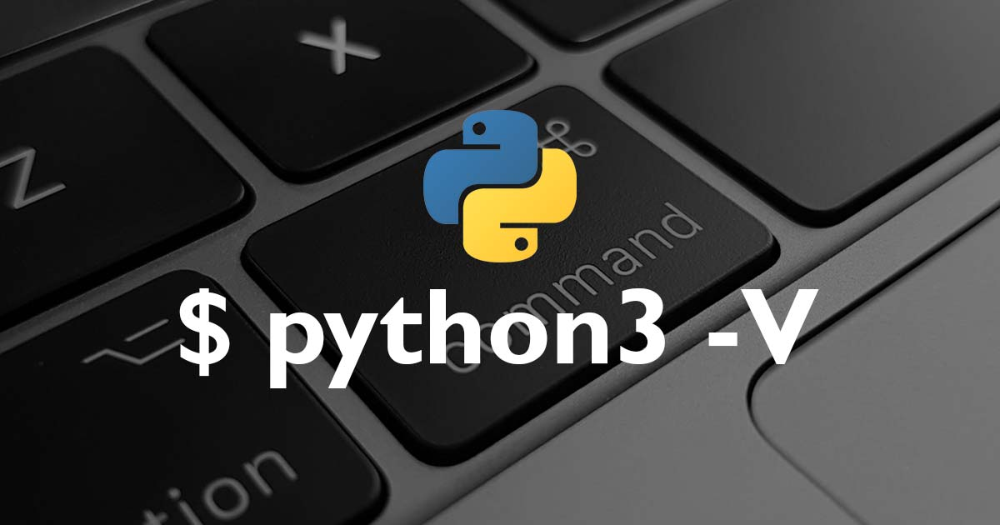
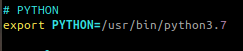

# Becoming a Expert Python
[](https://app.codacy.com/app/brunocampos01/becoming-a-python-expert?utm_source=github.com&utm_medium=referral&utm_content=brunocampos01/becoming-a-python-expert&utm_campaign=Badge_Grade_Dashboard)

[](https://www.python.org/downloads/release/python-371/)
[](https://github.com/sindresorhus/awesome)


These guides aim to understand the development and execution environment of Python. In addition, I will cover topics ranging from language fundamentals, good practices, build, deploy, distribution to advanced language programming topics.

_Estes guias tem por objetivo compreender o ambiente de desenvolvimento e execução de Python. Além disso, vou cobrir tópicos que envolvem desde os fundamentos da linguagem, boas práticas, build, deploy e distribuição_

- NOTE: Tópicos avançados de programação com Python ficaram em outro contexto.

# Summary
[ How to install and set up a Python](#how-to-install-and-set-up-a-Python)

## Preparing the Environment for the Python
This topic describe how to set up the environment to Python developement.
- [Check Python Configuration](#check-python-configuration)
- [Preparing Environment](#preparing-environment)
- [Requirements File](#requirements-file)
- [Virtual Environment](#virtual-environment)
- [Pipenv](#pipenv)

## Fundamentals
- [What's is Python ?](#what's-is-python-?)
- [Zen of Python](#zen-of-python)
- [Types](#types)
- [Interpreter and Compiler](#interpreter-and-compiler)
- [Complete Documentation](#https://docs.python.org/3/contents.html)
- [Main()](#main())
    - [__ main __](#main)
    - https://docs.python.org/3/library/index.html
    - https://docs.python.org/3/reference/index.html
    - https://docs.python.org/3/howto/index.html
    - https://docs.python.org/3/reference/import.
    - html#replacing-the-standard-import-system
- [Executing modules as scripts](#)
- [Options Command](#)
- [`-c` command](#)
- [`-m` module-name](#) https://realpython.com/run-python-scripts/
- Language limitations
  - GIL

## Advanced
- Anonymous functions (lambda)
  -https://pt.stackoverflow.com/questions/50422/como-declarar-uma-fun%C3%A7%C3%A3o-an%C3%B4nima-no-python
- Generators
- Iterators
- Decorators
- Personal Exceptions
- Enfeites em funções
- Metaclasses
- coroutine function
- concurrent

## Build, Distribute and Deploy Python Code
This part of the guide focuses on sharing and deploying your Python code.
- https://docs.python-guide.org/

## Python Files
- [.py](#Files:-.)
- [.pyc](#Files:-.)
- [.pyo](#Files:-.)
- [.egg](#Files:-.)
- [`__init__.py`](#_init.py)
- [`__main__.py`](#_main.py)
- [Requirements File](#requirements-file)
- [Pipfile and Pipfile.lock](#pipfile-and-pipfile.lock)

## Books
- https://www.packtpub.com/application-development/expert-python-programming

## Best Pratices
- [Identation and Length](#identation-and-length)
- [Line Break After a Binary Operator](#line-break-after-a-binary-operator)
- [Naming](#naming)
- [Encoding](#encoding)
- [Strings `' '` and `" "`](#strings-and)
- [Comments `#`](#comments)
- [Imports](#imports)
- [Dunders to Documentation](#dunders-to-documentation)
- [Annotation Functions](#annotation-functions)
 - [Type Hints](#type-hints)
- [String Concatenation](#string-concatenation)
- [String Methods](#string-methods)
- [Exception](#exception)
- [Return](#return)
- [Type Comparisons](#type-comparisons)
- [Methods with numerous parameters ](#methods-with-numerous-parameters)
- Docstrings
    - [`__doc__`](#__doc__)
    - [`help()`](#help)
    - [Scripts with docstrings](#scripts-with-docstrings)
    - [Functions with Docstrings](#functions-with-docstrings)
    - [Class with Docstrings](#class-with-docstrings)
TODO - https://realpython.com/documenting-python-code/
TODO - https://docs.python-guide.org/

### Curso em Vídeo: resolutions exercises
- Class notes and exercises solved
- Teacher: Gustavo Guanabara.

Words   | Themes
------- | ---
1 | [Fundamentals](https://www.youtube.com/playlist?list=PLHz_AreHm4dlKP6QQCekuIPky1CiwmdI6)
2 | [Control Structures](https://www.youtube.com/playlist?list=PLHz_AreHm4dk_nZHmxxf_J0WRAqy5Czye)
3 | [Compound Structures](https://www.youtube.com/watch?v=0LB3FSfjvao&list=PLHz_AreHm4dksnH2jVTIVNviIMBVYyFnH)
4 | [Functions](https://www.youtube.com/watch?v=0LB3FSfjvao&list=PLHz_AreHm4dksnH2jVTIVNviIMBVYyFnH)

<br/>

# **Awesome Python**

**Data Engineering**
- [Caching](#caching)
- [Queue](#queue)
- [Data Serialization](#data-serialization)
- [Data Analysis](#data-analysis)
- [Data Validation](#data-validation)
- [Data Visualization](#data-visualization)

**Artificial Inteligence**
- [Computer Vision](#computer-vision)
- [Machine Learning](#machine-learning)
- [Deep Learning](#deep-learning)
- [Network Virtualization](#network-virtualization)
- [Text Processing](#text-processing)
- [Natural Language Processing](#natural-language-processing)
- [ChatOps Tools](#chatops-tools)
- [Image Processing](#image-processing)
- [Search](#search)
- [Robotics](#robotics)
- [Science](#science)
- [General-Purpose Machine Learning](#general-purpose-machine-learning-21)
- [Data Analysis / Data Visualization](#data-analysis--data-visualization-9)
- [Misc Scripts / iPython Notebooks / Codebases](#misc-scripts--ipython-notebooks--codebases)
- [Neural Networks](#neural-networks)
- [Kaggle Competition Source Code](#kaggle-competition-source-code)
- [Reinforcement Learning](#reinforcement-learning-1)

**Databases**
- [Database](#database)
- [Database Drivers](#database-drivers)
- [ORM](#orm)

**Security**
- [Authentication](#authentication)
- [Cryptography](#cryptography)
- [Permissions](#permissions)

**Operation**
- [Date and Time](#date-and-time)
- [Built-in Classes Enhancement](#built-in-classes-enhancement)
- [Command-line Interface Development](#command-line-interface-development)
- [Command-line Tools](#command-line-tools)
- [Environment Management](#environment-management)
- [Files](#files)
- [Networking](#networking)
- [Audio](#audio)
- [Hardware](#hardware)
- [Video](#video)

**DevOps**
- [Parsing](#parsing)
- [Processes](#processes)
- [Concurrency and Parallelism](#concurrency-and-parallelism)
- [Distributed Computing](#distributed-computing)
- [Compatibility](#compatibility)
- [Configuration](#configuration)
- [Debugging Tools](#debugging-tools)
- [DevOps Tools](#devops-tools)
- [Distribution](#distribution)
- [Documentation](#documentation)
- [Downloader](#downloader)
- [Logging](#logging)
- [Job Scheduler](#job-scheduler)
- [Continuous Integration](#continuous-integration)

**Cloud**
- [Serverless Frameworks](#serverless-frameworks)
- [Libraries to management services in cloud](#libraries-to-managenent-services-in-cloud)

**Python**
- [Algorithms and Design Patterns](#algorithms-and-design-patterns)
- [Code Analysis](#code-analysis)
- [Code Quality](#code-quality)
- [Functional Programming](#functional-programming)
- [Implementations](#implementations)
- [Interactive Interpreter](#interactive-interpreter)
- [Package Management](#package-management)
- [Package Repositories](#package-repositories)
- [Testing](#testing)
- [Editor Plugins and IDEs](#editor-plugins-and-ides)
- [Build Tools](#build-tools)

**Managemant Libraries**
- [Python Package Index](https://pypi.org/)
- [Poetry](https://python-poetry.org/)
- [Conda](https://docs.conda.io/en/latest/)
- [Pipenv](https://pipenv-fork.readthedocs.io/en/latest/)

**Web**
- [Admin Panels](#admin-panels)
- [CMS](#cms)
- [Forms](#forms)
- [HTML Manipulation](#html-manipulation)
- [HTTP Clients](#http-clients)
- [News Feed](#news-feed)
- [Static Site Generator](#static-site-generator)
- [URL Manipulation](#url-manipulation)
- [Web Asset Management](#web-asset-management)
- [Web Content Extracting](#web-content-extracting)
- [Web Crawling](#web-crawling)
- [Web Frameworks](#web-frameworks)
- [WebSocket](#websocket)
- [WSGI Servers](#wsgi-servers)
- [Tagging](#tagging)
- [Template Engine](#template-engine)

**Miscellaneous**
- [Miscellaneous](#miscellaneous)
- [Recommender Systems](#recommender-systems)
- [Game Development](#game-development)
- [Geolocation](#geolocation)
- [GUI Development](#gui-development)
- [E-commerce](#e-commerce)
- [Email](#email)

**Services**
- [RESTful API](#restful-api)
- [Services](#services)
- [Third-party APIs](#third-party-apis)

### FAQ
- How do I configure my computer to run Python code?
- How do I configure my computer to develop in Python?
- What are the best practices to prepare an environment that runs Python?
- What is a requirements.txt file ?
- How to ensure a fully reproducible (100% equal) environment ?
- How is the virtual environment Python executable able to use something different from the system site packages ?
- When use golang in place Python
---
---

## How to install and set up a Python 


On **Linux**, make sure you have the right version of Python pre-installed, and the basic developer toolset available. Makes sure of that:

1. Install the latest version of Python.
```bash
sudo apt install python3.8
```

2. Satisfy some system requirements
```bash
sudo apt install build-essential\
                 libffi-dev\
                 python3-pip\
                 python3-dev\
                 python3-venv \
                 python3-setuptools\
                 python3-pkg-resources           
```

2. Create and activate Python virtual environment

```bash
cd your-project
python3 -m venv venv
source venv/bin/activate
```

NOTE for beginners:
<br/>
A Python virtual environment is a local interpreter that allows to install dependencies without polluting the global Python interpreter. There are different ways to create virtual environments (virtualenv; -m venv) and to install packages (pip install; easy_install), which may be confusing at the beginning.


4. Install tools
- [Git](https://github.com/brunocampos01/devops/tree/master/git)
```bash
sudo apt install git
```

- Vim editor (git's default editor)
```bash
sudo apt install vim
```

5. Install Libraries used in this project
```bash
pip3 install --user od \
                    numpy \
                    pandas \
                    matplotlib \
                    virtualenv \
                    jupyter \
                    mysql-connector-python
```

---


## Check Python Configuration



- Check what version Python
```bash
python --version

# Python 3.6.7
```

If return Python2, try set a alias in file [.bashrc](https://github.com/brunocampos01/home-sweet-home/blob/master/.bashrc)
```
# Python
alias python=python3
```

- Check **where** installed Python
```bash
which python

# /usr/bin/python
```

---

## Preparing Environment

### Enviornment Variables

- To individual project
`PYTHONPATH` search path until module.

- To interpreter
`PYTHONHOME` indicate standard libraries.

### Configure Python PATH
1. First open profile in editor
```bash
sudo vim ~/.profile
```

or

```bash
sudo vim ~/.bashrc
```

2. Insert Python PATH
```bash
export PYTHONHOME=/usr/bin/python<NUMER_VERSION>
```



NOTE: quit vim: `ESC, :wq`


3. Update profile/bashrc
```bash
source ~/.bashrc

# or

.  ~/.bashrc
```

### Install multiple Python3
`update-alternatives` symbolic links determining default commands

1. Execute in terminal
```bash
sudo update-alternatives --config python
```
If return error: `update-alternatives: error: no alternatives for python3`, following to step [2](#2)

2. Install multiples Python
```bash
update-alternatives --install /usr/bin/python python /usr/bin/python<NUMER_VERSION> 1

update-alternatives --install /usr/bin/python python /usr/bin/python<OTHER_NUMER_VERSION> 2
```

3. Change Python versions
```bash
sudo update-alternatives --config python
```


```bash
sudo update-alternatives  --set python /usr/bin/python3.6
```

4. Check changes
```bash
python --version

# Python 3.8
```

---

## Requirements File
_Requirements files_ is file containing a list of items to be installed using pip install.

- Generate file `requirements.txt`
```bash
pip3 freeze > requirements.txt
```

or

```bash
venv/bin/pip3 freeze > requirements.txt
cat requirements # image bellow
```


- Visualize instaled libraries 
```bash
pip3 freeze
```


- Install libraries in requirements
```bash
pip3 install -r requirements.txt
```
`-r` recursive

---

## Virtual Environment


The Python can is executed in a virtual environment with **semi-isolated** from system.
<br/>
When Python is initiating, it analyzes the path of its binary. In a virtual environment, it's actually just a copy or Symbolic link to your system's Python binary. Next, set the `sys.prefix` location which is used to locate the `site-packages` (third party libraries)

_Quando o Python está iniciando, ele analisa o caminho do seu binário. Em um virtual environment, na verdade, é apenas uma cópia ou Symbolic link para o binário Python do seu sistema. Em seguida, define o local `sys.prefix` que é usado para localizar o `site-packages`(third party libraries)._


### Symbolic link
- `sys.prefix` points to the virtual environment directory.
- `sys.base.prefix` points to the **non-virtual** environment.

Example, how keep the files in folder of virtual environment:
```bash
ll

# random.py -> /usr/lib/python3.6/random.py
# reprlib.py -> /usr/lib/python3.6/reprlib.py
# re.py -> /usr/lib/python3.6/re.py
# ...
```

```bash
tree

├── bin
│   ├── activate
│   ├── activate.csh
│   ├── activate.fish
│   ├── easy_install
│   ├── easy_install-3.8
│   ├── pip
│   ├── pip3
│   ├── pip3.8
│   ├── python -> python3.8
│   ├── python3 -> python3.8
│   └── python3.8 -> /Library/Frameworks/Python.framework/Versions/3.8/bin/python3.8
├── include
├── lib
│   └── python3.8
│       └── site-packages
└── pyvenv.cfg
```

### Create Virtual Environment
```bash
$ virtualenv -p python3  NAME_ENVIRONMENT
(env) $
```
or
```bash
$ python3 -m venv NAME_ENVIRONMENT
(env) $
```

###  To begin using the virtual environment, it needs to be activated


Execute activate script
```bash
source <DIR>/bin/activate
```


#### References
- [python-virtual-environments-a-primer](https://realpython.com/python-virtual-environments-a-primer/)

---

## Pipenv
- Package manager: `Pipefile`
- Virtual environment: `$HOME/.local/share`
- Lock package: `Pipefile.lock`


### Why use pipefile?
Using pip and requirements.txt file, have a **real issue here is that the build isn’t [deterministic](https://pt.wikipedia.org/wiki/Algoritmo_determin%C3%ADstico)**. What I mean by that is that, given the same input (the requirements.txt file), pip doesn’t always produce the same environment. 

### What is pipefile?
It automatically creates and manages a virtualenv for your projects, as well as adds/removes packages from your Pipfile as you install/uninstall packages. It also generates the ever-important Pipfile.lock, which is used to produce deterministic builds.

Features:
- Deterministic builds
- Separates development and production environment libraries into a single file `Pipefile`
- Automatically adds/removes packages from your `Pipfile`
- Automatically create and manage a virtualenv
- Check PEP 508 requirements
- Check installed package safety

### Comparisons
```
# Pipfile

[[source]]
name = "pypi"
url = "https://pypi.org/simple"
verify_ssl = true

[dev-packages]
matplotlib = "==3.1.3"

[packages]
requests = "*"
numpy = "==1.18.1"
pandas = "==1.0.1"
wget = "==3.2"

[requires]
python_version = "3.8"
platform_system = 'Linux'
```

```
# requirements.txt

requests
matplotlib==3.1.3
numpy==1.18.1
pandas==1.0.1
wget==3.2
```


### Install
```bash
pip3 install --user pipenv
```

### Create Pipfile and virtual environment
```bash
pipenv --python 3

# Creating a virtualenv for this project…
# Pipfile: /home/campos/projects/becoming-a-expert-python/Pipfile

# Using /usr/bin/python3.8 (3.8.2) to create virtualenv…
# ⠼ Creating virtual environment...created virtual environment CPython3.8.2.final.0-64 in 256ms

#   creator CPython3Posix(dest=/home/campos/.local/share/virtualenvs/becoming-a-expert-python-fmPL6zJP, clear=False, global=False)

#   seeder FromAppData(download=False, pip=latest, setuptools=latest, wheel=latest, via=copy, app_data_dir=/home/campos/.local/share/virtualenv/seed-app-data/v1)

#   activators BashActivator,CShellActivator,FishActivator,PowerShellActivator,PythonActivator,XonshActivator

# ✔ Successfully created virtual environment! 
# Virtualenv location: /home/campos/.local/share/virtualenvs/becoming-a-expert-python-fmPL6zJP

# requirements.txt found, instead of Pipfile! Converting…
# ✔ Success! 
```

- See where virtual environment installed
```bash
pipenv --venv
```

### Activate environment
```bash
pipenv run
```


### Install Libraries with Pipefile
```bash
pipenv install flask

# or

pipenv install --dev flask
```

### Create lock file
```bash
pipenv lock

# Locking [dev-packages] dependencies…
# Locking [packages] dependencies…
# ✔ Success!
```

#### References
- [Official documentation](https://github.com/pypa/pipenv)
- [Gerenciando suas dependências e ambientes python com pipenv](https://medium.com/code-rocket-blog/gerenciando-suas-depend%C3%AAncias-e-ambientes-python-com-pipenv-9e5413513fa6)
- [How are Pipfile and Pipfile.lock used?](https://stackoverflow.com/questions/46330327/how-are-pipfile-and-pipfile-lock-used)

---


---

## Python Files
REFACTORING
https://packaging.python.org/key_projects/#pipenv

In production ...
- distlib
- virtualenv
- eggs
- Wheel

#### Files: `.py`

File: Typically, a Python file is any file that contains code. Most Python files have the extension .py.

Script: A Python script is a file that you intend to execute from the command line to accomplish a task.

Module: A Python module is a file that you intend to import from within another module or a script, or from the interactive interpreter. You can read more about modules in the Python documentation.


Call unique def in file.py (`python -c "import FILE_NAME; def test(requirements)"`)


```
sound/                          Top-level package
      __init__.py               Initialize the sound package
      formats/                  Subpackage for file format conversions
              __init__.py
              wavread.py
              wavwrite.py
              aiffread.py
              aiffwrite.py
              auread.py
              auwrite.py
              ...
      effects/                  Subpackage for sound effects
              __init__.py
              echo.py
              surround.py
              reverse.py
              ...
      filters/                  Subpackage for filters
              __init__.py
              equalizer.py
              vocoder.py
              karaoke.py
              ...

```

#### `__init__.py`

- The `__init__.py` files are required to make Python treat directories containing the file as packages.
- File can empty
- Is good pratice `__init__` have a list with modules to import. Example:
```
__all__ = ["echo", "surround", "reverse"]
```
- So import `from sound.effects import *` call the modules: "echo", "surround", "reverse"


Import individual module:<br/>
```python
from package import item.subitem.subsubite...

from module import name
```

TODO:
- https://nbviewer.jupyter.org/github/ricardoduarte/python-for-developers/blob/master/Chapter10/Chapter10_Packages.ipynb


#### Global Modules
- Módulos que são projetados para uso via M import * devem usar o mecanismo `__ all __` para impedir a exportação de globals

- To better  support introspection
Use __ all __ to switch *. E.g
```Python
__all__ = ['foo', 'Bar']

from module import *
```
significa que, quando você `from module import * ` apenas esses nomes __all__ são importados.

EXAMPLES...
- More details: https://stackoverflow.com/questions/44834/can-someone-explain-all-in-python and https://www.python.org/dev/peps/pep-0008/#naming-conventions


- Examples ...
- Read: https://realpython.com/run-python-scripts/


#### Compiler Files: `.pyc`
Program **doesn’t run any faster when it is read from a .pyc** file than when it is read from a .py file;

.pyc it's faster to loaded modules

---

## Undertanding

### Zen of Python


```python
Beautiful is better than ugly.
Explicit is better than implicit.
Simple is better than complex.
Complex is better than complicated.
Flat is better than nested.
Sparse is better than dense.
Readability counts.
Special cases aren't special enough to break the rules.
Although practicality beats purity.
Errors should never pass silently.
Unless explicitly silenced.
In the face of ambiguity, refuse the temptation to guess.
There should be one-- and preferably only one --obvious way to do it.
Although that way may not be obvious at first unless you're Dutch.
Now is better than never.
Although never is often better than *right* now.
If the implementation is hard to explain, it's a bad idea.
If the implementation is easy to explain, it may be a good idea.
Namespaces are one honking great idea -- let's do more of those!
```

NOTE: [PEP 20](https://www.python.org/dev/peps/pep-0020/)

---

## Types


Examples:
```python
# Converting real to integer
print 'int(3.14) =', int(3.14)

# Converting integer to real
print 'float(5) =', float(5)

# Calculation between integer and real results in real
print '5.0 / 2 + 3 = ', 5.0 / 2 + 3

# Integers in other base
print "int('20', 8) =", int('20', 8) # base 8
print "int('20', 16) =", int('20', 16) # base 16

# Operations with complex numbers
c = 3 + 4j
print 'c =', c
print 'Real Part:', c.real
print 'Imaginary Part:', c.imag
print 'Conjugate:', c.conjugate()

# int(3.14) = 3
# float(5) = 5.0
# 5.0 / 2 + 3 =  5.5
# int('20', 8) = 16
# int('20', 16) = 32
# c = (3+4j)
# Real Part: 3.0
# Imaginary Part: 4.0
# Conjugate: (3-4j)
```

---
## Interpreter and Compiler

 

### CPython
Compiler and interpreter bytecode, write in C.

### Jython


Compiler and interpreter Java bytecode, write in Java.


### Comparian


#### Why use alter compiler python?

**CPython:** torna muito fácil escrever extensões C para seu código Python porque no final ele é executado por um interpretador C. <br/>
**Jython:**, por outro lado, torna muito fácil trabalhar com outros programas Java: você pode importar qualquer classe Java sem esforço adicional, chamando e utilizando suas classes Java de dentro de seus programas Jython.


#### How Python program run ?


1. First, Python interpreter **checks syntax** (sequential)
2. **Compile and convert it to bytecode** and directly bytecode is loaded in system memory.
3. Then compiled bytecode interpreted from memory to execute it.

---

## Programming Recommendations

_"Readability counts"_

##### Identation and Length
- 4 spaces
- Limit all line 72 characteres to docstring
- Limit all line 79 to code
- Statement of functions and flow, e.g:

```Python
# Aligned with opening delimiter.
foo = long_function_name(var_one=0.0, var_two=0.0,
                         var_three=0.0, var_four=0.0)

```

##### Naming
- Class Name (camelCase): `CapWords()`
- Variables (snack_case): `cat_words`
- Constants: `MAX_OVERFLOW`


##### Line Break After a Binary Operator
```Python
income = (gross_wages
          + taxable_interest
          + (dividends - qualified_dividends)
          - ira_deduction
          - student_loan_interest)

```

##### Encoding
By default: `UTF-8`

```Python
# -*- coding: UTF-8 -*-
<code>
```

##### Strings `' '` and `" "`
Single quotation marks and strings with double quotation marks are the same.

##### Comments `#`
- Fisrt word **need** upper case.
- Comments in-line separete by 2 spaces.
```Python
x = x + 1  # Compensar borda
```

##### Imports
Following order:

1. Standard library imports.
2. Related third party imports.
(_parte de terceiros_)
3. Local application/library specific imports.

```Python
import argparse
import configparser
import os

import mysql.connector

import my_module
```

Yes:
```Python
import os
import sys
```

No:
```Python
import os, sys
```

No problems:
```Python
from subprocess import Popen, PIPE
```


##### Dunders to Documentation
```Python
__version__ = '0.1'
__author__ = 'Bruno Campos'
```


##### String Concatenation

- Use ` ''.join()`, to concatenate 3 or more:
```python
os.path.dirname.join(stringA + stringB + stringC + stringD)
```

- This optimization is fragile even in CPython. **Not** use:
```python
stringA + stringB + stringC + stringD
```


##### String Methods

- Use string methods instead of the string module because, String methods are always much faster.
- Use `''.startswith()` and `''.endswith()` instead of string slicing to check for prefixes or suffixes.

```Python
Yes: if foo.startswith('bar'):
No:  if foo[:3] == 'bar':
```


##### Exception

Limit the clausule `try:` minimal code necessary.

Yes:
```Python
try:
    value = collection[key]
except KeyError:
    return key_not_found(key)
else:
    return handle_value(value)
```

No:
```Python
try:
    # Too broad!
    return handle_value(collection[key])
except KeyError:
    # Will also catch KeyError raised by handle_value()
    return key_not_found(key)
```

- Objetivo de responder à pergunta **"O que deu errado?"** programaticamente, em vez de apenas afirmar que _"Ocorreu um problema"_


##### Return
"_Should explicitly state this as return None_"

- Be consistent in return statements.
- Todas as instruções de retorno em uma função devem retornar uma expressão ou nenhuma delas deve.

Yes:
```Python
def foo(x):
    if x >= 0:
        return math.sqrt(x)
    else:
        return None
```

No:
```Python
def foo(x):
    if x >= 0:
        return math.sqrt(x)
```


##### Type Comparisons
- Always use `isinstance()`
```Python
Yes: if isinstance(obj, int):

No:  if type(obj) is type(1):
```

#### Annotation Functions
"_Don’t use comments to specify a type, when you can use type annotation._"

-  Atua como um linter (analisador de código para mostrar erros) muito poderoso.
- O Python não atribui nenhum significado a essas anotações.
- _Examples_:

Method arguments and return values
```Python
def func(a: int) -> List[int]:
```

```Python
def hello_name(name: str) -> str:
    return (f'Hello' {name}')
```

Declare the type of a variable (type hints)
```python
a = SomeFunc()  # type: SomeType
```

Isso informa que o tipo esperado do argumento de nome é str . Analogicamente, o tipo de retorno esperado é str .

##### Type Hints
```Python
def send_email(address,     # type: Union[str, List[str]]
               sender,      # type: str
               cc,          # type: Optional[List[str]]
               bcc,         # type: Optional[List[str]]
               subject='',
               body=None    # type: List[str]
               ):
    """Send an email message.  Return True if successful."""
    <code>
```

TODO
- https://docs.python.org/3/library/typing.html#module-typing


##### References
- https://medium.com/@shamir.stav_83310/the-other-great-benefit-of-python-type-annotations-896c7d077c6b
- https://www.python.org/dev/peps/pep-0484/
- https://blog.jetbrains.com/pycharm/2015/11/python-3-5-type-hinting-in-pycharm-5/

---

## Docstrings

- Docstrings must have:
  - Args
  - Returns
  - Raises

Simple Example
```Python
def say_hello(name):
    """
    A simple function that says hello...
    Richie style
    """

    print(f"Hello {name}, is it me you're looking for?")
```

Example partner Google
```Python
def fetch_bigtable_rows(big_table, keys, other_silly_variable=None):
    """Fetches rows from a Bigtable.

    Retrieves rows pertaining to the given keys from the Table instance
    represented by big_table.  Silly things may happen if
    other_silly_variable is not None.

    Args:
        big_table: An open Bigtable Table instance.
        keys: A sequence of strings representing the key of each table row
            to fetch.
        other_silly_variable: Another optional variable, that has a much
            longer name than the other args, and which does nothing.

    Returns:
        A dict mapping keys to the corresponding table row data
        fetched. Each row is represented as a tuple of strings. For
        example:

        {'Serak': ('Rigel VII', 'Preparer'),
         'Zim': ('Irk', 'Invader'),
         'Lrrr': ('Omicron Persei 8', 'Emperor')}

        If a key from the keys argument is missing from the dictionary,
        then that row was not found in the table.

    Raises:
        IOError: An error occurred accessing the bigtable.Table object.
    """
    return None
```

#### `__doc__`

Such a docstring becomes the `__doc__` special attribute of that object.

- Simple Example
```Python
print(say_hello.__doc__)

# A simple function that says hello... Richie style
```

- Example partner Google


##### `help()`
- Create manual: `man`
- Is a built-in function help() that prints out the objects docstring.

```Python
>>> help(say_hello)
Help on function say_hello in module __main__:

# say_hello(name)
#     A simple function that says hello... Richie style
```


##### Scripts with Docstrings
- Docstrings must show how to use script
- Must doc:
  - Usage: sintax command line
  - Examples
  - Arguments required and optional

```python
"""
Example of program with many options using docopt.
Usage:
  options_example.py [-hvqrf FILE PATH]
  my_program tcp <host> <port> [--timeout=<seconds>]

Examples:
  calculator_example.py 1 + 2 + 3 + 4 + 5
  calculator_example.py 1 + 2 '*' 3 / 4 - 5    # note quotes around '*'
  calculator_example.py sum 10 , 20 , 30 , 40

Arguments:
  FILE     input file
  PATH     out directory

Options:
  -h --help            show this help message and exit
  --version            show version and exit
  -v --verbose         print status messages
  -q --quiet           quiet mode
  -f --force
  -t, --timeout TIMEOUT    set timeout TIMEOUT seconds
  -a, --all             List everything.

"""
from docopt import docopt


if __name__ == '__main__':
    arguments = docopt(__doc__, version='1.0.0rc2')
    print(arguments)
```

##### Functions with Docstrings
A docstring to a function or method must resume:
- behavior
- arguments required
- arguments optional
- default value of arguments
- returns
- raise Exceptions

Example

```Python
def says(self, sound=None):
    """Prints what the animals name is and what sound it makes.

    If the argument `sound` isn't passed in, the default Animal
    sound is used.

    Parameters
    ----------
    sound : str, optional
        The sound the animal makes (default is None)

    Raises
    ------
    NotImplementedError
        If no sound is set for the animal or passed in as a parameter.
    """

    if self.sound is None and sound is None:
        raise NotImplementedError("Silent Animals are not supported!")

    out_sound = self.sound if sound is None else sound
    print(self.says_str.format(name=self.name, sound=out_sound))

```

##### Class with Docstrings
A docstring para uma classe deve resumir seu comportamento e listar os métodos públicos e variáveis ​​de instância. Se a classe se destina a ser uma subclasse e possui uma interface adicional para subclasses, essa interface deve ser listada separadamente (no docstring). O construtor de classe deve ser documentado na docstring para seu método __init__ . Os métodos individuais devem ser documentados por seus próprios docstring.

Example
```Python
class SimpleClass:
    """Class docstrings go here."""

    def say_hello(self, name: str):
        """Class method docstrings go here."""

        print(f'Hello {name}')
```

Class docstrings should contain the following information:

- A brief summary of its purpose and behavior
- Any public methods, along with a brief description
- Any class properties (attributes)
- Anything related to the interface for subclassers, if the class is intended to be subclassed


##### References
- [PEP 08](https://www.python.org/dev/peps/pep-0008/)
- [PEP 484](https://www.python.org/dev/peps/pep-0484/)
- [PEP 257](https://www.python.org/dev/peps/pep-0257/)
- https://realpython.com/python-pep8/#naming-conventions
- https://pep8.org
- Style guide Google: https://github.com/google/styleguide/blob/gh-pages/pyguide.md#38-comments-and-docstrings

#### Methods with numerous parameters
Methods with numerous parameters are a challenge to maintain, especially if most of them share the same datatype.
<br/>
These situations usually denote the **need for new objects to wrap the
 numerous parameters**.


#### Example(s):

- too many arguments
```python
def add_person(birthYear: int, birthMonth: int, birthDate: int,
               height: int, weight: int,
               ssn: int):
'''too many arguments'''

    . . .
```
- preferred approach
```python
def add_person(birthdate: 'Date',
               measurements: 'BodyMeasurements',
               ssn: int):
'''preferred approach'''

    . . .
```


## Cyclomatic Complexity
cyclomatic complexity counts the number of decision points in a method

---

# Basic Comands
- Libraries
- Function print
- Types data
- Numeric systems
- libs matematics


## Control Structure
- Conditional
- Repeatition
- Functional Programming

## Simple Data Structure
 - Tuples
 - List
 - Dict

## Functions
- Defining Functions
- Documentation
- Default arguments
- Packing and unpacking arguments
- Variable Scope
- Global variable
- Constants
- function recursive
- Lambda Expressions

```
 Do global variables evil?

 global variables are bad in any programming language.

 However, global constants are not conceptually the same as global variables;
 global constants are perfectly fine to use.

 so when you need a constant you have to use a global.

 - http://wiki.c2.com/?GlobalVariablesAreBad


 To make code more modular, the first step is always to move all global variables into a "config" object.

```
#### Violating Pure Function definition
I believe that a clean and (nearly) bug-free code should have functions that are as pure as possible (see pure functions). A pure function is the one that has the following conditions:

A função sempre avalia o mesmo valor de resultado, dado o (s) mesmo (s) valor (es) do argumento. O valor do resultado da função não pode depender de qualquer informação ou estado oculto que possa mudar enquanto a execução do programa prossegue ou entre diferentes execuções do programa, nem pode depender de qualquer entrada externa de dispositivos de E / S (normalmente - veja abaixo).
A avaliação do resultado não causa nenhum efeito colateral observável semanticamente, como a mutação de objetos mutáveis ​​ou a saída para dispositivos de E / S.
Ter variáveis ​​globais está violando pelo menos um dos itens acima, se não ambos, pois um código externo provavelmente pode causar resultados inesperados.

Outra definição clara de funções puras: "Função pura é uma função que toma todas as suas entradas como argumentos explícitos e produz todas as suas saídas como resultados explícitos". [1] Ter variáveis ​​globais viola a idéia de funções puras, já que uma entrada e talvez uma das saídas (a variável global) não está sendo explicitamente dada ou retornada.


#### Violating Unit testing F.I.R.S.T principle
Further on that, if you consider unit-testing and the F.I.R.S.T
 principle (Fast tests, Independent tests, Repeatable, Self-Validating and Timely) will probably violate the Independent tests principle (which means that tests don't depend on each other).


## Configuration File
There are ways to manage the configuration:
- Using built-in data structure
- Using external configuration file
    - json
    - ini
- Using environment variables
- Using dynamic loading


#### Using built-in data structure
Use dictionary, ex:<br/>
```bash
DATABASE_CONFIG = {
    'host': 'localhost',
    'dbname': 'company',
    'user': 'user',
    'password': 'password',
    'port': 3306
}
```
<br/>
Must is file separed, how example `config.py`


#### Using environment variables
The configuration values are not managed as a separate file.

## Control Flow
-  examples
  - [range](https://docs.python.org/3/library/stdtypes.html#range)
  - Looping Techniques
    - items()
    - enumerate()
    - zip()

###### items()
- dictionaries

```python
knights = {'gallahad': 'the pure',
           'robin': 'the brave'}

for k, v in knights.items():
     print(k, v)

# gallahad the pure
# robin the brave
```

###### enumerate()
- List

```python
for i, v in enumerate(['tic', 'tac', 'toe']):
    print(i, v)

# 0 tic
# 1 tac
# 2 toe
```

###### zip()
- Loop over two or more sequences at the same time
- Excelent tools to garant good algorith complex

```python
questions = ['name', 'quest', 'favorite color']
answers = ['lancelot', 'the holy grail', 'blue']


for q, a in zip(questions, answers):
    print('What is your {0}?  It is {1}.'.format(q, a))

# What is your name?  It is lancelot.
# What is your quest?  It is the holy grail.
# What is your favorite color?  It is blue.
```


## Functions

TODO:
- https://nbviewer.jupyter.org/github/ricardoduarte/python-for-developers/blob/master/Chapter6/Chapter6_Functions.ipynb

- examples
- Optional arguments
- Unpacking Argument (**kwargs)


##### Optional arguments

```python
def parrot(voltage, state='a stiff', action='voom', type='Norwegian Blue'):
```
Accepts **one required argument (`voltage`)** and three optional arguments (`state, action, and type`)

##### Unpacking Argument
```python
def parrot(voltage, state='a stiff', action='voom'):
    print("-- This parrot wouldn't", action, end=' ')
    print("if you put", voltage, "volts through it.", end=' ')
    print("E's", state, "!")

d = {"voltage": "four million",
     "state": "bleedin' demised",
     "action": "VOOM"}

parrot(**d)

# This parrot wouldn't VOOM if you put four million volts through it. E's bleedin' demised !
```


## Exceptions
...

## Strings
TODO:
- https://nbviewer.jupyter.org/github/ricardoduarte/python-for-developers/blob/master/Chapter5/Chapter5_Types.ipynb

```
 +---+---+---+---+---+---+
 | P | y | t | h | o | n |
 +---+---+---+---+---+---+
 0   1   2   3   4   5   6
-6  -5  -4  -3  -2  -1
```

```
print('The story of {0}, {1}, and {other}.'.format('Bill', 'Manfred',
                                                       other='Georg'))
# The story of Bill, Manfred, and Georg.
```

## Files
- o arquivo de saída padrão pode ser referenciado como `sys.stdout`

## Serialization
- Pickle
- sqlite

## Classes
- Um namespace é um mapeamento de nomes para objetos.
apenas ligam nomes a objetos
- verbos para métodos e substantivos para atributos de dados
-  nada no Python torna possível impor a ocultação de dados

Examples:
```python
class MyClass:
    """A simple example class"""
    i = 12345

    def f(self):
        return 'hello world'
```
##### self
- O primeiro argumento de um método é chamado self. Isso nada mais é do que uma convenção
- É útil para aumenta a legibilidade dos métodos: não há chance de confundir variáveis ​​locais e variáveis ​​de instância ao olhar através de um método.

```python
class Bag:
    def __init__(self):
        self.data = []

    def add(self, x):
        self.data.append(x)

    def addtwice(self, x):
        self.add(x)
        self.add(x)
```

##### `__class__`
- Each value is an object. It is stored as `object.__class__`

```python
class MyFirstClass:
    """A simple example class"""
    i = 42

    def func_ex(self):
        print('learning Python')


if __name__ == '__main__':
    object = MyFirstClass()  # initialized instance
    object.func_ex()

    print(object.__class__)

# learning Python
# <class '__main__.MyFirstClass'>
```

##### Inheritance


##### Private Variables

##### Iterators
When call `for` the interpreter call `iter()`<br/>
The function `iter()` return next object of list

##### Generators

##### Generators Expressoins
`sum(i*i for i in range(10))                 # sum of squares`

## Tests
One approach for developing high quality software is to write tests for each function


#### doctest
The doctest module provides a tool for scanning a module and validating tests embedded in a program’s docstrings.
<br/>
Isso aprimora a documentação fornecendo ao usuário um exemplo e permite que o módulo doctest verifique se o código permanece fiel à documentação:
```python
def average(values):
    """Computes the arithmetic mean of a list of numbers.

    >>> print(average([20, 30, 70]))
    40.0
    """
    return sum(values) / len(values)

import doctest
doctest.testmod()   # automatically validate the embedded tests
```

...

## Logging
```
import logging
logging.debug('Debugging information')
logging.info('Informational message')
logging.warning('Warning:config file %s not found', 'server.conf')
logging.error('Error occurred')
logging.critical('Critical error -- shutting down')
```
...

### stdin, stdout, and stderr

## Threads
...

## Web
- Scrapping

### Frameworks
- Flask (microframework)
- Django

# Orientação à objetos
...

# Design Pattern
...

## Science
- Numpy
- Pandas
- Matplotlib
- Skitlearn (aprendizagem supervisionada, nao supervisionada)
- TensorFlow (neural network)

- - -

# Awesome Python by Category
A curated list of awesome Python frameworks, libraries, software and resources.

##### Based: https://awesome-python.com/


## Admin Panels

*Libraries for administrative interfaces.*

* [ajenti](https://github.com/ajenti/ajenti) - The admin panel your servers deserve.
* [django-grappelli](https://grappelliproject.com/) - A jazzy skin for the Django Admin-Interface.
* [django-jet](https://github.com/geex-arts/django-jet) - Modern responsive template for the Django admin interface with improved functionality.
* [django-suit](https://djangosuit.com/) - Alternative Django Admin-Interface (free only for Non-commercial use).
* [django-xadmin](https://github.com/sshwsfc/xadmin) - Drop-in replacement of Django admin comes with lots of goodies.
* [jet-bridge](https://github.com/jet-admin/jet-bridge) - Admin panel framework for any application with nice UI (ex Jet Django)
* [flask-admin](https://github.com/flask-admin/flask-admin) - Simple and extensible administrative interface framework for Flask.
* [flower](https://github.com/mher/flower) - Real-time monitor and web admin for Celery.
* [wooey](https://github.com/wooey/wooey) - A Django app which creates automatic web UIs for Python scripts.

## Algorithms and Design Patterns

*Python implementation of algorithms and design patterns.*

* [algorithms](https://github.com/keon/algorithms) - Minimal examples of data structures and algorithms in Python.
* [PyPattyrn](https://github.com/tylerlaberge/PyPattyrn) - A simple yet effective library for implementing common design patterns.
* [python-patterns](https://github.com/faif/python-patterns) - A collection of design patterns in Python.
* [sortedcontainers](https://github.com/grantjenks/python-sortedcontainers) - Fast, pure-Python implementation of SortedList, SortedDict, and SortedSet types.

## Audio

*Libraries for manipulating audio and its metadata.*

* Audio
    * [audioread](https://github.com/beetbox/audioread) - Cross-library (GStreamer + Core Audio + MAD + FFmpeg) audio decoding.
    * [dejavu](https://github.com/worldveil/dejavu) - Audio fingerprinting and recognition.
    * [mingus](http://bspaans.github.io/python-mingus/) - An advanced music theory and notation package with MIDI file and playback support.
    * [pyAudioAnalysis](https://github.com/tyiannak/pyAudioAnalysis) - Audio feature extraction, classification, segmentation and applications.
    * [pydub](https://github.com/jiaaro/pydub) - Manipulate audio with a simple and easy high level interface.
    * [TimeSide](https://github.com/Parisson/TimeSide) - Open web audio processing framework.
* Metadata
    * [beets](https://github.com/beetbox/beets) - A music library manager and [MusicBrainz](https://musicbrainz.org/) tagger.
    * [eyeD3](https://github.com/nicfit/eyeD3) - A tool for working with audio files, specifically MP3 files containing ID3 metadata.
    * [mutagen](https://github.com/quodlibet/mutagen) - A Python module to handle audio metadata.
    * [tinytag](https://github.com/devsnd/tinytag) - A library for reading music meta data of MP3, OGG, FLAC and Wave files.

## Authentication

*Libraries for implementing authentications schemes.*

* OAuth
    * [authlib](https://github.com/lepture/authlib) - JavaScript Object Signing and Encryption draft implementation.
    * [django-allauth](https://github.com/pennersr/django-allauth) - Authentication app for Django that "just works."
    * [django-oauth-toolkit](https://github.com/evonove/django-oauth-toolkit) - OAuth 2 goodies for Django.
    * [oauthlib](https://github.com/idan/oauthlib) - A generic and thorough implementation of the OAuth request-signing logic.
    * [python-oauth2](https://github.com/joestump/python-oauth2) - A fully tested, abstract interface to creating OAuth clients and servers.
    * [python-social-auth](https://github.com/omab/python-social-auth) - An easy-to-setup social authentication mechanism.
* JWT
    * [pyjwt](https://github.com/jpadilla/pyjwt) - JSON Web Token implementation in Python.
    * [python-jose](https://github.com/mpdavis/python-jose/) - A JOSE implementation in Python.
    * [python-jwt](https://github.com/davedoesdev/python-jwt) - A module for generating and verifying JSON Web Tokens.

## Build Tools

*Compile software from source code.*

* [buildout](http://www.buildout.org/en/latest/) - A build system for creating, assembling and deploying applications from multiple parts.
* [PlatformIO](https://github.com/platformio/platformio-core) - A console tool to build code with different development platforms.
* [pybuilder](https://github.com/pybuilder/pybuilder) - A continuous build tool written in pure Python.
* [SCons](http://www.scons.org/) - A software construction tool.

## Built-in Classes Enhancement

*Libraries for enhancing Python built-in classes.*

* [dataclasses](https://docs.python.org/3/library/dataclasses.html) - (Python standard library) Data classes.
* [attrs](https://github.com/python-attrs/attrs) - Replacement for `__init__`, `__eq__`, `__repr__`, etc. boilerplate in class definitions.
* [bidict](https://github.com/jab/bidict) - Efficient, Pythonic bidirectional map data structures and related functionality..
* [Box](https://github.com/cdgriffith/Box) - Python dictionaries with advanced dot notation access.
* [DottedDict](https://github.com/carlosescri/DottedDict) - A library that provides a method of accessing lists and dicts with a dotted path notation.

## CMS

*Content Management Systems.*

* [wagtail](https://wagtail.io/) - A Django content management system.
* [django-cms](https://www.django-cms.org/en/) - An Open source enterprise CMS based on the Django.
* [feincms](https://github.com/feincms/feincms) - One of the most advanced Content Management Systems built on Django.
* [Kotti](https://github.com/Kotti/Kotti) - A high-level, Pythonic web application framework built on Pyramid.
* [mezzanine](https://github.com/stephenmcd/mezzanine) - A powerful, consistent, and flexible content management platform.
* [plone](https://plone.org/) - A CMS built on top of the open source application server Zope.
* [quokka](https://github.com/rochacbruno/quokka) - Flexible, extensible, small CMS powered by Flask and MongoDB.

## Caching

*Libraries for caching data.*

* [beaker](https://github.com/bbangert/beaker) - A WSGI middleware for sessions and caching.
* [django-cache-machine](https://github.com/django-cache-machine/django-cache-machine) - Automatic caching and invalidation for Django models.
* [django-cacheops](https://github.com/Suor/django-cacheops) - A slick ORM cache with automatic granular event-driven invalidation.
* [dogpile.cache](http://dogpilecache.readthedocs.io/en/latest/) - dogpile.cache is next generation replacement for Beaker made by same authors.
* [HermesCache](https://pypi.org/project/HermesCache/) - Python caching library with tag-based invalidation and dogpile effect prevention.
* [pylibmc](https://github.com/lericson/pylibmc) - A Python wrapper around the [libmemcached](https://libmemcached.org/libMemcached.html) interface.
* [python-diskcache](http://www.grantjenks.com/docs/diskcache/) - SQLite and file backed cache backend with faster lookups than memcached and redis.

## ChatOps Tools

*Libraries for chatbot development.*

* [errbot](https://github.com/errbotio/errbot/) - The easiest and most popular chatbot to implement ChatOps.

## Code Analysis

*Tools of static analysis, linters and code quality checkers. Also see [awesome-static-analysis](https://github.com/mre/awesome-static-analysis).*

* Code Analysis
    * [coala](https://github.com/coala/coala/) - Language independent and easily extendable code analysis application.
    * [code2flow](https://github.com/scottrogowski/code2flow) - Turn your Python and JavaScript code into DOT flowcharts.
    * [prospector](https://github.com/PyCQA/prospector) - A tool to analyse Python code.
    * [pycallgraph](https://github.com/gak/pycallgraph) - A library that visualises the flow (call graph) of your Python application.
* Code Linters
    * [flake8](https://pypi.org/project/flake8/) - A wrapper around `pycodestyle`, `pyflakes` and McCabe.
        * [awesome-flake8-extensions](https://github.com/DmytroLitvinov/awesome-flake8-extensions)
    * [pylint](https://www.pylint.org/) - A fully customizable source code analyzer.
    * [pylama](https://github.com/klen/pylama) - A code audit tool for Python and JavaScript.
    * [wemake-python-styleguide](https://github.com/wemake-services/wemake-python-styleguide) - The strictest and most opinionated python linter ever.
* Code Formatters
    * [black](https://github.com/python/black) - The uncompromising Python code formatter.
    * [yapf](https://github.com/google/yapf) - Yet another Python code formatter from Google.
* Static Type Checkers, also see [awesome-python-typing](https://github.com/typeddjango/awesome-python-typing)
    * [mypy](http://mypy-lang.org/) - Check variable types during compile time.
    * [pyre-check](https://github.com/facebook/pyre-check) - Performant type checking.
* Static Type Annotations Generators
    * [MonkeyType](https://github.com/Instagram/MonkeyType) - A system for Python that generates static type annotations by collecting runtime types

## Command-line Interface Development

*Libraries for building command-line applications.*

* Command-line Application Development
    * [cement](http://builtoncement.com/) - CLI Application Framework for Python.
    * [click](http://click.pocoo.org/dev/) - A package for creating beautiful command line interfaces in a composable way.
    * [cliff](https://docs.openstack.org/developer/cliff/) - A framework for creating command-line programs with multi-level commands.
    * [clint](https://github.com/kennethreitz/clint) - Python Command-line Application Tools.
    * [docopt](http://docopt.org/) - Pythonic command line arguments parser.
    * [python-fire](https://github.com/google/python-fire) - A library for creating command line interfaces from absolutely any Python object.
    * [python-prompt-toolkit](https://github.com/jonathanslenders/python-prompt-toolkit) - A library for building powerful interactive command lines.
* Terminal Rendering
    * [asciimatics](https://github.com/peterbrittain/asciimatics) - A package to create full-screen text UIs (from interactive forms to ASCII animations).
    * [bashplotlib](https://github.com/glamp/bashplotlib) - Making basic plots in the terminal.
    * [colorama](https://pypi.org/project/colorama/) - Cross-platform colored terminal text.
    * [tqdm](https://github.com/tqdm/tqdm) - Fast, extensible progress bar for loops and CLI.

## Command-line Tools

*Useful CLI-based tools for productivity.*

* Productivity Tools
    * [cookiecutter](https://github.com/audreyr/cookiecutter) - A command-line utility that creates projects from cookiecutters (project templates).
    * [doitlive](https://github.com/sloria/doitlive) - A tool for live presentations in the terminal.
    * [howdoi](https://github.com/gleitz/howdoi) - Instant coding answers via the command line.
    * [PathPicker](https://github.com/facebook/PathPicker) - Select files out of bash output.
    * [percol](https://github.com/mooz/percol) - Adds flavor of interactive selection to the traditional pipe concept on UNIX.
    * [thefuck](https://github.com/nvbn/thefuck) - Correcting your previous console command.
    * [tmuxp](https://github.com/tony/tmuxp) - A [tmux](https://github.com/tmux/tmux) session manager.
    * [try](https://github.com/timofurrer/try) - A dead simple CLI to try out python packages - it's never been easier.
* CLI Enhancements
    * [httpie](https://github.com/jakubroztocil/httpie) - A command line HTTP client, a user-friendly cURL replacement.
    * [kube-shell](https://github.com/cloudnativelabs/kube-shell) - An integrated shell for working with the Kubernetes CLI.
    * [mycli](https://github.com/dbcli/mycli) - A Terminal Client for MySQL with AutoCompletion and Syntax Highlighting.
    * [pgcli](https://github.com/dbcli/pgcli) - Postgres CLI with autocompletion and syntax highlighting.
    * [saws](https://github.com/donnemartin/saws) - A Supercharged [aws-cli](https://github.com/aws/aws-cli).

## Compatibility

*Libraries for migrating from Python 2 to 3.*

* [python-future](http://python-future.org/index.html) - The missing compatibility layer between Python 2 and Python 3.
* [python-modernize](https://github.com/mitsuhiko/python-modernize) - Modernizes Python code for eventual Python 3 migration.
* [six](https://pypi.org/project/six/) - Python 2 and 3 compatibility utilities.

## Computer Vision

*Libraries for computer vision.*

* [OpenCV](https://opencv.org/) - Open Source Computer Vision Library.
* [pytesseract](https://github.com/madmaze/pytesseract) - Another wrapper for [Google Tesseract OCR](https://github.com/tesseract-ocr).
* [SimpleCV](http://simplecv.org/) - An open source framework for building computer vision applications.

## Concurrency and Parallelism

*Libraries for concurrent and parallel execution. Also see [awesome-asyncio](https://github.com/timofurrer/awesome-asyncio).*

* [concurrent.futures](https://docs.python.org/3/library/concurrent.futures.html) - (Python standard library) A high-level interface for asynchronously executing callables.
* [multiprocessing](https://docs.python.org/3/library/multiprocessing.html) - (Python standard library) Process-based parallelism.
* [eventlet](http://eventlet.net/) - Asynchronous framework with WSGI support.
* [gevent](http://www.gevent.org/) - A coroutine-based Python networking library that uses [greenlet](https://github.com/python-greenlet/greenlet).
* [uvloop](https://github.com/MagicStack/uvloop) - Ultra fast implementation of `asyncio` event loop on top of `libuv`.
* [scoop](https://github.com/soravux/scoop) - Scalable Concurrent Operations in Python.

## Configuration

*Libraries for storing and parsing configuration options.*

* [configobj](https://github.com/DiffSK/configobj) - INI file parser with validation.
* [configparser](https://docs.python.org/3/library/configparser.html) - (Python standard library) INI file parser.
* [profig](https://profig.readthedocs.io/en/default/) - Config from multiple formats with value conversion.
* [python-decouple](https://github.com/henriquebastos/python-decouple) - Strict separation of settings from code.

## Cryptography

* [cryptography](https://cryptography.io/en/latest/) - A package designed to expose cryptographic primitives and recipes to Python developers.
* [paramiko](https://github.com/paramiko/paramiko) - The leading native Python SSHv2 protocol library.
* [passlib](https://passlib.readthedocs.io/en/stable/) - Secure password storage/hashing library, very high level.
* [pynacl](https://github.com/pyca/pynacl) - Python binding to the Networking and Cryptography (NaCl) library.

## Data Analysis

*Libraries for data analyzing.*

* [Blaze](https://github.com/blaze/blaze) - NumPy and Pandas interface to Big Data.
* [Open Mining](https://github.com/mining/mining) - Business Intelligence (BI) in Pandas interface.
* [Orange](https://orange.biolab.si/) - Data mining, data visualization, analysis and machine learning through visual programming or scripts.
* [Pandas](http://pandas.pydata.org/) - A library providing high-performance, easy-to-use data structures and data analysis tools.
* [Optimus](https://github.com/ironmussa/Optimus) - Agile Data Science Workflows made easy with PySpark.

## Data Validation

*Libraries for validating data. Used for forms in many cases.*

* [Cerberus](https://github.com/pyeve/cerberus) - A lightweight and extensible data validation library.
* [colander](https://docs.pylonsproject.org/projects/colander/en/latest/) - Validating and deserializing data obtained via XML, JSON, an HTML form post.
* [jsonschema](https://github.com/Julian/jsonschema) - An implementation of [JSON Schema](http://json-schema.org/) for Python.
* [schema](https://github.com/keleshev/schema) - A library for validating Python data structures.
* [Schematics](https://github.com/schematics/schematics) - Data Structure Validation.
* [valideer](https://github.com/podio/valideer) - Lightweight extensible data validation and adaptation library.
* [voluptuous](https://github.com/alecthomas/voluptuous) - A Python data validation library.

## Data Visualization

*Libraries for visualizing data. Also see [awesome-javascript](https://github.com/sorrycc/awesome-javascript#data-visualization).*

* [Altair](https://github.com/altair-viz/altair) - Declarative statistical visualization library for Python.
* [Bokeh](https://github.com/bokeh/bokeh) - Interactive Web Plotting for Python.
* [bqplot](https://github.com/bloomberg/bqplot) - Interactive Plotting Library for the Jupyter Notebook
* [Dash](https://plot.ly/products/dash/) - Built on top of Flask, React and Plotly aimed at analytical web applications.
    * [awesome-dash](https://github.com/Acrotrend/awesome-dash)
* [plotnine](https://github.com/has2k1/plotnine) - A grammar of graphics for Python based on ggplot2.
* [Matplotlib](http://matplotlib.org/) - A Python 2D plotting library.
* [Pygal](http://www.pygal.org/en/latest/) - A Python SVG Charts Creator.
* [PyGraphviz](https://pypi.org/project/pygraphviz/) - Python interface to [Graphviz](http://www.graphviz.org/).
* [PyQtGraph](http://www.pyqtgraph.org/) - Interactive and realtime 2D/3D/Image plotting and science/engineering widgets.
* [Seaborn](https://github.com/mwaskom/seaborn) - Statistical data visualization using Matplotlib.
* [VisPy](https://github.com/vispy/vispy) - High-performance scientific visualization based on OpenGL.

## Database

*Databases implemented in Python.*

* [pickleDB](https://github.com/patx/pickledb) - A simple and lightweight key-value store for Python.
* [tinydb](https://github.com/msiemens/tinydb) - A tiny, document-oriented database.
* [ZODB](https://github.com/zopefoundation/ZODB) - A native object database for Python. A key-value and object graph database.

## Database Drivers

*Libraries for connecting and operating databases.*

* MySQL - [awesome-mysql](http://shlomi-noach.github.io/awesome-mysql/)
    * [mysqlclient](https://github.com/PyMySQL/mysqlclient-python) - MySQL connector with Python 3 support ([mysql-python](https://sourceforge.net/projects/mysql-python/) fork).
    * [PyMySQL](https://github.com/PyMySQL/PyMySQL) - A pure Python MySQL driver compatible to mysql-python.
* PostgreSQL - [awesome-postgres](https://github.com/dhamaniasad/awesome-postgres)
    * [psycopg2](http://initd.org/psycopg/) - The most popular PostgreSQL adapter for Python.
    * [queries](https://github.com/gmr/queries) - A wrapper of the psycopg2 library for interacting with PostgreSQL.
* Other Relational Databases
    * [pymssql](http://www.pymssql.org/en/latest/) - A simple database interface to Microsoft SQL Server.
    * [SuperSQLite](https://github.com/plasticityai/supersqlite) - A supercharged SQLite library built on top of [apsw](https://github.com/rogerbinns/apsw).
* NoSQL Databases
    * [cassandra-driver](https://github.com/datastax/python-driver) - The Python Driver for Apache Cassandra.
    * [happybase](https://github.com/wbolster/happybase) - A developer-friendly library for Apache HBase.
    * [kafka-python](https://github.com/dpkp/kafka-python) - The Python client for Apache Kafka.
    * [py2neo](https://py2neo.org/) - A client library and toolkit for working with Neo4j.
    * [pymongo](https://github.com/mongodb/mongo-python-driver) - The official Python client for MongoDB.
    * [redis-py](https://github.com/andymccurdy/redis-py) - The Python client for Redis.
* Asynchronous Clients
    * [motor](https://github.com/mongodb/motor) - The async Python driver for MongoDB.

## Date and Time

*Libraries for working with dates and times.*

* [Chronyk](https://github.com/KoffeinFlummi/Chronyk) - A Python 3 library for parsing human-written times and dates.
* [dateutil](https://github.com/dateutil/dateutil) - Extensions to the standard Python [datetime](https://docs.python.org/3/library/datetime.html) module.
* [delorean](https://github.com/myusuf3/delorean/) - A library for clearing up the inconvenient truths that arise dealing with datetimes.
* [moment](https://github.com/zachwill/moment) - A Python library for dealing with dates/times. Inspired by [Moment.js](http://momentjs.com/).
* [Pendulum](https://github.com/sdispater/pendulum) - Python datetimes made easy.
* [PyTime](https://github.com/shinux/PyTime) - An easy-to-use Python module which aims to operate date/time/datetime by string.
* [pytz](https://launchpad.net/pytz) - World timezone definitions, modern and historical. Brings the [tz database](https://en.wikipedia.org/wiki/Tz_database) into Python.
* [when.py](https://github.com/dirn/When.py) - Providing user-friendly functions to help perform common date and time actions.
* [maya](https://github.com/kennethreitz/maya) - Datetimes for Humans.

## Debugging Tools

*Libraries for debugging code.*

* pdb-like Debugger
    * [ipdb](https://github.com/gotcha/ipdb) - IPython-enabled [pdb](https://docs.python.org/3/library/pdb.html).
    * [pdb++](https://github.com/antocuni/pdb) - Another drop-in replacement for pdb.
    * [pudb](https://github.com/inducer/pudb) - A full-screen, console-based Python debugger.
    * [wdb](https://github.com/Kozea/wdb) - An improbable web debugger through WebSockets.
* Tracing
    * [lptrace](https://github.com/khamidou/lptrace) - [strace](http://man7.org/linux/man-pages/man1/strace.1.html) for Python programs.
    * [manhole](https://github.com/ionelmc/python-manhole) - Debugging UNIX socket connections and present the stacktraces for all threads and an interactive prompt.
    * [pyringe](https://github.com/google/pyringe) - Debugger capable of attaching to and injecting code into Python processes.
    * [python-hunter](https://github.com/ionelmc/python-hunter) - A flexible code tracing toolkit.
* Profiler
    * [line_profiler](https://github.com/rkern/line_profiler) - Line-by-line profiling.
    * [memory_profiler](https://github.com/fabianp/memory_profiler) - Monitor Memory usage of Python code.
    * [profiling](https://github.com/what-studio/profiling) - An interactive Python profiler.
    * [py-spy](https://github.com/benfred/py-spy) - A sampling profiler for Python programs. Written in Rust.
    * [pyflame](https://github.com/uber/pyflame) - A ptracing profiler For Python.
    * [vprof](https://github.com/nvdv/vprof) - Visual Python profiler.
* Others
    * [icecream](https://github.com/gruns/icecream) - Inspect variables, expressions, and program execution with a single, simple function call.
    * [django-debug-toolbar](https://github.com/jazzband/django-debug-toolbar) - Display various debug information for Django.
    * [django-devserver](https://github.com/dcramer/django-devserver) - A drop-in replacement for Django's runserver.
    * [flask-debugtoolbar](https://github.com/mgood/flask-debugtoolbar) - A port of the django-debug-toolbar to flask.
    * [pyelftools](https://github.com/eliben/pyelftools) - Parsing and analyzing ELF files and DWARF debugging information.

## Deep Learning

*Frameworks for Neural Networks and Deep Learning. Also see [awesome-deep-learning](https://github.com/ChristosChristofidis/awesome-deep-learning).*

* [caffe](https://github.com/BVLC/caffe) - A fast open framework for deep learning..
* [keras](https://github.com/keras-team/keras) - A high-level neural networks library and capable of running on top of either TensorFlow or Theano.
* [mxnet](https://github.com/dmlc/mxnet) - A deep learning framework designed for both efficiency and flexibility.
* [pytorch](https://github.com/pytorch/pytorch) - Tensors and Dynamic neural networks in Python with strong GPU acceleration.
* [SerpentAI](https://github.com/SerpentAI/SerpentAI) - Game agent framework. Use any video game as a deep learning sandbox.
* [tensorflow](https://github.com/tensorflow/tensorflow) - The most popular Deep Learning framework created by Google.
* [Theano](https://github.com/Theano/Theano) - A library for fast numerical computation.

## DevOps Tools

*Software and libraries for DevOps.*

* [ansible](https://github.com/ansible/ansible) - A radically simple IT automation platform.
* [cloudinit](https://cloudinit.readthedocs.io/en/latest/) - A multi-distribution package that handles early initialization of a cloud instance.
* [cuisine](https://github.com/sebastien/cuisine) - Chef-like functionality for Fabric.
* [docker-compose](https://docs.docker.com/compose/) - Fast, isolated development environments using [Docker](https://www.docker.com/).
* [fabric](https://github.com/fabric/fabric) - A simple, Pythonic tool for remote execution and deployment.
* [fabtools](https://github.com/fabtools/fabtools) - Tools for writing awesome Fabric files.
* [honcho](https://github.com/nickstenning/honcho) - A Python clone of [Foreman](https://github.com/ddollar/foreman), for managing Procfile-based applications.
* [OpenStack](https://www.openstack.org/) - Open source software for building private and public clouds.
* [pexpect](https://github.com/pexpect/pexpect) - Controlling interactive programs in a pseudo-terminal like GNU expect.
* [psutil](https://github.com/giampaolo/psutil) - A cross-platform process and system utilities module.
* [saltstack](https://github.com/saltstack/salt) - Infrastructure automation and management system.
* [supervisor](https://github.com/Supervisor/supervisor) - Supervisor process control system for UNIX.

## Distributed Computing

*Frameworks and libraries for Distributed Computing.*

* Batch Processing
    * [PySpark](https://pypi.org/project/pyspark/) - [Apache Spark](https://spark.apache.org/) Python API.
    * [dask](https://github.com/dask/dask) - A flexible parallel computing library for analytic computing.
    * [luigi](https://github.com/spotify/luigi) - A module that helps you build complex pipelines of batch jobs.
    * [mrjob](https://github.com/Yelp/mrjob) - Run MapReduce jobs on Hadoop or Amazon Web Services.
    * [Ray](https://github.com/ray-project/ray/) - A system for parallel and distributed Python that unifies the machine learning ecosystem.
* Stream Processing
    * [faust](https://github.com/robinhood/faust) - A stream processing library, porting the ideas from [Kafka Streams](https://kafka.apache.org/documentation/streams/) to Python.
    * [streamparse](https://github.com/Parsely/streamparse) - Run Python code against real-time streams of data via [Apache Storm](http://storm.apache.org/).

## Distribution

*Libraries to create packaged executables for release distribution.*

* [dh-virtualenv](https://github.com/spotify/dh-virtualenv) - Build and distribute a virtualenv as a Debian package.
* [Nuitka](http://nuitka.net/) - Compile scripts, modules, packages to an executable or extension module.
* [py2app](http://pythonhosted.org/py2app/) - Freezes Python scripts (Mac OS X).
* [py2exe](http://www.py2exe.org/) - Freezes Python scripts (Windows).
* [PyInstaller](https://github.com/pyinstaller/pyinstaller) - Converts Python programs into stand-alone executables (cross-platform).
* [pynsist](http://pynsist.readthedocs.io/en/latest/) - A tool to build Windows installers, installers bundle Python itself.

## Documentation

*Libraries for generating project documentation.*

* [sphinx](https://github.com/sphinx-doc/sphinx/) - Python Documentation generator.
    * [awesome-sphinxdoc](https://github.com/yoloseem/awesome-sphinxdoc)
* [pdoc](https://github.com/mitmproxy/pdoc) - Epydoc replacement to auto generate API documentation for Python libraries.
* [pycco](https://github.com/pycco-docs/pycco) - The literate-programming-style documentation generator.

## Downloader

*Libraries for downloading.*

* [s3cmd](https://github.com/s3tools/s3cmd) - A command line tool for managing Amazon S3 and CloudFront.
* [s4cmd](https://github.com/bloomreach/s4cmd) - Super S3 command line tool, good for higher performance.
* [you-get](https://you-get.org/) - A YouTube/Youku/Niconico video downloader written in Python 3.
* [youtube-dl](https://rg3.github.io/youtube-dl/) - A small command-line program to download videos from YouTube.

## E-commerce

*Frameworks and libraries for e-commerce and payments.*

* [alipay](https://github.com/lxneng/alipay) - Unofficial Alipay API for Python.
* [Cartridge](https://github.com/stephenmcd/cartridge) - A shopping cart app built using the Mezzanine.
* [django-oscar](http://oscarcommerce.com/) - An open-source e-commerce framework for Django.
* [django-shop](https://github.com/awesto/django-shop) - A Django based shop system.
* [merchant](https://github.com/agiliq/merchant) - A Django app to accept payments from various payment processors.
* [money](https://github.com/carlospalol/money) - `Money` class with optional CLDR-backed locale-aware formatting and an extensible currency exchange.
* [python-currencies](https://github.com/Alir3z4/python-currencies) - Display money format and its filthy currencies.
* [forex-python](https://github.com/MicroPyramid/forex-python) - Foreign exchange rates, Bitcoin price index and currency conversion.
* [saleor](http://getsaleor.com/) - An e-commerce storefront for Django.
* [shoop](https://www.shuup.com/en/) - An open source E-Commerce platform based on Django.

## Editor Plugins and IDEs

* Emacs
    * [elpy](https://github.com/jorgenschaefer/elpy) - Emacs Python Development Environment.
* Sublime Text
    * [anaconda](https://github.com/DamnWidget/anaconda) - Anaconda turns your Sublime Text 3 in a full featured Python development IDE.
    * [SublimeJEDI](https://github.com/srusskih/SublimeJEDI) - A Sublime Text plugin to the awesome auto-complete library Jedi.
* Vim
    * [jedi-vim](https://github.com/davidhalter/jedi-vim) - Vim bindings for the Jedi auto-completion library for Python.
    * [python-mode](https://github.com/python-mode/python-mode) - An all in one plugin for turning Vim into a Python IDE.
    * [YouCompleteMe](https://github.com/Valloric/YouCompleteMe) - Includes [Jedi](https://github.com/davidhalter/jedi)-based completion engine for Python.
* Visual Studio
    * [PTVS](https://github.com/Microsoft/PTVS) - Python Tools for Visual Studio.
* Visual Studio Code
    * [Python](https://marketplace.visualstudio.com/items?itemName=ms-python.python) - The official VSCode extension with rich support for Python.
* IDE
    * [PyCharm](https://www.jetbrains.com/pycharm/) - Commercial Python IDE by JetBrains. Has free community edition available.
    * [spyder](https://github.com/spyder-ide/spyder) - Open Source Python IDE.

## Email

*Libraries for sending and parsing email.*

* [envelopes](http://tomekwojcik.github.io/envelopes/) - Mailing for human beings.
* [flanker](https://github.com/mailgun/flanker) - An email address and Mime parsing library.
* [imbox](https://github.com/martinrusev/imbox) - Python IMAP for Humans.
* [inbox.py](https://github.com/kennethreitz/inbox.py) - Python SMTP Server for Humans.
* [lamson](https://github.com/zedshaw/lamson) - Pythonic SMTP Application Server.
* [Marrow Mailer](https://github.com/marrow/mailer) - High-performance extensible mail delivery framework.
* [modoboa](https://github.com/modoboa/modoboa) - A mail hosting and management platform including a modern and simplified Web UI.
* [Nylas Sync Engine](https://github.com/nylas/sync-engine) - Providing a RESTful API on top of a powerful email sync platform.
* [yagmail](https://github.com/kootenpv/yagmail) - Yet another Gmail/SMTP client.

## Environment Management

*Libraries for Python version and virtual environment management.*

* [pip](https://github.com/pyenv/pyenv) - Simple Python version management.
* [pipenv](https://github.com/pypa/pipenv) - Python Development Workflow for Humans. **Good**
* [poetry](https://github.com/sdispater/poetry) - Python dependency management and packaging made easy.
* [virtualenv](https://github.com/pypa/virtualenv) - A tool to create isolated Python environments.

## Files

*Libraries for file manipulation and MIME type detection.*

* [mimetypes](https://docs.python.org/3/library/mimetypes.html) - (Python standard library) Map filenames to MIME types.
* [path.py](https://github.com/jaraco/path.py) - A module wrapper for [os.path](https://docs.python.org/3/library/os.path.html).
* [pathlib](https://docs.python.org/3/library/pathlib.html) - (Python standard library) An cross-platform, object-oriented path library.
* [PyFilesystem2](https://github.com/pyfilesystem/pyfilesystem2) - Python's filesystem abstraction layer.
* [python-magic](https://github.com/ahupp/python-magic) - A Python interface to the libmagic file type identification library.
* [Unipath](https://github.com/mikeorr/Unipath) - An object-oriented approach to file/directory operations.
* [watchdog](https://github.com/gorakhargosh/watchdog) - API and shell utilities to monitor file system events.


## Forms

*Libraries for working with forms.*

* [Deform](https://github.com/Pylons/deform) - Python HTML form generation library influenced by the formish form generation library.
* [django-bootstrap3](https://github.com/dyve/django-bootstrap3) - Bootstrap 3 integration with Django.
* [django-bootstrap4](https://github.com/zostera/django-bootstrap4) - Bootstrap 4 integration with Django.
* [django-crispy-forms](https://github.com/django-crispy-forms/django-crispy-forms) - A Django app which lets you create beautiful forms in a very elegant and DRY way.
* [django-remote-forms](https://github.com/WiserTogether/django-remote-forms) - A platform independent Django form serializer.
* [WTForms](https://github.com/wtforms/wtforms) - A flexible forms validation and rendering library.

## Functional Programming

*Functional Programming with Python.*

* [Coconut](http://coconut-lang.org/) - Coconut is a variant of Python built for simple, elegant, Pythonic functional programming.
* [CyToolz](https://github.com/pytoolz/cytoolz/) - Cython implementation of Toolz: High performance functional utilities.
* [fn.py](https://github.com/kachayev/fn.py) - Functional programming in Python: implementation of missing features to enjoy FP.
* [funcy](https://github.com/Suor/funcy) - A fancy and practical functional tools.
* [Toolz](https://github.com/pytoolz/toolz) - A collection of functional utilities for iterators, functions, and dictionaries.

## GUI Development

*Libraries for working with graphical user interface applications.*

* [curses](https://docs.python.org/3/library/curses.html) - Built-in wrapper for [ncurses](http://www.gnu.org/software/ncurses/) used to create terminal GUI applications.
* [Eel](https://github.com/ChrisKnott/Eel) - A library for making simple Electron-like offline HTML/JS GUI apps.
* [enaml](https://github.com/nucleic/enaml) - Creating beautiful user-interfaces with Declarative Syntax like QML.
* [Flexx](https://github.com/zoofIO/flexx) - Flexx is a pure Python toolkit for creating GUI's, that uses web technology for its rendering.
* [Gooey](https://github.com/chriskiehl/Gooey) - Turn command line programs into a full GUI application with one line.
* [kivy](https://kivy.org/) - A library for creating NUI applications, running on Windows, Linux, Mac OS X, Android and iOS.
* [pyglet](https://bitbucket.org/pyglet/pyglet/wiki/Home) - A cross-platform windowing and multimedia library for Python.
* [PyGObject](https://wiki.gnome.org/Projects/PyGObject) - Python Bindings for GLib/GObject/GIO/GTK+ (GTK+3).
* [PyQt](https://riverbankcomputing.com/software/pyqt/intro) - Python bindings for the [Qt](https://www.qt.io/) cross-platform application and UI framework.
* [PySimpleGUI](https://github.com/PySimpleGUI/PySimpleGUI) - Wrapper for tkinter, Qt, WxPython and Remi.
* [pywebview](https://github.com/r0x0r/pywebview/) - A lightweight cross-platform native wrapper around a webview component.
* [Tkinter](https://wiki.python.org/moin/TkInter) - Tkinter is Python's de-facto standard GUI package.
* [Toga](https://github.com/pybee/toga) - A Python native, OS native GUI toolkit.
* [urwid](http://urwid.org/) - A library for creating terminal GUI applications with strong support for widgets, events, rich colors, etc.
* [wxPython](https://wxpython.org/) - A blending of the wxWidgets C++ class library with the Python.

## Game Development

*Awesome game development libraries.*

* [Cocos2d](http://cocos2d.org/) - cocos2d is a framework for building 2D games, demos, and other graphical/interactive applications.
* [Harfang3D](http://www.harfang3d.com) - Python framework for 3D, VR and game development.
* [Panda3D](https://www.panda3d.org/) - 3D game engine developed by Disney.
* [Pygame](http://www.pygame.org/news.html) - Pygame is a set of Python modules designed for writing games.
* [PyOgre](http://www.ogre3d.org/tikiwiki/PyOgre) - Python bindings for the Ogre 3D render engine, can be used for games, simulations, anything 3D.
* [PyOpenGL](http://pyopengl.sourceforge.net/) - Python ctypes bindings for OpenGL and it's related APIs.
* [PySDL2](https://pysdl2.readthedocs.io) - A ctypes based wrapper for the SDL2 library.
* [RenPy](https://www.renpy.org/) - A Visual Novel engine.

## Geolocation

*Libraries for geocoding addresses and working with latitudes and longitudes.*

* [django-countries](https://github.com/SmileyChris/django-countries) - A Django app that provides a country field for models and forms.
* [GeoDjango](https://docs.djangoproject.com/en/dev/ref/contrib/gis/) - A world-class geographic web framework.
* [GeoIP](https://github.com/maxmind/geoip-api-python) - Python API for MaxMind GeoIP Legacy Database.
* [geojson](https://github.com/frewsxcv/python-geojson) - Python bindings and utilities for GeoJSON.
* [geopy](https://github.com/geopy/geopy) - Python Geocoding Toolbox.
* [pygeoip](https://github.com/appliedsec/pygeoip) - Pure Python GeoIP API.

## HTML Manipulation

*Libraries for working with HTML and XML.*

* [BeautifulSoup](https://www.crummy.com/software/BeautifulSoup/bs4/doc/) - Providing Pythonic idioms for iterating, searching, and modifying HTML or XML.
* [bleach](https://github.com/mozilla/bleach) - A whitelist-based HTML sanitization and text linkification library.
* [cssutils](https://pypi.org/project/cssutils/) - A CSS library for Python.
* [html5lib](https://github.com/html5lib/html5lib-python) - A standards-compliant library for parsing and serializing HTML documents and fragments.
* [lxml](http://lxml.de/) - A very fast, easy-to-use and versatile library for handling HTML and XML.
* [MarkupSafe](https://github.com/pallets/markupsafe) - Implements a XML/HTML/XHTML Markup safe string for Python.
* [pyquery](https://github.com/gawel/pyquery) - A jQuery-like library for parsing HTML.
* [untangle](https://github.com/stchris/untangle) - Converts XML documents to Python objects for easy access.
* [WeasyPrint](http://weasyprint.org) - A visual rendering engine for HTML and CSS that can export to PDF.
* [xmldataset](https://xmldataset.readthedocs.io/en/latest/) - Simple XML Parsing.
* [xmltodict](https://github.com/martinblech/xmltodict) - Working with XML feel like you are working with JSON.

## HTTP Clients

*Libraries for working with HTTP.*

* [grequests](https://github.com/kennethreitz/grequests) - requests + gevent for asynchronous HTTP requests.
* [httplib2](https://github.com/httplib2/httplib2) - Comprehensive HTTP client library.
* [requests](https://requests.kennethreitz.org/en/master/) - HTTP Requests for Humans™.
* [treq](https://github.com/twisted/treq) - Python requests like API built on top of Twisted's HTTP client.
* [urllib3](https://github.com/shazow/urllib3) - A HTTP library with thread-safe connection pooling, file post support, sanity friendly.

## Hardware

*Libraries for programming with hardware.*

* [ino](http://inotool.org/) - Command line toolkit for working with [Arduino](https://www.arduino.cc/).
* [keyboard](https://github.com/boppreh/keyboard) - Hook and simulate global keyboard events on Windows and Linux.
* [mouse](https://github.com/boppreh/mouse) - Hook and simulate global mouse events on Windows and Linux.
* [Pingo](http://www.pingo.io/) - Pingo provides a uniform API to program devices like the Raspberry Pi, pcDuino, Intel Galileo, etc.
* [PyUserInput](https://github.com/SavinaRoja/PyUserInput) - A module for cross-platform control of the mouse and keyboard.
* [scapy](https://github.com/secdev/scapy) - A brilliant packet manipulation library.
* [wifi](https://github.com/rockymeza/wifi) - A Python library and command line tool for working with WiFi on Linux.

## Image Processing

*Libraries for manipulating images.*

* [hmap](https://github.com/rossgoodwin/hmap) - Image histogram remapping.
* [imgSeek](https://sourceforge.net/projects/imgseek/) - A project for searching a collection of images using visual similarity.
* [nude.py](https://github.com/hhatto/nude.py) - Nudity detection.
* [pagan](https://github.com/daboth/pagan) - Retro identicon (Avatar) generation based on input string and hash.
* [pillow](https://github.com/python-pillow/Pillow) - Pillow is the friendly [PIL](http://www.pythonware.com/products/pil/) fork.
* [pyBarcode](https://pythonhosted.org/pyBarcode/) - Create barcodes in Python without needing PIL.
* [pygram](https://github.com/ajkumar25/pygram) - Instagram-like image filters.
* [python-qrcode](https://github.com/lincolnloop/python-qrcode) - A pure Python QR Code generator.
* [Quads](https://github.com/fogleman/Quads) - Computer art based on quadtrees.
* [scikit-image](http://scikit-image.org/) - A Python library for (scientific) image processing.
* [thumbor](https://github.com/thumbor/thumbor) - A smart imaging service. It enables on-demand crop, re-sizing and flipping of images.
* [wand](https://github.com/dahlia/wand) - Python bindings for [MagickWand](http://www.imagemagick.org/script/magick-wand.php), C API for ImageMagick.

## Implementations

*Implementations of Python.*

* [CPython](https://github.com/python/cpython) - **Default, most widely used implementation of the Python programming language written in C.**
* [Cython](http://cython.org/) - Optimizing Static Compiler for Python.
* [CLPython](https://github.com/metawilm/cl-python) - Implementation of the Python programming language written in Common Lisp.
* [Grumpy](https://github.com/google/grumpy) - More compiler than interpreter as more powerful CPython2.7 replacement (alpha).
* [IronPython](https://github.com/IronLanguages/ironpython3) - Implementation of the Python programming language written in C#.
* [Jython](https://hg.python.org/jython) - Implementation of Python programming language written in Java for the JVM.
* [MicroPython](https://github.com/micropython/micropython) - A lean and efficient Python programming language implementation.
* [Numba](http://numba.pydata.org/) - Python JIT compiler to LLVM aimed at scientific Python.
* [PeachPy](https://github.com/Maratyszcza/PeachPy) - x86-64 assembler embedded in Python.
* [Pyjion](https://github.com/Microsoft/Pyjion) - A JIT for Python based upon CoreCLR.
* [PyPy](https://bitbucket.org/pypy/pypy) - A very fast and compliant implementation of the Python language.
* [Pyston](https://github.com/dropbox/pyston) - A Python implementation using JIT techniques.
* [Stackless Python](https://github.com/stackless-dev/stackless) - An enhanced version of the Python programming language.

## Interactive Interpreter

*Interactive Python interpreters (REPL).*

* [bpython](https://github.com/bpython/bpython) - A fancy interface to the Python interpreter.
* [Jupyter Notebook (IPython)](https://jupyter.org) - A rich toolkit to help you make the most out of using Python interactively.
    * [awesome-jupyter](https://github.com/markusschanta/awesome-jupyter)
* [ptpython](https://github.com/jonathanslenders/ptpython) - Advanced Python REPL built on top of the [python-prompt-toolkit](https://github.com/jonathanslenders/python-prompt-toolkit).


## Job Scheduler

*Libraries for scheduling jobs.*

* [APScheduler](http://apscheduler.readthedocs.io/en/latest/) - A light but powerful in-process task scheduler that lets you schedule functions.
* [django-schedule](https://github.com/thauber/django-schedule) - A calendaring app for Django.
* [doit](http://pydoit.org/) - A task runner and build tool.
* [gunnery](https://github.com/gunnery/gunnery) - Multipurpose task execution tool for distributed systems with web-based interface.
* [Joblib](https://joblib.readthedocs.io/) - A set of tools to provide lightweight pipelining in Python.
* [Plan](https://github.com/fengsp/plan) - Writing crontab file in Python like a charm.
* [schedule](https://github.com/dbader/schedule) - Python job scheduling for humans.
* [Spiff](https://github.com/knipknap/SpiffWorkflow) - A powerful workflow engine implemented in pure Python.
* [TaskFlow](https://docs.openstack.org/developer/taskflow/) - A Python library that helps to make task execution easy, consistent and reliable.
* [Airflow](https://airflow.apache.org/) - Airflow is a platform to programmatically author, schedule and monitor workflows.

## Logging

*Libraries for generating and working with logs.*

* [Eliot](https://github.com/ScatterHQ/eliot) - Logging for complex & distributed systems.
* [logbook](http://logbook.readthedocs.io/en/stable/) - Logging replacement for Python.
* [logging](https://docs.python.org/3/library/logging.html) - (Python standard library) Logging facility for Python.
* [raven](https://github.com/getsentry/raven-python) - Python client for Sentry, a log/error tracking, crash reporting and aggregation platform for web applications.

## Machine Learning
Awesome more complete [HERE](https://github.com/josephmisiti/awesome-machine-learning). Contains libraries, blogs, books, courses, events, meetups.

## Microsoft Windows

*Python programming on Microsoft Windows.*

* [Python(x,y)](http://python-xy.github.io/) - Scientific-applications-oriented Python Distribution based on Qt and Spyder.
* [pythonlibs](http://www.lfd.uci.edu/~gohlke/pythonlibs/) - Unofficial Windows binaries for Python extension packages.
* [PythonNet](https://github.com/pythonnet/pythonnet) - Python Integration with the .NET Common Language Runtime (CLR).
* [PyWin32](https://sourceforge.net/projects/pywin32/) - Python Extensions for Windows.
* [WinPython](https://winpython.github.io/) - Portable development environment for Windows 7/8.

## Miscellaneous

*Useful libraries or tools that don't fit in the categories above.*


* [boltons](https://github.com/mahmoud/boltons) - A set of pure-Python utilities.
* [itsdangerous](https://github.com/pallets/itsdangerous) - Various helpers to pass trusted data to untrusted environments.


## Natural Language Processing

*Libraries for working with human languages.*

- General
    * [gensim](https://github.com/RaRe-Technologies/gensim) - Topic Modeling for Humans.
    * [langid.py](https://github.com/saffsd/langid.py) - Stand-alone language identification system.
    * [nltk](http://www.nltk.org/) - A leading platform for building Python programs to work with human language data.
    * [pattern](https://github.com/clips/pattern) - A web mining module for the Python.
    * [polyglot](https://github.com/aboSamoor/polyglot) - Natural language pipeline supporting hundreds of languages.
    * [pytext](https://github.com/facebookresearch/pytext) - A natural language modeling framework based on PyTorch.
    * [PyTorch-NLP](https://github.com/PetrochukM/PyTorch-NLP) - A toolkit enabling rapid deep learning NLP prototyping for research.
    * [spacy](https://spacy.io/) - A library for industrial-strength natural language processing in Python and Cython.
    * [stanfordnlp](https://github.com/stanfordnlp/stanfordnlp) - The Stanford NLP Group's official Python library, supporting 50+ languages.
- Chinese
    * [jieba](https://github.com/fxsjy/jieba) - The most popular Chinese text segmentation library.
    * [pkuseg-python](https://github.com/lancopku/pkuseg-python) - A toolkit for Chinese word segmentation in various domains.
    * [snownlp](https://github.com/isnowfy/snownlp) - A library for processing Chinese text.
    * [funNLP](https://github.com/fighting41love/funNLP) - A collection of tools and datasets for Chinese NLP.

## Network Virtualization

*Tools and libraries for Virtual Networking and SDN (Software Defined Networking).*

* [mininet](https://github.com/mininet/mininet) - A popular network emulator and API written in Python.
* [pox](https://github.com/noxrepo/pox) - A Python-based SDN control applications, such as OpenFlow SDN controllers.

## Networking

*Libraries for networking programming.*

* [asyncio](https://docs.python.org/3/library/asyncio.html) - (Python standard library) Asynchronous I/O, event loop, coroutines and tasks.
    - [awesome-asyncio](https://github.com/timofurrer/awesome-asyncio)
* [pulsar](https://github.com/quantmind/pulsar) - Event-driven concurrent framework for Python.
* [pyzmq](https://github.com/zeromq/pyzmq) - A Python wrapper for the ZeroMQ message library.
* [Twisted](https://twistedmatrix.com/trac/) - An event-driven networking engine.
* [napalm](https://github.com/napalm-automation/napalm) - Cross-vendor API to manipulate network devices.

## News Feed

*Libraries for building user's activities.*

* [django-activity-stream](https://github.com/justquick/django-activity-stream) - Generating generic activity streams from the actions on your site.
* [Stream Framework](https://github.com/tschellenbach/Stream-Framework) - Building news feed and notification systems using Cassandra and Redis.

## ORM

*Libraries that implement Object-Relational Mapping or data mapping techniques.*

* Relational Databases
    * [Django Models](https://docs.djangoproject.com/en/dev/topics/db/models/) - A part of Django.
    * [SQLAlchemy](https://www.sqlalchemy.org/) - The Python SQL Toolkit and Object Relational Mapper.
        * [awesome-sqlalchemy](https://github.com/dahlia/awesome-sqlalchemy)
    * [dataset](https://github.com/pudo/dataset) - Store Python dicts in a database - works with SQLite, MySQL, and PostgreSQL.
    * [orator](https://github.com/sdispater/orator) -  The Orator ORM provides a simple yet beautiful ActiveRecord implementation.
    * [orm](https://github.com/encode/orm) - An async ORM.
    * [peewee](https://github.com/coleifer/peewee) - A small, expressive ORM.
    * [pony](https://github.com/ponyorm/pony/) - ORM that provides a generator-oriented interface to SQL.
    * [pydal](https://github.com/web2py/pydal/) - A pure Python Database Abstraction Layer.
* NoSQL Databases
    * [hot-redis](https://github.com/stephenmcd/hot-redis) - Rich Python data types for Redis.
    * [mongoengine](https://github.com/MongoEngine/mongoengine) - A Python Object-Document-Mapper for working with MongoDB.
    * [PynamoDB](https://github.com/pynamodb/PynamoDB) - A Pythonic interface for [Amazon DynamoDB](https://aws.amazon.com/dynamodb/).
    * [redisco](https://github.com/kiddouk/redisco) - A Python Library for Simple Models and Containers Persisted in Redis.

## Package Management

*Libraries for package and dependency management.*

* [pip](https://pip.pypa.io/en/stable/) - The Python package and dependency manager.
    * [PyPI](https://pypi.org/)
    * [pip-tools](https://github.com/jazzband/pip-tools) - A set of tools to keep your pinned Python dependencies fresh.
* [conda](https://github.com/conda/conda/) - Cross-platform, Python-agnostic binary package manager.

## Package Repositories

*Local PyPI repository server and proxies.*

* [warehouse](https://github.com/pypa/warehouse) - Next generation Python Package Repository (PyPI).
* [bandersnatch](https://github.com/pypa/bandersnatch/) - PyPI mirroring tool provided by Python Packaging Authority (PyPA).
* [devpi](https://github.com/devpi/devpi) - PyPI server and packaging/testing/release tool.
* [localshop](https://github.com/jazzband/localshop) - Local PyPI server (custom packages and auto-mirroring of pypi).

## Permissions

*Libraries that allow or deny users access to data or functionality.*

* [django-guardian](https://github.com/django-guardian/django-guardian) - Implementation of per object permissions for Django 1.2+
* [django-rules](https://github.com/dfunckt/django-rules) - A tiny but powerful app providing object-level permissions to Django, without requiring a database.

## Processes

*Libraries for starting and communicating with OS processes.*

* [delegator.py](https://github.com/kennethreitz/delegator.py) - [Subprocesses](https://docs.python.org/3.6/library/subprocess.html) for Humans™ 2.0.
* [sarge](https://sarge.readthedocs.io/en/latest/) - Yet another wrapper for subprocess.
* [sh](https://github.com/amoffat/sh) - A full-fledged subprocess replacement for Python.

## Queue

*Libraries for working with event and task queues.*

* [celery](http://www.celeryproject.org/) - An asynchronous task queue/job queue based on distributed message passing.
* [huey](https://github.com/coleifer/huey) - Little multi-threaded task queue.
* [mrq](https://github.com/pricingassistant/mrq) - Mr. Queue - A distributed worker task queue in Python using Redis & gevent.
* [rq](https://github.com/rq/rq) - Simple job queues for Python.

## Recommender Systems

*Libraries for building recommender systems.*

* [annoy](https://github.com/spotify/annoy) - Approximate Nearest Neighbors in C++/Python optimized for memory usage.
* [fastFM](https://github.com/ibayer/fastFM) - A library for Factorization Machines.
* [implicit](https://github.com/benfred/implicit) - A fast Python implementation of collaborative filtering for implicit datasets.
* [libffm](https://github.com/guestwalk/libffm) - A library for Field-aware Factorization Machine (FFM).
* [lightfm](https://github.com/lyst/lightfm) - A Python implementation of a number of popular recommendation algorithms.
* [spotlight](https://github.com/maciejkula/spotlight) - Deep recommender models using PyTorch.
* [Surprise](https://github.com/NicolasHug/Surprise) - A scikit for building and analyzing recommender systems.
* [tensorrec](https://github.com/jfkirk/tensorrec) - A Recommendation Engine Framework in TensorFlow.

## RESTful API

*Libraries for developing RESTful APIs.*

* Django
    * [django-rest-framework](http://www.django-rest-framework.org/) - A powerful and flexible toolkit to build web APIs.
    * [django-tastypie](http://tastypieapi.org/) - Creating delicious APIs for Django apps.
* Flask
    * [eve](https://github.com/pyeve/eve) - REST API framework powered by Flask, MongoDB and good intentions.
    * [flask-api-utils](https://github.com/marselester/flask-api-utils) - Taking care of API representation and authentication for Flask.
    * [flask-api](http://www.flaskapi.org/) - Browsable Web APIs for Flask.
    * [flask-restful](https://github.com/flask-restful/flask-restful) - Quickly building REST APIs for Flask.
    * [flask-restless](https://github.com/jfinkels/flask-restless) - Generating RESTful APIs for database models defined with SQLAlchemy.
* Pyramid
    * [cornice](https://github.com/Cornices/cornice) - A RESTful framework for Pyramid.
* Framework agnostic
    * [apistar](https://github.com/encode/apistar) - A smart Web API framework, designed for Python 3.
    * [falcon](http://falconframework.org/) - A high-performance framework for building cloud APIs and web app backends.
    * [hug](https://github.com/timothycrosley/hug) - A Python 3 framework for cleanly exposing APIs.
    * [restless](https://github.com/toastdriven/restless) - Framework agnostic REST framework based on lessons learned from Tastypie.
    * [ripozo](https://github.com/vertical-knowledge/ripozo) - Quickly creating REST/HATEOAS/Hypermedia APIs.
    * [sandman](https://github.com/jeffknupp/sandman) - Automated REST APIs for existing database-driven systems.

## Robotics

*Libraries for robotics.*

* [PythonRobotics](https://github.com/AtsushiSakai/PythonRobotics) - This is a compilation of various robotics algorithms with visualizations.
* [rospy](http://wiki.ros.org/rospy) - This is a library for ROS (Robot Operating System).

## RPC Servers

*RPC-compatible servers.*

* [SimpleJSONRPCServer](https://github.com/joshmarshall/jsonrpclib/) - This library is an implementation of the JSON-RPC specification.
* [SimpleXMLRPCServer](https://docs.python.org/3/library/xmlrpc.server.html) - (Python standard library) Simple XML-RPC server implementation, single-threaded.
* [zeroRPC](https://github.com/0rpc/zerorpc-python) - zerorpc is a flexible RPC implementation based on [ZeroMQ](http://zeromq.org/) and [MessagePack](http://msgpack.org/).

## Science

*Libraries for scientific computing. Also see [Python-for-Scientists](https://github.com/TomNicholas/Python-for-Scientists)*

* [astropy](http://www.astropy.org/) - A community Python library for Astronomy.
* [bcbio-nextgen](https://github.com/chapmanb/bcbio-nextgen) - Providing best-practice pipelines for fully automated high throughput sequencing analysis.
* [bccb](https://github.com/chapmanb/bcbb) - Collection of useful code related to biological analysis.
* [Biopython](http://biopython.org/wiki/Main_Page) - Biopython is a set of freely available tools for biological computation.
* [cclib](http://cclib.github.io/) - A library for parsing and interpreting the results of computational chemistry packages.
* [Colour](http://colour-science.org/) - Implementing a comprehensive number of colour theory transformations and algorithms.
* [NetworkX](https://networkx.github.io/) - A high-productivity software for complex networks.
* [NIPY](http://nipy.org) - A collection of neuroimaging toolkits.
* [NumPy](http://www.numpy.org/) - A fundamental package for scientific computing with Python.
* [Open Babel](http://openbabel.org/wiki/Main_Page) - A chemical toolbox designed to speak the many languages of chemical data.
* [ObsPy](https://github.com/obspy/obspy/wiki/) - A Python toolbox for seismology.
* [PyDy](http://www.pydy.org/) - Short for Python Dynamics, used to assist with workflow in the modeling of dynamic motion.
* [PyMC](https://github.com/pymc-devs/pymc3) - Markov Chain Monte Carlo sampling toolkit.
* [QuTiP](http://qutip.org/) - Quantum Toolbox in Python.
* [RDKit](http://www.rdkit.org/) - Cheminformatics and Machine Learning Software.
* [SciPy](https://www.scipy.org/) - A Python-based ecosystem of open-source software for mathematics, science, and engineering.
* [statsmodels](https://github.com/statsmodels/statsmodels) - Statistical modeling and econometrics in Python.
* [SymPy](https://github.com/sympy/sympy) - A Python library for symbolic mathematics.
* [Zipline](https://github.com/quantopian/zipline) - A Pythonic algorithmic trading library.
* [SimPy](https://bitbucket.org/simpy/simpy) -  A process-based discrete-event simulation framework.

## Search

*Libraries and software for indexing and performing search queries on data.*

* [elasticsearch-py](https://www.elastic.co/guide/en/elasticsearch/client/python-api/current/index.html) - The official low-level Python client for [Elasticsearch](https://www.elastic.co/products/elasticsearch).
* [elasticsearch-dsl-py](https://github.com/elastic/elasticsearch-dsl-py) - The official high-level Python client for Elasticsearch.
* [django-haystack](https://github.com/django-haystack/django-haystack) - Modular search for Django.
* [pysolr](https://github.com/django-haystack/pysolr) - A lightweight Python wrapper for [Apache Solr](https://lucene.apache.org/solr/).
* [whoosh](http://whoosh.readthedocs.io/en/latest/) - A fast, pure Python search engine library.

## Serialization

*Libraries for serializing complex data types*

* [marshmallow](https://github.com/marshmallow-code/marshmallow) - A lightweight library for converting complex objects to and from simple Python datatypes.
* [pysimdjson](https://github.com/TkTech/pysimdjson) - A Python bindings for [simdjson](https://github.com/lemire/simdjson).
* [python-rapidjson](https://github.com/python-rapidjson/python-rapidjson) - A Python wrapper around [RapidJSON](https://github.com/Tencent/rapidjson).
* [ultrajson](https://github.com/esnme/ultrajson) - A fast JSON decoder and encoder written in C with Python bindings.

## Serverless Frameworks

*Frameworks for developing serverless Python code.*

* [python-lambda](https://github.com/nficano/python-lambda) - A toolkit for developing and deploying Python code in AWS Lambda.
* [Zappa](https://github.com/Miserlou/Zappa) - A tool for deploying WSGI applications on AWS Lambda and API Gateway.

## Libraries to Management Services in Cloud
- [Azure](https://azure.microsoft.com/en-us/develop/python/)
- [AWS - boto3](https://boto3.amazonaws.com/v1/documentation/api/latest/index.html)
- [Google Cloud Platform](https://cloud.google.com/python/)


## Parsing

*Libraries for parsing and manipulating specific text formats.*

* General
    * [tablib](https://github.com/kennethreitz/tablib) - A module for Tabular Datasets in XLS, CSV, JSON, YAML.
* Office
    * [openpyxl](https://openpyxl.readthedocs.io/en/stable/) - A library for reading and writing Excel 2010 xlsx/xlsm/xltx/xltm files.
    * [pyexcel](https://github.com/pyexcel/pyexcel) - Providing one API for reading, manipulating and writing csv, ods, xls, xlsx and xlsm files.
    * [python-docx](https://github.com/python-openxml/python-docx) - Reads, queries and modifies Microsoft Word 2007/2008 docx files.
    * [python-pptx](https://github.com/scanny/python-pptx) - Python library for creating and updating PowerPoint (.pptx) files.
    * [unoconv](https://github.com/unoconv/unoconv) - Convert between any document format supported by LibreOffice/OpenOffice.
    * [XlsxWriter](https://github.com/jmcnamara/XlsxWriter) - A Python module for creating Excel .xlsx files.
    * [xlwings](https://github.com/ZoomerAnalytics/xlwings) - A BSD-licensed library that makes it easy to call Python from Excel and vice versa.
    * [xlwt](https://github.com/python-excel/xlwt) / [xlrd](https://github.com/python-excel/xlrd) - Writing and reading data and formatting information from Excel files.
* PDF
    * [PDFMiner](https://github.com/euske/pdfminer) - A tool for extracting information from PDF documents.
    * [PyPDF2](https://github.com/mstamy2/PyPDF2) - A library capable of splitting, merging and transforming PDF pages.
    * [ReportLab](https://www.reportlab.com/opensource/) - Allowing Rapid creation of rich PDF documents.
* Markdown
    * [Mistune](https://github.com/lepture/mistune) - Fastest and full featured pure Python parsers of Markdown.
    * [Python-Markdown](https://github.com/waylan/Python-Markdown) - A Python implementation of John Gruber’s Markdown.
* YAML
    * [PyYAML](http://pyyaml.org/) - YAML implementations for Python.
* CSV
    * [csvkit](https://github.com/wireservice/csvkit) - Utilities for converting to and working with CSV.
* Archive
    * [unp](https://github.com/mitsuhiko/unp) - A command line tool that can unpack archives easily.

## Static Site Generator

*Static site generator is a software that takes some text + templates as input and produces HTML files on the output.*

* [mkdocs](https://github.com/mkdocs/mkdocs/) - Markdown friendly documentation generator.
* [pelican](https://github.com/getpelican/pelican) - Static site generator that supports Markdown and reST syntax.
* [lektor](https://github.com/lektor/lektor) - An easy to use static CMS and blog engine.
* [nikola](https://github.com/getnikola/nikola) - A static website and blog generator.

## Tagging

*Libraries for tagging items.*

* [django-taggit](https://github.com/jazzband/django-taggit) - Simple tagging for Django.

## Template Engine

*Libraries and tools for templating and lexing.*

* [Jinja2](https://github.com/pallets/jinja) - A modern and designer friendly templating language.
* [Genshi](https://genshi.edgewall.org/) - Python templating toolkit for generation of web-aware output.
* [Mako](http://www.makotemplates.org/) - Hyperfast and lightweight templating for the Python platform.

## Testing

*Libraries for testing codebases and generating test data.*

* Testing Frameworks
    * [pytest](https://docs.pytest.org/en/latest/) - A mature full-featured Python testing tool.
    * [hypothesis](https://github.com/HypothesisWorks/hypothesis) - Hypothesis is an advanced Quickcheck style property based testing library.
    * [nose2](https://github.com/nose-devs/nose2) - The successor to `nose`, based on `unittest2.
    * [Robot Framework](https://github.com/robotframework/robotframework) - A generic test automation framework.
    * [unittest](https://docs.python.org/3/library/unittest.html) - (Python standard library) Unit testing framework.
* Test Runners
    * [green](https://github.com/CleanCut/green) - A clean, colorful test runner.
    * [mamba](http://nestorsalceda.github.io/mamba/) - The definitive testing tool for Python. Born under the banner of BDD.
    * [tox](https://tox.readthedocs.io/en/latest/) - Auto builds and tests distributions in multiple Python versions
* GUI / Web Testing
    * [locust](https://github.com/locustio/locust) - Scalable user load testing tool written in Python.
    * [PyAutoGUI](https://github.com/asweigart/pyautogui) - PyAutoGUI is a cross-platform GUI automation Python module for human beings.
    * [Selenium](https://pypi.org/project/selenium/) - Python bindings for [Selenium](http://www.seleniumhq.org/) WebDriver.
    * [sixpack](https://github.com/seatgeek/sixpack) - A language-agnostic A/B Testing framework.
    * [splinter](https://github.com/cobrateam/splinter) - Open source tool for testing web applications.
* Mock
    * [mock](https://docs.python.org/3/library/unittest.mock.html) - (Python standard library) A mocking and patching library.
    * [doublex](https://pypi.org/project/doublex/) - Powerful test doubles framework for Python.
    * [freezegun](https://github.com/spulec/freezegun) - Travel through time by mocking the datetime module.
    * [httmock](https://github.com/patrys/httmock) - A mocking library for requests for Python 2.6+ and 3.2+.
    * [httpretty](https://github.com/gabrielfalcao/HTTPretty) - HTTP request mock tool for Python.
    * [mocket](https://github.com/mindflayer/python-mocket) - A socket mock framework with gevent/asyncio/SSL support.
    * [responses](https://github.com/getsentry/responses) - A utility library for mocking out the requests Python library.
    * [VCR.py](https://github.com/kevin1024/vcrpy) - Record and replay HTTP interactions on your tests.
* Object Factories
    * [factory_boy](https://github.com/FactoryBoy/factory_boy) - A test fixtures replacement for Python.
    * [mixer](https://github.com/klen/mixer) - Another fixtures replacement. Supported Django, Flask, SQLAlchemy, Peewee and etc.
    * [model_mommy](https://github.com/vandersonmota/model_mommy) - Creating random fixtures for testing in Django.
* Code Coverage
    * [coverage](https://pypi.org/project/coverage/) - Code coverage measurement.
* Fake Data
    * [mimesis](https://github.com/lk-geimfari/mimesis) - is a Python library that help you generate fake data.
    * [fake2db](https://github.com/emirozer/fake2db) - Fake database generator.
    * [faker](https://github.com/joke2k/faker) - A Python package that generates fake data.
    * [radar](https://pypi.org/project/radar/) - Generate random datetime / time.

#### General-Purpose Machine Learning
 * [Little Ball of Fur](https://github.com/benedekrozemberczki/littleballoffur) -> A graph sampling extension library for NetworkX with a Scikit-Learn like API.
 * [Karate Club](https://github.com/benedekrozemberczki/karateclub) -> An unsupervised machine learning extension library for NetworkX with a Scikit-Learn like API.
* [Auto_ViML](https://github.com/AutoViML/Auto_ViML) -> Automatically Build Variant Interpretable ML models fast! Auto_ViML is pronounced "auto vimal", is a comprehensive and scalable Python AutoML toolkit with imbalanced handling, ensembling, stacking and built-in feature selection. Featured in <a href="https://towardsdatascience.com/why-automl-is-an-essential-new-tool-for-data-scientists-2d9ab4e25e46?source=friends_link&sk=d03a0cc55c23deb497d546d6b9be0653">Medium article</a>.
* [PyOD](https://github.com/yzhao062/pyod) -> Python Outlier Detection, comprehensive and scalable Python toolkit for detecting outlying objects in multivariate data. Featured for Advanced models, including Neural Networks/Deep Learning and Outlier Ensembles.
* [steppy](https://github.com/neptune-ml/steppy) -> Lightweight, Python library for fast and reproducible machine learning experimentation. Introduces very simple interface that enables clean machine learning pipeline design.
* [steppy-toolkit](https://github.com/neptune-ml/steppy-toolkit) -> Curated collection of the neural networks, transformers and models that make your machine learning work faster and more effective.
* [CNTK](https://github.com/Microsoft/CNTK) - Microsoft Cognitive Toolkit (CNTK), an open source deep-learning toolkit. Documentation can be found [here](https://docs.microsoft.com/cognitive-toolkit/).
* [auto_ml](https://github.com/ClimbsRocks/auto_ml) - Automated machine learning for production and analytics. Lets you focus on the fun parts of ML, while outputting production-ready code, and detailed analytics of your dataset and results. Includes support for NLP, XGBoost, CatBoost, LightGBM, and soon, deep learning.
* [machine learning](https://github.com/jeff1evesque/machine-learning) - automated build consisting of a [web-interface](https://github.com/jeff1evesque/machine-learning#web-interface), and set of [programmatic-interface](https://github.com/jeff1evesque/machine-learning#programmatic-interface) API, for support vector machines. Corresponding dataset(s) are stored into a SQL database, then generated model(s) used for prediction(s), are stored into a NoSQL datastore.
* [XGBoost](https://github.com/dmlc/xgboost) - Python bindings for eXtreme Gradient Boosting (Tree) Library.
* [Apache SINGA](https://singa.apache.org) - An Apache Incubating project for developing an open source machine learning library.
* [Bayesian Methods for Hackers](https://github.com/CamDavidsonPilon/Probabilistic-Programming-and-Bayesian-Methods-for-Hackers) - Book/iPython notebooks on Probabilistic Programming in Python.
* [Featureforge](https://github.com/machinalis/featureforge) A set of tools for creating and testing machine learning features, with a scikit-learn compatible API.
* [MLlib in Apache Spark](http://spark.apache.org/docs/latest/mllib-guide.html) - Distributed machine learning library in Spark
* [Hydrosphere Mist](https://github.com/Hydrospheredata/mist) - a service for deployment Apache Spark MLLib machine learning models as realtime, batch or reactive web services.
* [scikit-learn](https://scikit-learn.org/) - A Python module for machine learning built on top of SciPy.
* [metric-learn](https://github.com/metric-learn/metric-learn) - A Python module for metric learning.
* [SimpleAI](https://github.com/simpleai-team/simpleai) Python implementation of many of the artificial intelligence algorithms described on the book "Artificial Intelligence, a Modern Approach". It focuses on providing an easy to use, well documented and tested library.
* [astroML](https://www.astroml.org/) - Machine Learning and Data Mining for Astronomy.
* [graphlab-create](https://turi.com/products/create/docs/) - A library with various machine learning models (regression, clustering, recommender systems, graph analytics, etc.) implemented on top of a disk-backed DataFrame.
* [BigML](https://bigml.com) - A library that contacts external servers.
* [pattern](https://github.com/clips/pattern) - Web mining module for Python.
* [NuPIC](https://github.com/numenta/nupic) - Numenta Platform for Intelligent Computing.
* [Pylearn2](https://github.com/lisa-lab/pylearn2) - A Machine Learning library based on [Theano](https://github.com/Theano/Theano). **[Deprecated]**
* [keras](https://github.com/keras-team/keras) - High-level neural networks frontend for [TensorFlow](https://github.com/tensorflow/tensorflow), [CNTK](https://github.com/Microsoft/CNTK) and [Theano](https://github.com/Theano/Theano).
* [Lasagne](https://github.com/Lasagne/Lasagne) - Lightweight library to build and train neural networks in Theano.
* [hebel](https://github.com/hannes-brt/hebel) - GPU-Accelerated Deep Learning Library in Python. **[Deprecated]**
* [Chainer](https://github.com/chainer/chainer) - Flexible neural network framework.
* [prophet](https://facebook.github.io/prophet/) - Fast and automated time series forecasting framework by Facebook.
* [gensim](https://github.com/RaRe-Technologies/gensim) - Topic Modelling for Humans.
* [topik](https://github.com/ContinuumIO/topik) - Topic modelling toolkit. **[Deprecated]**
* [PyBrain](https://github.com/pybrain/pybrain) - Another Python Machine Learning Library.
* [Brainstorm](https://github.com/IDSIA/brainstorm) - Fast, flexible and fun neural networks. This is the successor of PyBrain.
* [Surprise](https://surpriselib.com) - A scikit for building and analyzing recommender systems.
* [implicit](https://implicit.readthedocs.io/en/latest/quickstart.html) - Fast Python Collaborative Filtering for Implicit Datasets.
* [LightFM](https://making.lyst.com/lightfm/docs/home.html) -  A Python implementation of a number of popular recommendation algorithms for both implicit and explicit feedback.
* [Crab](https://github.com/muricoca/crab) - A flexible, fast recommender engine. **[Deprecated]**
* [python-recsys](https://github.com/ocelma/python-recsys) - A Python library for implementing a Recommender System.
* [thinking bayes](https://github.com/AllenDowney/ThinkBayes) - Book on Bayesian Analysis.
* [Image-to-Image Translation with Conditional Adversarial Networks](https://github.com/williamFalcon/pix2pix-keras) - Implementation of image to image (pix2pix) translation from the paper by [isola et al](https://arxiv.org/pdf/1611.07004.pdf).[DEEP LEARNING]
* [Restricted Boltzmann Machines](https://github.com/echen/restricted-boltzmann-machines) -Restricted Boltzmann Machines in Python. [DEEP LEARNING]
* [Bolt](https://github.com/pprett/bolt) - Bolt Online Learning Toolbox. **[Deprecated]**
* [CoverTree](https://github.com/patvarilly/CoverTree) - Python implementation of cover trees, near-drop-in replacement for scipy.spatial.kdtree **[Deprecated]**
* [nilearn](https://github.com/nilearn/nilearn) - Machine learning for NeuroImaging in Python.
* [neuropredict](https://github.com/raamana/neuropredict) - Aimed at novice machine learners and non-expert programmers, this package offers easy (no coding needed) and comprehensive machine learning (evaluation and full report of predictive performance WITHOUT requiring you to code) in Python for NeuroImaging and any other type of features. This is aimed at absorbing the much of the ML workflow, unlike other packages like nilearn and pymvpa, which require you to learn their API and code to produce anything useful.
* [imbalanced-learn](https://imbalanced-learn.org/en/stable/index.html) - Python module to perform under sampling and over sampling with various techniques.
* [Shogun](https://github.com/shogun-toolbox/shogun) - The Shogun Machine Learning Toolbox.
* [Pyevolve](https://github.com/perone/Pyevolve) - Genetic algorithm framework. **[Deprecated]**
* [Caffe](https://github.com/BVLC/caffe) - A deep learning framework developed with cleanliness, readability, and speed in mind.
* [breze](https://github.com/breze-no-salt/breze) - Theano based library for deep and recurrent neural networks. 
* [Cortex](https://github.com/cortexlabs/cortex) - Open source platform for deploying machine learning models in production.
* [pyhsmm](https://github.com/mattjj/pyhsmm) - library for approximate unsupervised inference in Bayesian Hidden Markov Models (HMMs) and explicit-duration Hidden semi-Markov Models (HSMMs), focusing on the Bayesian Nonparametric extensions, the HDP-HMM and HDP-HSMM, mostly with weak-limit approximations.
* [mrjob](https://pythonhosted.org/mrjob/) - A library to let Python program run on Hadoop.
* [SKLL](https://github.com/EducationalTestingService/skll) - A wrapper around scikit-learn that makes it simpler to conduct experiments.
* [neurolab](https://github.com/zueve/neurolab)
* [Spearmint](https://github.com/HIPS/Spearmint) - Spearmint is a package to perform Bayesian optimization according to the algorithms outlined in the paper: Practical Bayesian Optimization of Machine Learning Algorithms. Jasper Snoek, Hugo Larochelle and Ryan P. Adams. Advances in Neural Information Processing Systems, 2012. **[Deprecated]**
* [Pebl](https://github.com/abhik/pebl/) - Python Environment for Bayesian Learning. **[Deprecated]**
* [Theano](https://github.com/Theano/Theano/) - Optimizing GPU-meta-programming code generating array oriented optimizing math compiler in Python.
* [TensorFlow](https://github.com/tensorflow/tensorflow/) - Open source software library for numerical computation using data flow graphs.
* [pomegranate](https://github.com/jmschrei/pomegranate) - Hidden Markov Models for Python, implemented in Cython for speed and efficiency.
* [python-timbl](https://github.com/proycon/python-timbl) - A Python extension module wrapping the full TiMBL C++ programming interface. Timbl is an elaborate k-Nearest Neighbours machine learning toolkit.
* [deap](https://github.com/deap/deap) - Evolutionary algorithm framework.
* [pydeep](https://github.com/andersbll/deeppy) - Deep Learning In Python. **[Deprecated]**
* [mlxtend](https://github.com/rasbt/mlxtend) - A library consisting of useful tools for data science and machine learning tasks.
* [neon](https://github.com/NervanaSystems/neon) - Nervana's [high-performance](https://github.com/soumith/convnet-benchmarks) Python-based Deep Learning framework [DEEP LEARNING]. **[Deprecated]**
* [Optunity](https://optunity.readthedocs.io/en/latest/) - A library dedicated to automated hyperparameter optimization with a simple, lightweight API to facilitate drop-in replacement of grid search.
* [Neural Networks and Deep Learning](https://github.com/mnielsen/neural-networks-and-deep-learning) - Code samples for my book "Neural Networks and Deep Learning" [DEEP LEARNING].
* [Annoy](https://github.com/spotify/annoy) - Approximate nearest neighbours implementation.
* [TPOT](https://github.com/EpistasisLab/tpot) - Tool that automatically creates and optimizes machine learning pipelines using genetic programming. Consider it your personal data science assistant, automating a tedious part of machine learning.
* [pgmpy](https://github.com/pgmpy/pgmpy) A python library for working with Probabilistic Graphical Models.
* [DIGITS](https://github.com/NVIDIA/DIGITS) - The Deep Learning GPU Training System (DIGITS) is a web application for training deep learning models.
* [Orange](https://orange.biolab.si/) - Open source data visualization and data analysis for novices and experts.
* [MXNet](https://github.com/apache/incubator-mxnet) - Lightweight, Portable, Flexible Distributed/Mobile Deep Learning with Dynamic, Mutation-aware Dataflow Dep Scheduler; for Python, R, Julia, Go, Javascript and more.
* [milk](https://github.com/luispedro/milk) - Machine learning toolkit focused on supervised classification. **[Deprecated]**
* [TFLearn](https://github.com/tflearn/tflearn) - Deep learning library featuring a higher-level API for TensorFlow.
* [REP](https://github.com/yandex/rep) - an IPython-based environment for conducting data-driven research in a consistent and reproducible way. REP is not trying to substitute scikit-learn, but extends it and provides better user experience. **[Deprecated]**
* [rgf_python](https://github.com/RGF-team/rgf) - Python bindings for Regularized Greedy Forest (Tree) Library.
* [skbayes](https://github.com/AmazaspShumik/sklearn-bayes) - Python package for Bayesian Machine Learning with scikit-learn API.
* [fuku-ml](https://github.com/fukuball/fuku-ml) - Simple machine learning library, including Perceptron, Regression, Support Vector Machine, Decision Tree and more, it's easy to use and easy to learn for beginners.
* [Xcessiv](https://github.com/reiinakano/xcessiv) - A web-based application for quick, scalable, and automated hyperparameter tuning and stacked ensembling.
* [PyTorch](https://github.com/pytorch/pytorch) - Tensors and Dynamic neural networks in Python with strong GPU acceleration
* [ML-From-Scratch](https://github.com/eriklindernoren/ML-From-Scratch) - Implementations of Machine Learning models from scratch in Python with a focus on transparency. Aims to showcase the nuts and bolts of ML in an accessible way.
* [Edward](http://edwardlib.org/) - A library for probabilistic modeling, inference, and criticism. Built on top of TensorFlow.
* [xRBM](https://github.com/omimo/xRBM) - A library for Restricted Boltzmann Machine (RBM) and its conditional variants in Tensorflow.
* [CatBoost](https://github.com/catboost/catboost) - General purpose gradient boosting on decision trees library with categorical features support out of the box. It is easy to install, well documented and supports CPU and GPU (even multi-GPU) computation.
* [stacked_generalization](https://github.com/fukatani/stacked_generalization) - Implementation of machine learning stacking technic as handy library in Python.
* [modAL](https://github.com/modAL-python/modAL) - A modular active learning framework for Python, built on top of scikit-learn.
* [Cogitare](https://github.com/cogitare-ai/cogitare): A Modern, Fast, and Modular Deep Learning and Machine Learning framework for Python.
* [Parris](https://github.com/jgreenemi/Parris) - Parris, the automated infrastructure setup tool for machine learning algorithms.
* [neonrvm](https://github.com/siavashserver/neonrvm) - neonrvm is an open source machine learning library based on RVM technique. It's written in C programming language and comes with Python programming language bindings.
* [Turi Create](https://github.com/apple/turicreate) - Machine learning from Apple. Turi Create simplifies the development of custom machine learning models. You don't have to be a machine learning expert to add recommendations, object detection, image classification, image similarity or activity classification to your app.
* [xLearn](https://github.com/aksnzhy/xlearn) - A high performance, easy-to-use, and scalable machine learning package, which can be used to solve large-scale machine learning problems. xLearn is especially useful for solving machine learning problems on large-scale sparse data, which is very common in Internet services such as online advertisement and recommender systems.
* [mlens](https://github.com/flennerhag/mlens) - A high performance, memory efficient, maximally parallelized ensemble learning, integrated with scikit-learn.
* [Netron](https://github.com/lutzroeder/netron) - Visualizer for machine learning models.
* [Thampi](https://github.com/scoremedia/thampi) - Machine Learning Prediction System on AWS Lambda
* [MindsDB](https://github.com/mindsdb/mindsdb) - Open Source framework to streamline use of neural networks.
* [Microsoft Recommenders](https://github.com/Microsoft/Recommenders): Examples and best practices for building recommendation systems, provided as Jupyter notebooks. The repo contains some of the latest state of the art algorithms from Microsoft Research as well as from other companies and institutions.
* [StellarGraph](https://github.com/stellargraph/stellargraph): Machine Learning on Graphs, a Python library for machine learning on graph-structured (network-structured) data.
* [BentoML](https://github.com/bentoml/bentoml): Toolkit for package and deploy machine learning models for serving in production
* [MiraiML](https://github.com/arthurpaulino/miraiml): An asynchronous engine for continuous & autonomous machine learning, built for real-time usage.
* [numpy-ML](https://github.com/ddbourgin/numpy-ml): Reference implementations of ML models written in numpy
* [creme](https://github.com/creme-ml/creme): A framework for online machine learning.
* [Neuraxle](https://github.com/Neuraxio/Neuraxle): A framework providing the right abstractions to ease research, development, and deployment of your ML pipelines.
* [Cornac](https://github.com/PreferredAI/cornac) - A comparative framework for multimodal recommender systems with a focus on models leveraging auxiliary data.
* [JAX](https://github.com/google/jax) - JAX is Autograd and XLA, brought together for high-performance machine learning research.
* [Catalyst](https://github.com/catalyst-team/catalyst) - High-level utils for PyTorch DL & RL research. It was developed with a focus on reproducibility, fast experimentation and code/ideas reusing. Being able to research/develop something new, rather than write another regular train loop.
* [Fastai](https://github.com/fastai/fastai) - High-level wrapper built on the top of Pytorch which supports vision, text, tabular data and collaborative filtering.
* [scikit-multiflow](https://github.com/scikit-multiflow/scikit-multiflow) - A machine learning framework for multi-output/multi-label and stream data.
* [Lightwood](https://github.com/mindsdb/lightwood) - A Pytorch based framework that breaks down machine learning problems into smaller blocks that can be glued together seamlessly with objective to build predictive models with one line of code.
* [bayeso](https://github.com/jungtaekkim/bayeso) - A simple, but essential Bayesian optimization package, written in Python.
* [mljar-supervised](https://github.com/mljar/mljar-supervised) - An Automated Machine Learning (AutoML) python package for tabular data. It can handle: Binary Classification, MultiClass Classification and Regression. It provides explanations and markdown reports.

<a name="python-data-analysis"></a>
#### Data Analysis / Data Visualization

* [SciPy](https://www.scipy.org/) - A Python-based ecosystem of open-source software for mathematics, science, and engineering.
* [NumPy](https://www.numpy.org/) - A fundamental package for scientific computing with Python.
* [AutoViz](https://github.com/AutoViML/AutoViz) AutoViz performs automatic visualization of any dataset with a single line of Python code. Give it any input file (CSV, txt or json) of any size and AutoViz will visualize it. See <a href="https://towardsdatascience.com/autoviz-a-new-tool-for-automated-visualization-ec9c1744a6ad?source=friends_link&sk=c9e9503ec424b191c6096d7e3f515d10">Medium article</a>.
* [Numba](https://numba.pydata.org/) - Python JIT (just in time) compiler to LLVM aimed at scientific Python by the developers of Cython and NumPy.
* [Mars](https://github.com/mars-project/mars) - A tensor-based framework for large-scale data computation which often regarded as a parallel and distributed version of NumPy.
* [NetworkX](https://networkx.github.io/) - A high-productivity software for complex networks.
* [igraph](https://igraph.org/python/) - binding to igraph library - General purpose graph library.
* [Pandas](https://pandas.pydata.org/) - A library providing high-performance, easy-to-use data structures and data analysis tools.
* [Open Mining](https://github.com/mining/mining) - Business Intelligence (BI) in Python (Pandas web interface) **[Deprecated]**
* [PyMC](https://github.com/pymc-devs/pymc) - Markov Chain Monte Carlo sampling toolkit.
* [zipline](https://github.com/quantopian/zipline) - A Pythonic algorithmic trading library.
* [PyDy](https://www.pydy.org/) - Short for Python Dynamics, used to assist with workflow in the modeling of dynamic motion based around NumPy, SciPy, IPython, and matplotlib.
* [SymPy](https://github.com/sympy/sympy) - A Python library for symbolic mathematics.
* [statsmodels](https://github.com/statsmodels/statsmodels) - Statistical modeling and econometrics in Python.
* [astropy](https://www.astropy.org/) - A community Python library for Astronomy.
* [matplotlib](https://matplotlib.org/) - A Python 2D plotting library.
* [bokeh](https://github.com/bokeh/bokeh) - Interactive Web Plotting for Python.
* [plotly](https://plot.ly/python/) - Collaborative web plotting for Python and matplotlib.
* [altair](https://github.com/altair-viz/altair) - A Python to Vega translator.
* [d3py](https://github.com/mikedewar/d3py) - A plotting library for Python, based on [D3.js](https://d3js.org/).
* [PyDexter](https://github.com/D3xterjs/pydexter) - Simple plotting for Python. Wrapper for D3xterjs; easily render charts in-browser.
* [ggplot](https://github.com/yhat/ggpy) - Same API as ggplot2 for R. **[Deprecated]**
* [ggfortify](https://github.com/sinhrks/ggfortify) - Unified interface to ggplot2 popular R packages.
* [Kartograph.py](https://github.com/kartograph/kartograph.py) - Rendering beautiful SVG maps in Python.
* [pygal](http://pygal.org/en/stable/) - A Python SVG Charts Creator.
* [PyQtGraph](https://github.com/pyqtgraph/pyqtgraph) - A pure-python graphics and GUI library built on PyQt4 / PySide and NumPy.
* [pycascading](https://github.com/twitter/pycascading) **[Deprecated]**
* [Petrel](https://github.com/AirSage/Petrel) - Tools for writing, submitting, debugging, and monitoring Storm topologies in pure Python.
* [Blaze](https://github.com/blaze/blaze) - NumPy and Pandas interface to Big Data.
* [emcee](https://github.com/dfm/emcee) - The Python ensemble sampling toolkit for affine-invariant MCMC.
* [windML](https://github.com/cigroup-ol/windml) - A Python Framework for Wind Energy Analysis and Prediction.
* [vispy](https://github.com/vispy/vispy) - GPU-based high-performance interactive OpenGL 2D/3D data visualization library.
* [cerebro2](https://github.com/numenta/nupic.cerebro2) A web-based visualization and debugging platform for NuPIC. **[Deprecated]**
* [NuPIC Studio](https://github.com/htm-community/nupic.studio) An all-in-one NuPIC Hierarchical Temporal Memory visualization and debugging super-tool! **[Deprecated]**
* [SparklingPandas](https://github.com/sparklingpandas/sparklingpandas) Pandas on PySpark (POPS).
* [Seaborn](https://seaborn.pydata.org/) - A python visualization library based on matplotlib.
* [bqplot](https://github.com/bloomberg/bqplot) - An API for plotting in Jupyter (IPython).
* [pastalog](https://github.com/rewonc/pastalog) - Simple, realtime visualization of neural network training performance.
* [Superset](https://github.com/apache/incubator-superset) - A data exploration platform designed to be visual, intuitive, and interactive.
* [Dora](https://github.com/nathanepstein/dora) - Tools for exploratory data analysis in Python.
* [Ruffus](http://www.ruffus.org.uk) - Computation Pipeline library for python.
* [SOMPY](https://github.com/sevamoo/SOMPY) - Self Organizing Map written in Python (Uses neural networks for data analysis).
* [somoclu](https://github.com/peterwittek/somoclu) Massively parallel self-organizing maps: accelerate training on multicore CPUs, GPUs, and clusters, has python API.
* [HDBScan](https://github.com/lmcinnes/hdbscan) - implementation of the hdbscan algorithm in Python - used for clustering
* [visualize_ML](https://github.com/ayush1997/visualize_ML) - A python package for data exploration and data analysis. **[Deprecated]**
* [scikit-plot](https://github.com/reiinakano/scikit-plot) - A visualization library for quick and easy generation of common plots in data analysis and machine learning.
* [Bowtie](https://github.com/jwkvam/bowtie) - A dashboard library for interactive visualizations using flask socketio and react.
* [lime](https://github.com/marcotcr/lime) - Lime is about explaining what machine learning classifiers (or models) are doing. It is able to explain any black box classifier, with two or more classes.
* [PyCM](https://github.com/sepandhaghighi/pycm) - PyCM is a multi-class confusion matrix library written in Python that supports both input data vectors and direct matrix, and a proper tool for post-classification model evaluation that supports most classes and overall statistics parameters
* [Dash](https://github.com/plotly/dash) - A framework for creating analytical web applications built on top of Plotly.js, React, and Flask
* [Lambdo](https://github.com/asavinov/lambdo) - A workflow engine for solving machine learning problems by combining in one analysis pipeline (i) feature engineering and machine learning (ii) model training and prediction (iii) table population and column evaluation via user-defined (Python) functions.
* [TensorWatch](https://github.com/microsoft/tensorwatch) - Debugging and visualization tool for machine learning and data science. It extensively leverages Jupyter Notebook to show real-time visualizations of data in running processes such as machine learning training.
* [dowel](https://github.com/rlworkgroup/dowel) - A little logger for machine learning research. Output any object to the terminal, CSV, TensorBoard, text logs on disk, and more with just one call to `logger.log()`.

<a name="python-misc"></a>
#### Misc Scripts / iPython Notebooks / Codebases
* [Map/Reduce implementations of common ML algorithms](https://github.com/Yannael/BigDataAnalytics_INFOH515): Jupyter notebooks that cover how to implement from scratch different ML algorithms (ordinary least squares, gradient descent, k-means, alternating least squares), using Python NumPy, and how to then make these implementations scalable using Map/Reduce and Spark.
* [BioPy](https://github.com/jaredthecoder/BioPy) - Biologically-Inspired and Machine Learning Algorithms in Python. **[Deprecated]**
* [SVM Explorer](https://github.com/plotly/dash-svm) - Interactive SVM Explorer, using Dash and scikit-learn
* [pattern_classification](https://github.com/rasbt/pattern_classification)
* [thinking stats 2](https://github.com/Wavelets/ThinkStats2)
* [hyperopt](https://github.com/hyperopt/hyperopt-sklearn)
* [numpic](https://github.com/numenta/nupic)
* [2012-paper-diginorm](https://github.com/dib-lab/2012-paper-diginorm)
* [A gallery of interesting IPython notebooks](https://github.com/jupyter/jupyter/wiki/A-gallery-of-interesting-Jupyter-Notebooks)
* [ipython-notebooks](https://github.com/ogrisel/notebooks)
* [data-science-ipython-notebooks](https://github.com/donnemartin/data-science-ipython-notebooks) - Continually updated Data Science Python Notebooks: Spark, Hadoop MapReduce, HDFS, AWS, Kaggle, scikit-learn, matplotlib, pandas, NumPy, SciPy, and various command lines.
* [decision-weights](https://github.com/CamDavidsonPilon/decision-weights)
* [Sarah Palin LDA](https://github.com/Wavelets/sarah-palin-lda) - Topic Modeling the Sarah Palin emails.
* [Diffusion Segmentation](https://github.com/Wavelets/diffusion-segmentation) - A collection of image segmentation algorithms based on diffusion methods.
* [Scipy Tutorials](https://github.com/Wavelets/scipy-tutorials) - SciPy tutorials. This is outdated, check out scipy-lecture-notes.
* [Crab](https://github.com/marcelcaraciolo/crab) - A recommendation engine library for Python.
* [BayesPy](https://github.com/maxsklar/BayesPy) - Bayesian Inference Tools in Python.
* [scikit-learn tutorials](https://github.com/GaelVaroquaux/scikit-learn-tutorial) - Series of notebooks for learning scikit-learn.
* [sentiment-analyzer](https://github.com/madhusudancs/sentiment-analyzer) - Tweets Sentiment Analyzer
* [sentiment_classifier](https://github.com/kevincobain2000/sentiment_classifier) - Sentiment classifier using word sense disambiguation.
* [group-lasso](https://github.com/fabianp/group_lasso) - Some experiments with the coordinate descent algorithm used in the (Sparse) Group Lasso model.
* [jProcessing](https://github.com/kevincobain2000/jProcessing) - Kanji / Hiragana / Katakana to Romaji Converter. Edict Dictionary & parallel sentences Search. Sentence Similarity between two JP Sentences. Sentiment Analysis of Japanese Text. Run Cabocha(ISO--8859-1 configured) in Python.
* [mne-python-notebooks](https://github.com/mne-tools/mne-python-notebooks) - IPython notebooks for EEG/MEG data processing using mne-python.
* [Neon Course](https://github.com/NervanaSystems/neon_course) - IPython notebooks for a complete course around understanding Nervana's Neon.
* [pandas cookbook](https://github.com/jvns/pandas-cookbook) - Recipes for using Python's pandas library.
* [climin](https://github.com/BRML/climin) - Optimization library focused on machine learning, pythonic implementations of gradient descent, LBFGS, rmsprop, adadelta and others.
* [Allen Downey’s Data Science Course](https://github.com/AllenDowney/DataScience) - Code for Data Science at Olin College, Spring 2014.
* [Allen Downey’s Think Bayes Code](https://github.com/AllenDowney/ThinkBayes) - Code repository for Think Bayes.
* [Allen Downey’s Think Complexity Code](https://github.com/AllenDowney/ThinkComplexity) - Code for Allen Downey's book Think Complexity.
* [Allen Downey’s Think OS Code](https://github.com/AllenDowney/ThinkOS) - Text and supporting code for Think OS: A Brief Introduction to Operating Systems.
* [Python Programming for the Humanities](https://www.karsdorp.io/python-course/) - Course for Python programming for the Humanities, assuming no prior knowledge. Heavy focus on text processing / NLP.
* [GreatCircle](https://github.com/mwgg/GreatCircle) - Library for calculating great circle distance.
* [Optunity examples](http://optunity.readthedocs.io/en/latest/notebooks/index.html) - Examples demonstrating how to use Optunity in synergy with machine learning libraries.
* [Dive into Machine Learning  with Python Jupyter notebook and scikit-learn](https://github.com/hangtwenty/dive-into-machine-learning) - "I learned Python by hacking first, and getting serious *later.* I wanted to do this with Machine Learning. If this is your style, join me in getting a bit ahead of yourself."
* [TDB](https://github.com/ericjang/tdb) - TensorDebugger (TDB) is a visual debugger for deep learning. It features interactive, node-by-node debugging and visualization for TensorFlow.
* [Suiron](https://github.com/kendricktan/suiron/) - Machine Learning for RC Cars.
* [Introduction to machine learning with scikit-learn](https://github.com/justmarkham/scikit-learn-videos) - IPython notebooks from Data School's video tutorials on scikit-learn.
* [Practical XGBoost in Python](https://parrotprediction.teachable.com/p/practical-xgboost-in-python) - comprehensive online course about using XGBoost in Python.
* [Introduction to Machine Learning with Python](https://github.com/amueller/introduction_to_ml_with_python) - Notebooks and code for the book "Introduction to Machine Learning with Python"
* [Pydata book](https://github.com/wesm/pydata-book) - Materials and IPython notebooks for "Python for Data Analysis" by Wes McKinney, published by O'Reilly Media
* [Homemade Machine Learning](https://github.com/trekhleb/homemade-machine-learning) - Python examples of popular machine learning algorithms with interactive Jupyter demos and math being explained
* [Prodmodel](https://github.com/prodmodel/prodmodel) - Build tool for data science pipelines.
* [the-elements-of-statistical-learning](https://github.com/maitbayev/the-elements-of-statistical-learning) - This repository contains Jupyter notebooks implementing the algorithms found in the book and summary of the textbook.

<a name="python-neural-networks"></a>
#### Neural Networks

* [nn_builder](https://github.com/p-christ/nn_builder) - nn_builder is a python package that lets you build neural networks in 1 line
* [NeuralTalk](https://github.com/karpathy/neuraltalk) - NeuralTalk is a Python+numpy project for learning Multimodal Recurrent Neural Networks that describe images with sentences.
* [Neuron](https://github.com/molcik/python-neuron) - Neuron is simple class for time series predictions. It's utilize LNU (Linear Neural Unit), QNU (Quadratic Neural Unit), RBF (Radial Basis Function), MLP (Multi Layer Perceptron), MLP-ELM (Multi Layer Perceptron - Extreme Learning Machine) neural networks learned with Gradient descent or LeLevenberg–Marquardt algorithm.
=======
* [NeuralTalk](https://github.com/karpathy/neuraltalk2) - NeuralTalk is a Python+numpy project for learning Multimodal Recurrent Neural Networks that describe images with sentences. **[Deprecated]**
* [Neuron](https://github.com/molcik/python-neuron) - Neuron is simple class for time series predictions. It's utilize LNU (Linear Neural Unit), QNU (Quadratic Neural Unit), RBF (Radial Basis Function), MLP (Multi Layer Perceptron), MLP-ELM (Multi Layer Perceptron - Extreme Learning Machine) neural networks learned with Gradient descent or LeLevenberg–Marquardt algorithm. **[Deprecated]**
* [Data Driven Code](https://github.com/atmb4u/data-driven-code) - Very simple implementation of neural networks for dummies in python without using any libraries, with detailed comments.
* [Machine Learning, Data Science and Deep Learning with Python](https://www.manning.com/livevideo/machine-learning-data-science-and-deep-learning-with-python) - LiveVideo course that covers machine learning, Tensorflow, artificial intelligence, and neural networks.
* [TResNet: High Performance GPU-Dedicated Architecture](https://github.com/mrT23/TResNet) - TResNet models were designed and optimized to give the best speed-accuracy tradeoff out there on GPUs. 

<a name="python-kaggle"></a>
#### Kaggle Competition Source Code
* [open-solution-home-credit](https://github.com/neptune-ml/open-solution-home-credit) -> source code and [experiments results](https://app.neptune.ml/neptune-ml/Home-Credit-Default-Risk) for [Home Credit Default Risk](https://www.kaggle.com/c/home-credit-default-risk).
* [open-solution-googleai-object-detection](https://github.com/neptune-ml/open-solution-googleai-object-detection) -> source code and [experiments results](https://app.neptune.ml/neptune-ml/Google-AI-Object-Detection-Challenge) for [Google AI Open Images - Object Detection Track](https://www.kaggle.com/c/google-ai-open-images-object-detection-track).
* [open-solution-salt-identification](https://github.com/neptune-ml/open-solution-salt-identification) -> source code and [experiments results](https://app.neptune.ml/neptune-ml/Salt-Detection) for [TGS Salt Identification Challenge](https://www.kaggle.com/c/tgs-salt-identification-challenge).
* [open-solution-ship-detection](https://github.com/neptune-ml/open-solution-ship-detection) -> source code and [experiments results](https://app.neptune.ml/neptune-ml/Ships) for [Airbus Ship Detection Challenge](https://www.kaggle.com/c/airbus-ship-detection).
* [open-solution-data-science-bowl-2018](https://github.com/neptune-ml/open-solution-data-science-bowl-2018) -> source code and [experiments results](https://app.neptune.ml/neptune-ml/Data-Science-Bowl-2018) for [2018 Data Science Bowl](https://www.kaggle.com/c/data-science-bowl-2018).
* [open-solution-value-prediction](https://github.com/neptune-ml/open-solution-value-prediction) -> source code and [experiments results](https://app.neptune.ml/neptune-ml/Santander-Value-Prediction-Challenge) for [Santander Value Prediction Challenge](https://www.kaggle.com/c/santander-value-prediction-challenge).
* [open-solution-toxic-comments](https://github.com/neptune-ml/open-solution-toxic-comments) -> source code for [Toxic Comment Classification Challenge](https://www.kaggle.com/c/jigsaw-toxic-comment-classification-challenge).
* [wiki challenge](https://github.com/hammer/wikichallenge) - An implementation of Dell Zhang's solution to Wikipedia's Participation Challenge on Kaggle.
* [kaggle insults](https://github.com/amueller/kaggle_insults) - Kaggle Submission for "Detecting Insults in Social Commentary".
* [kaggle_acquire-valued-shoppers-challenge](https://github.com/MLWave/kaggle_acquire-valued-shoppers-challenge) - Code for the Kaggle acquire valued shoppers challenge.
* [kaggle-cifar](https://github.com/zygmuntz/kaggle-cifar) - Code for the CIFAR-10 competition at Kaggle, uses cuda-convnet.
* [kaggle-blackbox](https://github.com/zygmuntz/kaggle-blackbox) - Deep learning made easy.
* [kaggle-accelerometer](https://github.com/zygmuntz/kaggle-accelerometer) - Code for Accelerometer Biometric Competition at Kaggle.
* [kaggle-advertised-salaries](https://github.com/zygmuntz/kaggle-advertised-salaries) - Predicting job salaries from ads - a Kaggle competition.
* [kaggle amazon](https://github.com/zygmuntz/kaggle-amazon) - Amazon access control challenge.
* [kaggle-bestbuy_big](https://github.com/zygmuntz/kaggle-bestbuy_big) - Code for the Best Buy competition at Kaggle.
* [kaggle-bestbuy_small](https://github.com/zygmuntz/kaggle-bestbuy_small)
* [Kaggle Dogs vs. Cats](https://github.com/kastnerkyle/kaggle-dogs-vs-cats) - Code for Kaggle Dogs vs. Cats competition.
* [Kaggle Galaxy Challenge](https://github.com/benanne/kaggle-galaxies) - Winning solution for the Galaxy Challenge on Kaggle.
* [Kaggle Gender](https://github.com/zygmuntz/kaggle-gender) - A Kaggle competition: discriminate gender based on handwriting.
* [Kaggle Merck](https://github.com/zygmuntz/kaggle-merck) - Merck challenge at Kaggle.
* [Kaggle Stackoverflow](https://github.com/zygmuntz/kaggle-stackoverflow) - Predicting closed questions on Stack Overflow.
* [kaggle_acquire-valued-shoppers-challenge](https://github.com/MLWave/kaggle_acquire-valued-shoppers-challenge) - Code for the Kaggle acquire valued shoppers challenge.
* [wine-quality](https://github.com/zygmuntz/wine-quality) - Predicting wine quality.

<a name="python-reinforcement-learning"></a>
#### Reinforcement Learning
* [DeepMind Lab](https://github.com/deepmind/lab) - DeepMind Lab is a 3D learning environment based on id Software's Quake III Arena via ioquake3 and other open source software. Its primary purpose is to act as a testbed for research in artificial intelligence, especially deep reinforcement learning.
* [Gym](https://github.com/openai/gym) - OpenAI Gym is a toolkit for developing and comparing reinforcement learning algorithms.
* [Serpent.AI](https://github.com/SerpentAI/SerpentAI) - Serpent.AI is a game agent framework that allows you to turn any video game you own into a sandbox to develop AI and machine learning experiments. For both researchers and hobbyists.
* [ViZDoom](https://github.com/mwydmuch/ViZDoom) - ViZDoom allows developing AI bots that play Doom using only the visual information (the screen buffer). It is primarily intended for research in machine visual learning, and deep reinforcement learning, in particular.
* [Roboschool](https://github.com/openai/roboschool) - Open-source software for robot simulation, integrated with OpenAI Gym.
* [Retro](https://github.com/openai/retro) - Retro Games in Gym
* [SLM Lab](https://github.com/kengz/SLM-Lab) - Modular Deep Reinforcement Learning framework in PyTorch.
* [Coach](https://github.com/NervanaSystems/coach) - Reinforcement Learning Coach by Intel® AI Lab enables easy experimentation with state of the art Reinforcement Learning algorithms
* [garage](https://github.com/rlworkgroup/garage) - A toolkit for reproducible reinforcement learning research
* [metaworld](https://github.com/rlworkgroup/metaworld) - An open source robotics benchmark for meta- and multi-task reinforcement learning

## Text Processing

*Libraries for parsing and manipulating plain texts.*

* General
    * [chardet](https://github.com/chardet/chardet) - Python 2/3 compatible character encoding detector.
    * [difflib](https://docs.python.org/3/library/difflib.html) - (Python standard library) Helpers for computing deltas.
    * [ftfy](https://github.com/LuminosoInsight/python-ftfy) - Makes Unicode text less broken and more consistent automagically.
    * [fuzzywuzzy](https://github.com/seatgeek/fuzzywuzzy) - Fuzzy String Matching.
    * [Levenshtein](https://github.com/ztane/python-Levenshtein/) - Fast computation of Levenshtein distance and string similarity.
    * [pangu.py](https://github.com/vinta/pangu.py) - Paranoid text spacing.
    * [pyfiglet](https://github.com/pwaller/pyfiglet) - An implementation of figlet written in Python.
    * [pypinyin](https://github.com/mozillazg/python-pinyin) - Convert Chinese hanzi (漢字) to pinyin (拼音).
    * [textdistance](https://github.com/orsinium/textdistance) - Compute distance between sequences with 30+ algorithms.
    * [unidecode](https://pypi.org/project/Unidecode/) - ASCII transliterations of Unicode text.
* Slugify
    * [awesome-slugify](https://github.com/dimka665/awesome-slugify) - A Python slugify library that can preserve unicode.
    * [python-slugify](https://github.com/un33k/python-slugify) - A Python slugify library that translates unicode to ASCII.
    * [unicode-slugify](https://github.com/mozilla/unicode-slugify) - A slugifier that generates unicode slugs with Django as a dependency.
* Unique identifiers
    * [hashids](https://github.com/davidaurelio/hashids-python) - Implementation of [hashids](http://hashids.org) in Python.
    * [shortuuid](https://github.com/skorokithakis/shortuuid) - A generator library for concise, unambiguous and URL-safe UUIDs.
* Parser
    * [ply](https://github.com/dabeaz/ply) - Implementation of lex and yacc parsing tools for Python.
    * [pygments](http://pygments.org/) - A generic syntax highlighter.
    * [pyparsing](https://github.com/pyparsing/pyparsing) - A general purpose framework for generating parsers.
    * [python-nameparser](https://github.com/derek73/python-nameparser) - Parsing human names into their individual components.
    * [python-phonenumbers](https://github.com/daviddrysdale/python-phonenumbers) - Parsing, formatting, storing and validating international phone numbers.
    * [python-user-agents](https://github.com/selwin/python-user-agents) - Browser user agent parser.
    * [sqlparse](https://github.com/andialbrecht/sqlparse) - A non-validating SQL parser.

## Third-party APIs

*Libraries for accessing third party services APIs. Also see [List of Python API Wrappers and Libraries](https://github.com/realpython/list-of-python-api-wrappers).*

* [apache-libcloud](https://libcloud.apache.org/) - One Python library for all clouds.
* [boto3](https://github.com/boto/boto3) - Python interface to Amazon Web Services.
* [django-wordpress](https://github.com/istrategylabs/django-wordpress) - WordPress models and views for Django.
* [facebook-sdk](https://github.com/mobolic/facebook-sdk) - Facebook Platform Python SDK.
* [google-api-python-client](https://github.com/google/google-api-python-client) - Google APIs Client Library for Python.
* [gspread](https://github.com/burnash/gspread) - Google Spreadsheets Python API.
* [twython](https://github.com/ryanmcgrath/twython) - A Python wrapper for the Twitter API.

## URL Manipulation

*Libraries for parsing URLs.*

* [furl](https://github.com/gruns/furl) - A small Python library that makes parsing and manipulating URLs easy.
* [purl](https://github.com/codeinthehole/purl) - A simple, immutable URL class with a clean API for interrogation and manipulation.
* [pyshorteners](https://github.com/ellisonleao/pyshorteners) - A pure Python URL shortening lib.
* [webargs](https://github.com/marshmallow-code/webargs) - A friendly library for parsing HTTP request arguments with built-in support for popular web frameworks.

## Video

*Libraries for manipulating video and GIFs.*

* [moviepy](https://zulko.github.io/moviepy/) - A module for script-based movie editing with many formats, including animated GIFs.
* [scikit-video](https://github.com/aizvorski/scikit-video) - Video processing routines for SciPy.

## WSGI Servers

*WSGI-compatible web servers.*

* [bjoern](https://github.com/jonashaag/bjoern) - Asynchronous, very fast and written in C.
* [gunicorn](https://github.com/benoitc/gunicorn) - Pre-forked, partly written in C.
* [uWSGI](https://uwsgi-docs.readthedocs.io/en/latest/) - A project aims at developing a full stack for building hosting services, written in C.
* [waitress](https://github.com/Pylons/waitress) - Multi-threaded, powers Pyramid.
* [werkzeug](https://github.com/pallets/werkzeug) - A WSGI utility library for Python that powers Flask and can easily be embedded into your own projects.

## Web Asset Management

*Tools for managing, compressing and minifying website assets.*

* [django-compressor](https://github.com/django-compressor/django-compressor) - Compresses linked and inline JavaScript or CSS into a single cached file.
* [django-pipeline](https://github.com/jazzband/django-pipeline) - An asset packaging library for Django.
* [django-storages](https://github.com/jschneier/django-storages) - A collection of custom storage back ends for Django.
* [fanstatic](http://www.fanstatic.org/en/latest/) - Packages, optimizes, and serves static file dependencies as Python packages.
* [fileconveyor](http://wimleers.com/fileconveyor) - A daemon to detect and sync files to CDNs, S3 and FTP.
* [flask-assets](https://github.com/miracle2k/flask-assets) - Helps you integrate webassets into your Flask app.
* [webassets](https://github.com/miracle2k/webassets) - Bundles, optimizes, and manages unique cache-busting URLs for static resources.

## Web Content Extracting

*Libraries for extracting web contents.*

* [html2text](https://github.com/Alir3z4/html2text) - Convert HTML to Markdown-formatted text.
* [lassie](https://github.com/michaelhelmick/lassie) - Web Content Retrieval for Humans.
* [micawber](https://github.com/coleifer/micawber) - A small library for extracting rich content from URLs.
* [newspaper](https://github.com/codelucas/newspaper) - News extraction, article extraction and content curation in Python.
* [python-readability](https://github.com/buriy/python-readability) - Fast Python port of arc90's readability tool.
* [requests-html](https://github.com/kennethreitz/requests-html) - Pythonic HTML Parsing for Humans.
* [sumy](https://github.com/miso-belica/sumy) - A module for automatic summarization of text documents and HTML pages.
* [textract](https://github.com/deanmalmgren/textract) - Extract text from any document, Word, PowerPoint, PDFs, etc.
* [toapi](https://github.com/gaojiuli/toapi) - Every web site provides APIs.

## Web Crawling

*Libraries to automate web scraping.*

* [cola](https://github.com/chineking/cola) - A distributed crawling framework.
* [feedparser](https://pythonhosted.org/feedparser/) - Universal feed parser.
* [grab](https://github.com/lorien/grab) - Site scraping framework.
* [MechanicalSoup](https://github.com/MechanicalSoup/MechanicalSoup) - A Python library for automating interaction with websites.
* [pyspider](https://github.com/binux/pyspider) - A powerful spider system.
* [robobrowser](https://github.com/jmcarp/robobrowser) - A simple, Pythonic library for browsing the web without a standalone web browser.
* [scrapy](https://scrapy.org/) - A fast high-level screen scraping and web crawling framework.
* [portia](https://github.com/scrapinghub/portia) - Visual scraping for Scrapy.

## Web Frameworks

*Full stack web frameworks.*

* Synchronous
    * [Django](https://www.djangoproject.com/) - The most popular web framework in Python.
        * [awesome-django](https://github.com/shahraizali/awesome-django)
    * [Flask](http://flask.pocoo.org/) - A microframework for Python.
        * [awesome-flask](https://github.com/humiaozuzu/awesome-flask)
    * [Pyramid](https://pylonsproject.org/) - A small, fast, down-to-earth, open source Python web framework.
        * [awesome-pyramid](https://github.com/uralbash/awesome-pyramid)
    * [Masonite](https://github.com/MasoniteFramework/masonite) - The modern and developer centric Python web framework.
* Asynchronous
    * [FastAPI](https://github.com/tiangolo/fastapi) - A modern, fast, web framework for building APIs with Python 3.6+ based on standard Python type hints.
    * [Sanic](https://github.com/huge-success/sanic) - Web server that's written to go fast.
    * [Vibora](https://vibora.io/) - Fast, efficient and asynchronous Web framework inspired by Flask.
    * [Tornado](http://www.tornadoweb.org/en/latest/) - A Web framework and asynchronous networking library.

## WebSocket

*Libraries for working with WebSocket.*

* [autobahn-python](https://github.com/crossbario/autobahn-python) - WebSocket & WAMP for Python on Twisted and [asyncio](https://docs.python.org/3/library/asyncio.html).
* [crossbar](https://github.com/crossbario/crossbar/) - Open-source Unified Application Router (Websocket & WAMP for Python on Autobahn).
* [django-channels](https://github.com/django/channels) - Developer-friendly asynchrony for Django.
* [django-socketio](https://github.com/stephenmcd/django-socketio) - WebSockets for Django.
* [WebSocket-for-Python](https://github.com/Lawouach/WebSocket-for-Python) - WebSocket client and server library for Python 2 and 3 as well as PyPy.

# Services

Online tools and APIs to simplify development.

## Continuous Integration

*Also see [awesome-CIandCD](https://github.com/ciandcd/awesome-ciandcd#online-build-system).*

* [CircleCI](https://circleci.com/) - A CI service that can run very fast parallel testing.
* [Travis CI](https://travis-ci.org) - A popular CI service for your open source and [private](https://travis-ci.com) projects. (GitHub only)
* [Vexor CI](https://vexor.io) - A continuous integration tool for private apps with pay-per-minute billing model.
* [Wercker](http://www.wercker.com/) - A Docker-based platform for building and deploying applications and microservices.

## Code Quality

* [Codacy](https://www.codacy.com/) - Automated Code Review to ship better code, faster.
* [Codecov](https://codecov.io/) - Code coverage dashboard.
* [CodeFactor](https://www.codefactor.io/) - Automated Code Review for Git.
* [Landscape](https://landscape.io/) - Hosted continuous Python code metrics.
* [PEP 8 Speaks](https://pep8speaks.com/) - GitHub integration to review code style.
---

## References
- https://realpython.com/python-virtual-environments-a-primer/
- https://github.com/vinta/awesome-python/edit/master/README.md
- https://www.digitalocean.com/community/tutorials/how-to-install-python-3-and-set-up-a-programming-environment-on-ubuntu-18-04-quickstart
- https://jtemporal.com/requirements-txt/
- https://pip.pypa.io/en/stable/user_guide/

---

## Author
- Bruno Aurélio Rôzza de Moura Campos
  - [github](https://github.com/brunocampos01)
  - [linkedin](https://www.linkedin.com/in/brunocampos01/)
  - brunocampos01@gmail.com

## Copyright
<a rel="license" href="http://creativecommons.org/licenses/by-sa/4.0/"></a><br />This work by <span xmlns:cc="http://creativecommons.org/ns#" property="cc:attributionName">Bruno A. R. M. Campos</span> is licensed under a <a rel="license" href="http://creativecommons.org/licenses/by-sa/4.0/">Creative Commons Attribution-ShareAlike 4.0 International License</a>.
