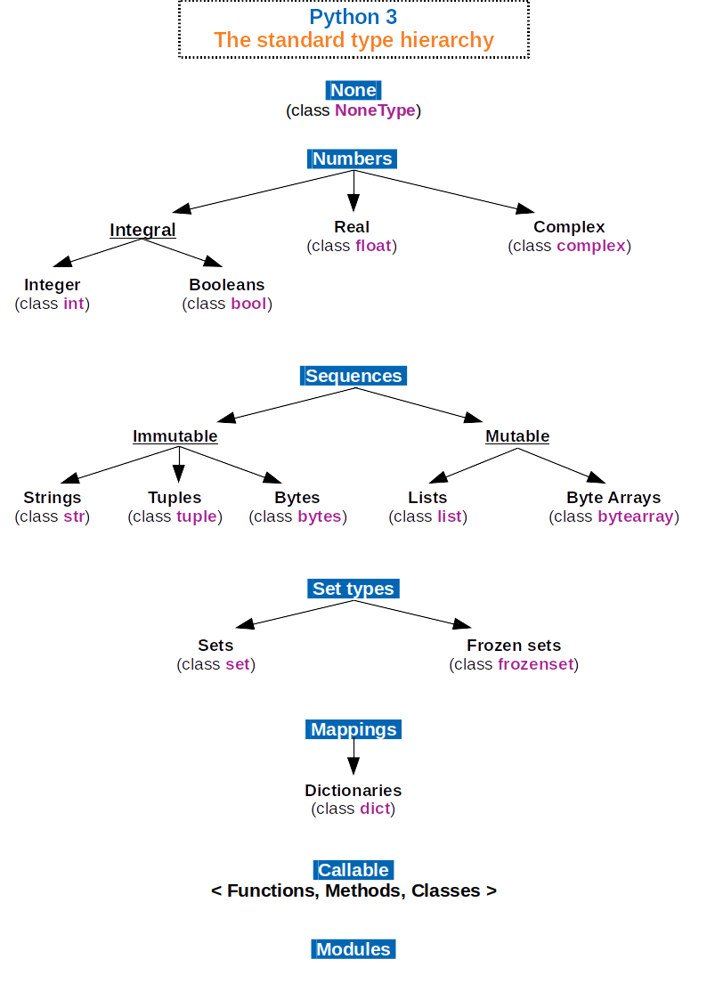
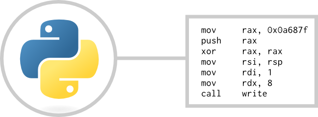
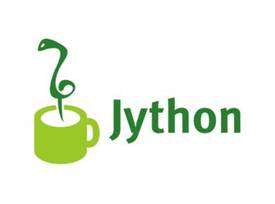
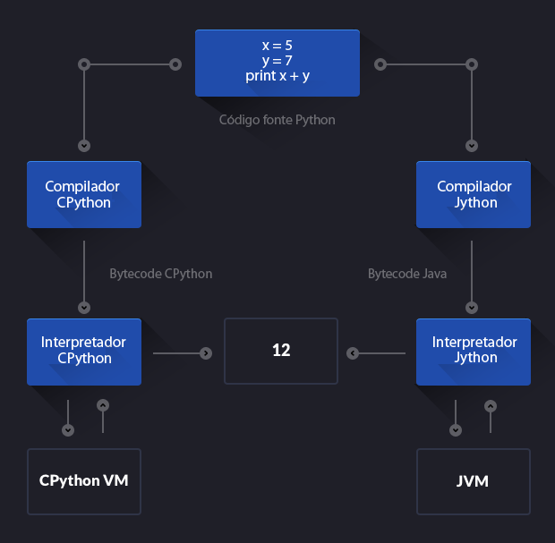

# **Becoming a Python Expert**
[](https://www.python.org/downloads/release/python-371/)


### Pre Requeriments
- Vim editor:<br/>
`sudo apt install vim`
- Python 3.7 or more:<br/>
`sudo apt install python3.7`
- Git:<br/>
`sudo apt get install git`
- pip:<br/>
`sudo apt install python-pip`
- Jupyter Notebook:<br/>
`sudo wget https://repo.anaconda.com/archive/Anaconda3-5.3.1-Linux-x86_64.sh`<br/>
`chmod +x Anaconda3-5.3.1-Linux-x86_64.sh`<br/>
`./Anaconda3-5.3.1-Linux-x86_64.sh`<br/>

---
<h1> Installation and preparing environment </h1>

- Python PATH
- How alter Python PATH and Python version
- Change versions of python

## Python PATH
1. First open profile in editor: <br/>
`vim ~/.profile` or `vim ~/.bashrc`

2. Insert Python PATH:  <br/>
`export PYTHON=/usr/bin/python<NUMER_VERSION>`

3. Update profile/bashrc: <br/>
`sudo vim ~/.bashrc`<br/>
`source ~/.bashrc` or `.  ~/.bashrc `

## Change versions of python
CMD: `update-alternatives` symbolic links determining default commands

- Check version<br/>
`python --version`

- Check where´s binary Python<br/>
`python --version`

_By default python 2.7 in /usr/bin/python<NUMER_VERSION>_

- Install multiples pythons<br/>
`update-alternatives --install /usr/bin/python python /usr/bin/python<NUMER_VERSION> 1`<br/><br/>
`update-alternatives --install /usr/bin/python python /usr/bin/python<OTHER_NUMER_VERSION> 2`<br/>

- Alter python versions<br/>
`sudo update-alternatives --config python`

 

- Check changes<br/>
`python --version`

---

<h1> Fundamentals Language </h1>

- What is Python?
- Zen of Python
- Keys words
- Types


## What is Python?
It is an interpreted programming language.<br/>
Paradigmas:
- imperativa
- orientada à objetos
- funcional
- scripts

---

## Zen of Python
`import this`<br/>

---

## Keys words:
```
and        del        from        not        while
as         elif       global      or         with
assert     else       if          pass       yield
break      except     import      print
class      exec       in          raise
continue   finally    is          return
def        for        lambda      try
```

---

# Types



---

<h1> Interpreter Python</h1>
- Interpreter and compiler
 - CPython
 - Jython
 - Comparian
- How Python program run

# Interpreter and compiler

 
 
## CPython
Compiler and interpreter bytecode, write in C.


## Jython


Compiler and interpreter Java bytecode, wirte in Java.


## Comparian



### Why use alter compiler python?

**CPython:** torna muito fácil escrever extensões C para seu código Python porque no final ele é executado por um interpretador C. <br/>
**Jython:**, por outro lado, torna muito fácil trabalhar com outros programas Java: você pode importar qualquer classe Java sem esforço adicional, chamando e utilizando suas classes Java de dentro de seus programas Jython.

---

## How Python program run ?


1. First Python checks for program syntax
2. Compiles and converts it to bytecode and directly bytecode is loaded in system memory.
3. Then compiled bytecode interpreted from memory to execute it.

---

<h1> Features Language </h1>

- Environment Virtual
- File of requirements
- PEP 8

## Environment Virtual Python

The Python can is executed in a environment virtual with isolation from system.<br/>
Each virtual environment has its **own Python binary**.
 
 

### Install
`pip install virtualenv` <br/>
or<br/>
`python3 -m venv /path/to/new/virtual/environment`

 


### Create environment
`virtualenv -p python3 NAME-ENVIRONMENT`

### Init
`source <DIR>/bin/activate`

### Install libraries
`venv/bin/pip3 install NAME-LIBRARIES`

---

## File of requirements

### Visualize libraries installs
`venv/bin/pip3 freeze`

 

- It´s passing address the *pip* the environment virtual

### Visualize libraries installs
`venv/bin/pip3 freeze > requirements.txt`

 


### Install libraries in requirements
`pip install -r requirements.txt`
- -r (recursive)


## PEP 8
Diz sobre a qualidade de cógido (sintaxe)
https://realpython.com/python-pep8/#naming-conventions


---


# Basic Comands
- Libraries
- Função print
- Types data
- Numeric systems
- libs matematics


## Estruturas de controle
...
 
## Estruturas de dados compostas
 - tuplas
 - listas
 - dicionários
 
## Funções
...

## Tratamento de exceções
...

## Strings
...

## Arquivos e serialização
...

## Testes
...

## Paralelismo
...

## Web
- Scrapping

### Frameworks
- Flask (microframework)
- Django

# Orientação à objetos
...

# Padrão de Projetos
...

## Científico (data science)
- Numpy
- Pandas
- Matplotlib
- Skitlearn (aprendizagem supervisionada, nao supervisionada)
- TensorFlow (redes neurais)

# Course in video in English
- Class notes and exercises solved.
- Teacher: Gustavo Guanabara.

Words   | Themes
-------- | ---
1 | [Fundamentals](https://www.youtube.com/playlist?list=PLHz_AreHm4dlKP6QQCekuIPky1CiwmdI6)
2 | [Control Structures](https://www.youtube.com/playlist?list=PLHz_AreHm4dk_nZHmxxf_J0WRAqy5Czye)
3 | [Compound Structures](https://www.youtube.com/watch?v=0LB3FSfjvao&list=PLHz_AreHm4dksnH2jVTIVNviIMBVYyFnH)

---

## Author
- Bruno Aurélio Rôzza de Moura Campos (brunocampos01@gmail.com)

## References
- https://realpython.com/python-virtual-environments-a-primer/


## Copyright
<a rel="license" href="http://creativecommons.org/licenses/by-sa/4.0/"></a><br />This work by <span xmlns:cc="http://creativecommons.org/ns#" property="cc:attributionName">Bruno A. R. M. Campos</span> is licensed under a <a rel="license" href="http://creativecommons.org/licenses/by-sa/4.0/">Creative Commons Attribution-ShareAlike 4.0 International License</a>.
