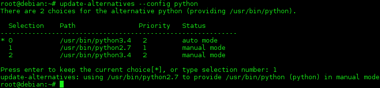

# **Learning Python**
[](https://www.python.org/downloads/release/python-371/)


# Pre Requeriments
### Instalation
- Vim editor:<br/>
`sudo apt-get install vim`
- Python 3.7 ou superior:<br/>
`sudo apt get install python3.7`
- Git:<br/>
`sudo apt get install git`
- pip:<br/>
`sudo apt get install python-pip`
- Jupyter Notebook:<br/>
```
sudo wget https://repo.anaconda.com/archive/Anaconda3-5.3.1-Linux-x86_64.sh; 
chmod +x Anaconda3-5.3.1-Linux-x86_64.sh; ./Anaconda3-5.3.1-Linux-x86_64.sh
```

### Alter Python PATH
1. First open profile in editor: <br/>
`~/.profile` or `~/.bashrc`

2. Insert Python PATH:  <br/>
`export PYTHON=/usr/bin/python<NUMER_VERSION>`

3. Update profile/bashrc: <br/>
`source ~/.profile` or `source ~/.bashrc`

### Alter Python version
CMD: `update-alternatives` symbolic links determining default commands

- Check version<br/>
`python --version`

- Install python 2.7 and 3.7 <br/>
`update-alternatives --install /usr/bin/python python /usr/bin/python<NUMER_VERSION> 1`<br/>
`update-alternatives --install /usr/bin/python python /usr/bin/python<OTHER_NUMER_VERSION> 2`<br/>

- Alter python versions<br/>
`sudo update-alternatives --config python`

 


# Fundamentals
- Pre Requeriments and Instalation
- How alter Python PATH and Python version
- What is Python?
- Keys words
- Interpreter Python
- How Python program run
- Environment Virtual

# Basic Comands
- Libraries
- Função print
- Types data
- Numeric systems
- libs matematics


## Estruturas de controle
...
 
## Estruturas de dados compostas
 - tuplas
 - listas
 - dicionários
 
## Funções
...

## Tratamento de exceções
...

## Strings
...

## Arquivos e serialização
...

## Testes
...

## Paralelismo
...

## Web
- Scrapping

### Frameworks
- Flask (microframework)
- Django

# Orientação à objetos
...

# Padrão de Projetos
...

## Científico (data science)
- Numpy
- Pandas
- Matplotlib
- Skitlearn (aprendizagem supervisionada, nao supervisionada)
- TensorFlow (redes neurais)

# Course in video in English
- Class notes and exercises solved.
- Teacher: Gustavo Guanabara.

Words   | Themes
-------- | ---
1 | [Fundamentals](https://www.youtube.com/playlist?list=PLHz_AreHm4dlKP6QQCekuIPky1CiwmdI6)
2 | [Control Structures](https://www.youtube.com/playlist?list=PLHz_AreHm4dk_nZHmxxf_J0WRAqy5Czye)
3 | [Compound Structures](https://www.youtube.com/watch?v=0LB3FSfjvao&list=PLHz_AreHm4dksnH2jVTIVNviIMBVYyFnH)

---

## Author
- Bruno Aurélio Rôzza de Moura Campos (brunocampos01@gmail.com)
## Copyright
<a rel="license" href="http://creativecommons.org/licenses/by-sa/4.0/"></a><br />This work by <span xmlns:cc="http://creativecommons.org/ns#" property="cc:attributionName">Bruno A. R. M. Campos</span> is licensed under a <a rel="license" href="http://creativecommons.org/licenses/by-sa/4.0/">Creative Commons Attribution-ShareAlike 4.0 International License</a>.
