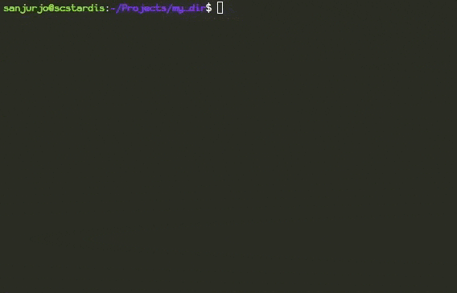
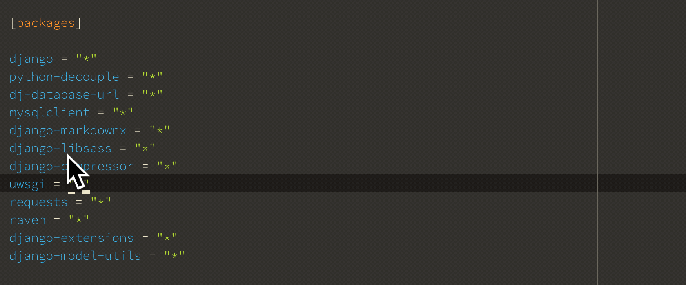
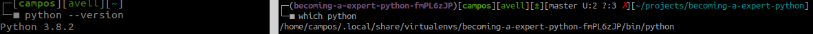

# Becoming a Expert Python


## Preparing the Environment for the Python
- How to prepare and install a Python environment?
- Analisando a fundo as configurações do ambiente
- O que é e como funciona um ambiente virtual de Python?
- Como organizar os requisitos de um projeto que tem Python?
- Gerenciadores de pacotes de Python
- Como usar arquivos de configurações em Python?

<!-- ## Preparing the Environment for the Python
This topic describe how to set up the environment to Python developement.
- [Check Python Configuration](#check-python-configuration)
- [Preparing Environment](#preparing-environment)
- [Requirements File](#requirements-file)
- [Virtual Environment](#virtual-environment)
- [Pipenv](#pipenv)

### FAQ
- How do I configure my computer to run Python code?
- How do I configure my computer to develop in Python?
- What are the best practices to prepare an environment that runs Python?
- What is a requirements.txt file ?
- How to ensure a fully reproducible (100% equal) environment ?
- How is the virtual environment Python executable able to use something different from the system site packages ?
- When use golang in place Python -->

---

## **How to prepare and install a Python environment?**

<details>
    <summary><b>  <a href="#linux"></a> Linux</b></summary>
  
  Python needs a set of tools that are system requirements. If necessary, install these requirements with this command:
  ```bash
  sudo apt update

  sudo apt install\
    software-properties-common\
    build-essential\
    libffi-dev\
    python3-pip\
    python3-dev\
    python3-venv\
    python3-setuptools\
    python3-pkg-resources
  ```
  
  Now, the environment is done to install Python
  ```bash
  sudo apt install python
  ```
  <br/>
</details>

<details>
  <summary><b>  <a href="#windows"></a> Windows</b></summary>

  On Windows, I recommend using the package manager [chocolatey](https://chocolatey.org/) and set your Powershell to can work as admin. See [this](devpos/infra-as-code) tutorial.

  Now, install Python
  ```powershell
  choco install python 
  ```
  
  
  
  
  <br/>
  
  Test
  ```powershell
  python --version 
  ```
  
  

  <br/>
</details>

---

## **Check Python Configuration**
### Check **current version**

<details>	
  <summary> Watch</summary>
  
</details>

```bash
python --version
```

### Check **where** installed Python
<details>	
  <summary> Watch</summary>
  
</details>

```bash
which python
```

### Check **which Python versions** are installed
<details>	
  <summary> Watch</summary>
  
</details>
  
```bash
sudo update-alternatives --list python
```

<br/>

---

## **Advanced settings of Python**

### **Install multiples Python versions**
Sometimes you might work on different projects at the same time with different versions of Python. Normally I using Anaconda is the easiest solution, however, can there are restricted.

1. Add repository
   <details>	
     <summary> Watch</summary>
     
   </details>

   This PPA contains more recent Python versions packaged for Ubuntu.
   ```bash
   sudo add-apt-repository ppa:deadsnakes/ppa -y
   ```

2. Update packeages
   ```bash
   sudo apt update -y
   ```
   
3. Check which python version is installed
   ```bash
   python --version
   ```
   
4. Install Python
   ```bash
   sudo apt install python3.<VERSION>
   ```
   
<br/>

### **Change system's Python**
Before installed other versions of Python it's necessary set which system's Python will be use.

1. Use `update-alternatives`

   It's possible use the `update-alternatives` command to set priority to different versions of the same software installed in Ubuntu systems. Now, define priority of versions:
   
   ```bash
   sudo update-alternatives --install /usr/bin/python python /usr/bin/python3.11 1
   
   sudo update-alternatives --install /usr/bin/python python /usr/bin/python3.10 2
    
   sudo update-alternatives --install /usr/bin/python python /usr/bin/python3.8 3

   sudo update-alternatives --install /usr/bin/python python /usr/bin/python3.6 4
   ```

   In directory `/usr/bin` will be create simbolic link: `/usr/bin/python -> /etc/alternatives/python*`

2. Choose version

   <details>	
     <summary> Watch</summary>
     
   </details>

   ```bash
   sudo update-alternatives --config python
   ```

3. Test
   ```bash
   python --version
   ```


<br/>

### **Change Python2 to Python3**
If return Python **2**, try set a alias in `/home/$USER/.bashrc`, see this [example](https://github.com/brunocampos01/home-sweet-home/blob/master/config/.bashrc).

```bash
alias python=python3
```

**NOTE:**
The important thing to realize is that Python 3 is not backwards compatible with Python 2. This means that if you try to run Python 2 code as Python 3, it will probably break.

<br/>

### **Set Python's Environment Variables**
- To individual project `PYTHONPATH` search path until module. Example: [Apache Airflow](https://airflow.apache.org/) read `dag\` folder and add automatically any file that is in this directory. 
- To interpreter `PYTHONHOME` indicate standard libraries.

#### **Configure `PYTHONPATH`**
1. Open profile
   ```bash
   sudo vim ~/.bashrc
   ```

2. Insert Python PATH
   ```bash
   export PYTHONHOME=/usr/bin/python<NUMER_VERSION>
   ```

3. Update profile/bashrc
   ```bash
   source ~/.bashrc
   ```

4. Test
   ```bash
   >>> import sys
   >>> from pprint import pprint
   >>> pprint(sys.path)
   ['',
    '/usr/lib/python311.zip',
    '/usr/lib/python3.11',
    '/usr/lib/python3.11/lib-dynload',
    '/usr/local/lib/python3.11/dist-packages',
    '/usr/lib/python3/dist-packages']
   ```
   
   Example with Apache Airflow
   ```bash
   >>> import sys
   >>> from pprint import pprint
   >>> pprint(sys.path)
   ['',
    '/home/project_name/dags',
    '/home/project_name/config',
    '/home/project_name/utilities',
    ...
    ]
   ```


<!-- 

---

## Requirements File
_Requirements files_ is file containing a list of items to be installed using pip install.

- Generate file `requirements.txt`
```bash
pip3 freeze > requirements.txt
```

or

```bash
venv/bin/pip3 freeze > requirements.txt
cat requirements # image bellow
```


- Visualize instaled libraries
```bash
pip3 freeze
```


- Install libraries in requirements
```bash
pip3 install -r requirements.txt
```
`-r` recursive

---

## Virtual Environment


The Python can is executed in a virtual environment with **semi-isolated** from system.
<br/>
When Python is initiating, it analyzes the path of its binary. In a virtual environment, it's actually just a copy or Symbolic link to your system's Python binary. Next, set the `sys.prefix` location which is used to locate the `site-packages` (third party libraries)

_Quando o Python está iniciando, ele analisa o caminho do seu binário. Em um virtual environment, na verdade, é apenas uma cópia ou Symbolic link para o binário Python do seu sistema. Em seguida, define o local `sys.prefix` que é usado para localizar o `site-packages`(third party libraries)._


### Symbolic link
- `sys.prefix` points to the virtual environment directory.
- `sys.base.prefix` points to the **non-virtual** environment.

Example, how keep the files in folder of virtual environment:
```bash
ll

# random.py -> /usr/lib/python3.6/random.py
# reprlib.py -> /usr/lib/python3.6/reprlib.py
# re.py -> /usr/lib/python3.6/re.py
# ...
```

```bash
tree

├── bin
│   ├── activate
│   ├── activate.csh
│   ├── activate.fish
│   ├── easy_install
│   ├── easy_install-3.8
│   ├── pip
│   ├── pip3
│   ├── pip3.8
│   ├── python -> python3.8
│   ├── python3 -> python3.8
│   └── python3.8 -> /Library/Frameworks/Python.framework/Versions/3.8/bin/python3.8
├── include
├── lib
│   └── python3.8
│       └── site-packages
└── pyvenv.cfg
```

### Create Virtual Environment
```bash
$ virtualenv -p python3  NAME_ENVIRONMENT
(env) $
```
or
```bash
$ python3 -m venv NAME_ENVIRONMENT
(env) $
```

###  To begin using the virtual environment, it needs to be activated


Execute activate script
```bash
source <DIR>/bin/activate
```


#### References
- [python-virtual-environments-a-primer](https://realpython.com/python-virtual-environments-a-primer/)

---

## Pipenv
- Package manager: `Pipefile`
- Virtual environment: `$HOME/.local/share`
- Lock package: `Pipefile.lock`




### Why use pipefile?
Using pip and requirements.txt file, have a **real issue here is that the build isn’t [deterministic](https://pt.wikipedia.org/wiki/Algoritmo_determin%C3%ADstico)**. What I mean by that is that, given the same input (the requirements.txt file), pip doesn’t always produce the same environment.

### What is pipefile?
It automatically creates and manages a virtualenv for your projects, as well as adds/removes packages from your Pipfile as you install/uninstall packages. It also generates the ever-important Pipfile.lock, which is used to produce deterministic builds.

Features:
- Deterministic builds
- Separates development and production environment libraries into a single file `Pipefile`
- Automatically adds/removes packages from your `Pipfile`
- Automatically create and manage a virtualenv
- Check PEP 508 requirements
- Check installed package safety

### Comparisons
```
# Pipfile

[[source]]
name = "pypi"
url = "https://pypi.org/simple"
verify_ssl = true

[dev-packages]
matplotlib = "==3.1.3"

[packages]
requests = "*"
numpy = "==1.18.1"
pandas = "==1.0.1"
wget = "==3.2"

[requires]
python_version = "3.8"
platform_system = 'Linux'
```

```
# requirements.txt

requests
matplotlib==3.1.3
numpy==1.18.1
pandas==1.0.1
wget==3.2
```


### Install
```bash
pip3 install --user pipenv
```

### Create Pipfile and virtual environment
```bash
pipenv --python 3

# Creating a virtualenv for this project…
# Pipfile: /home/campos/projects/becoming-a-expert-python/Pipfile

# Using /usr/bin/python3.8 (3.8.2) to create virtualenv…
# ⠼ Creating virtual environment...created virtual environment CPython3.8.2.final.0-64 in 256ms

#   creator CPython3Posix(dest=/home/campos/.local/share/virtualenvs/becoming-a-expert-python-fmPL6zJP, clear=False, global=False)

#   seeder FromAppData(download=False, pip=latest, setuptools=latest, wheel=latest, via=copy, app_data_dir=/home/campos/.local/share/virtualenv/seed-app-data/v1)

#   activators BashActivator,CShellActivator,FishActivator,PowerShellActivator,PythonActivator,XonshActivator

# ✔ Successfully created virtual environment!
# Virtualenv location: /home/campos/.local/share/virtualenvs/becoming-a-expert-python-fmPL6zJP

# requirements.txt found, instead of Pipfile! Converting…
# ✔ Success!
```

- See where virtual environment installed
```bash
pipenv --venv
```

### Activate environment
```bash
pipenv run
```


### Install Libraries with Pipefile
```bash
pipenv install flask

# or

pipenv install --dev flask
```

### Create lock file
```bash
pipenv lock

# Locking [dev-packages] dependencies…
# Locking [packages] dependencies…
# ✔ Success!
```

#### References
- [Official documentation](https://github.com/pypa/pipenv)
- [Gerenciando suas dependências e ambientes python com pipenv](https://medium.com/code-rocket-blog/gerenciando-suas-depend%C3%AAncias-e-ambientes-python-com-pipenv-9e5413513fa6)
- [How are Pipfile and Pipfile.lock used?](https://stackoverflow.com/questions/46330327/how-are-pipfile-and-pipfile-lock-used)

---


## Simple Deterministic Build

```
pip install pip-tools
pip3 freeze > requirements.in

pip-compile --generate-hashes requirements.in
```

output: requirements.txt
```
wtforms==2.3.3 \
    --hash=sha256:7b504fc724d0d1d4d5d5c114e778ec88c37ea53144683e084215eed5155ada4c \
    --hash=sha256:81195de0ac94fbc8368abbaf9197b88c4f3ffd6c2719b5bf5fc9da744f3d829c
    # via
    #   -r requirements.in
    #   flask-admin
    #   flask-wtf
zict==2.0.0 \
    --hash=sha256:26aa1adda8250a78dfc6a78d200bfb2ea43a34752cf58980bca75dde0ba0c6e9 \
    --hash=sha256:8e2969797627c8a663575c2fc6fcb53a05e37cdb83ee65f341fc6e0c3d0ced16
    # via
    #   -r requirements.in
    #   distributed
zipp==3.4.0 \
    --hash=sha256:102c24ef8f171fd729d46599845e95c7ab894a4cf45f5de11a44cc7444fb1108 \
    --hash=sha256:ed5eee1974372595f9e416cc7bbeeb12335201d8081ca8a0743c954d4446e5cb
    # via
    #   -r requirements.in
    #   importlib-metadata
    #   importlib-resources
    #   pep517
```


---
<!--
## Python Files
REFACTORING
https://packaging.python.org/key_projects/#pipenv

In production ...
- distlib
- virtualenv
- eggs
- Wheel

#### Files: `.py`

File: Typically, a Python file is any file that contains code. Most Python files have the extension .py.

Script: A Python script is a file that you intend to execute from the command line to accomplish a task.

Module: A Python module is a file that you intend to import from within another module or a script, or from the interactive interpreter. You can read more about modules in the Python documentation.


Call unique def in file.py (`python -c "import FILE_NAME; def test(requirements)"`)


```
sound/                          Top-level package
      __init__.py               Initialize the sound package
      formats/                  Subpackage for file format conversions
              __init__.py
              wavread.py
              wavwrite.py
              aiffread.py
              aiffwrite.py
              auread.py
              auwrite.py
              ...
      effects/                  Subpackage for sound effects
              __init__.py
              echo.py
              surround.py
              reverse.py
              ...
      filters/                  Subpackage for filters
              __init__.py
              equalizer.py
              vocoder.py
              karaoke.py
              ...

```

#### `__init__.py`

- The `__init__.py` files are required to make Python treat directories containing the file as packages.
- File can empty
- Is good pratice `__init__` have a list with modules to import. Example:
```
__all__ = ["echo", "surround", "reverse"]
```
- So import `from sound.effects import *` call the modules: "echo", "surround", "reverse"


Import individual module:<br/>
```python
from package import item.subitem.subsubite...

from module import name
```

TODO:
- https://nbviewer.jupyter.org/github/ricardoduarte/python-for-developers/blob/master/Chapter10/Chapter10_Packages.ipynb


#### Global Modules
- Módulos que são projetados para uso via M import * devem usar o mecanismo `__ all __` para impedir a exportação de globals

- To better  support introspection
Use __ all __ to switch *. E.g
```Python
__all__ = ['foo', 'Bar']

from module import *
```
significa que, quando você `from module import * ` apenas esses nomes __all__ são importados.

EXAMPLES...
- More details: https://stackoverflow.com/questions/44834/can-someone-explain-all-in-python and https://www.python.org/dev/peps/pep-0008/#naming-conventions


- Examples ...
- Read: https://realpython.com/run-python-scripts/


#### Compiler Files: `.pyc`
Program **doesn’t run any faster when it is read from a .pyc** file than when it is read from a .py file;

.pyc it's faster to loaded modules -->


---

<p  align="left">
<br/>
<a href="mailto:brunocampos01@gmail.com" target="_blank">
</a>
<a href="https://stackoverflow.com/users/8329698/bruno-campos" target="_blank">
</a>
<a href="https://www.linkedin.com/in/brunocampos01" target="_blank"></a>
<a href="https://github.com/brunocampos01" target="_blank"></a>
<a href="https://medium.com/@brunocampos01" target="_blank">
</a>
<a rel="license" href="http://creativecommons.org/licenses/by-sa/4.0/"></a><br/>
</p>
