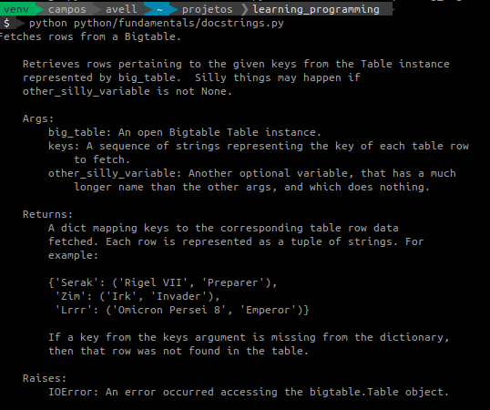

# Becoming a Expert Python


# Summary

:sunrise_over_mountains: **_Python's Habitat_**

This topic describe how to set up the environment to Python developement.
- [Preparing the Environment for the Python](#preparing-the-environment-for-the-python)
- [Check Python Configuration](#check-python-configuration)
- [Advanced settings of Python](#advanced-settings-of-python)
- [What is a virtual environment and how it works](#What-is-a-virtual-environment-and-how-it-works)

<br/>

:snake: **_Python's Taxonomy_**

This topic describe how is the pattern of Python projects.
- [Package manager](#package-manager)
- [Requirements File](#requirements-file)
- [Deterministic build](#deterministic-build)
<!-- - Principals Files -->

<br/>

:anger: **_Python's Behavior_**
- [How Python program run](#how-python-program-run)
<!-- 
- Tools (Dis, PDB, Python Profile and Tabnanny) #TODO
 https://data-flair.training/blogs/python-tools/ 
-->

<br/>

:bug: **_Python's Feeding_**

This topic describe best pratices.
- [Identation and Length](#identation-and-length)
- [Line Break After a Binary Operator](#line-break-after-a-binary-operator)
- [Naming](#naming)
- [Encoding](#encoding)
- [Strings `' '` and `" "`](#strings-and)
- [Comments `#`](#comments)
- [Imports](#imports)
- [Dunders to Documentation](#dunders-to-documentation)
- [Annotation Functions](#annotation-functions)
 - [Type Hints](#type-hints)
- [String Concatenation](#string-concatenation)
- [String Methods](#string-methods)
- [Exception](#exception)
- [Return](#return)
- [Type Comparisons](#type-comparisons)
- [Methods with numerous parameters ](#methods-with-numerous-parameters)
- Docstrings
<!-- TODO - https://realpython.com/documenting-python-code/
TODO - https://docs.python-guide.org/ -->


<br/>

:mag: **_Python's Other Features_**

Extra topics to see.

<br/>
<br/>
<br/>

---

<br/>

## **Preparing the Environment for the Python**

<details>
    <summary><b>  <a href="#linux"></a> Linux</b></summary>
  
  Python needs a set of tools that are system requirements. If necessary, install these requirements with this command:
  ```bash
  sudo apt update

  sudo apt install\
    software-properties-common\
    build-essential\
    libffi-dev\
    python3-pip\
    python3-dev\
    python3-venv\
    python3-setuptools\
    python3-pkg-resources
  ```
  
  Now, the environment is done to install Python
  ```bash
  sudo apt install python
  ```
  <br/>
</details>

<details>
  <summary><b>  <a href="#windows"></a> Windows</b></summary>

  On Windows, I recommend using the package manager [chocolatey](https://chocolatey.org/) and set your Powershell to can work as admin. See [this](devpos/infra-as-code) tutorial.

  Now, install Python
  ```powershell
  choco install python 
  ```
  
  
  
  
  <br/>
  
  Test
  ```powershell
  python --version 
  ```
  
  

  <br/>
</details>

---

<br/>

## **Check Python Configuration**
### Check **current version**

<details>	
  <summary> Watch</summary>
  
</details>

```bash
python --version
```

### Check **where** installed Python
<details>	
  <summary> Watch</summary>
  
</details>

```bash
which python
```

### Check **which Python versions** are installed
<details>	
  <summary> Watch</summary>
  
</details>
  
```bash
sudo update-alternatives --list python
```

---

<br/>

## **Advanced settings of Python**

<details>	
   <summary><b> Install multiples Python versions</b></summary>
  <!-- ### **Install multiples Python versions** -->
  Sometimes you might work on different projects at the same time with different versions of Python. Normally I using Anaconda is the easiest solution, however, can there are restricted.
  
  1. Add repository
     <details>	
       <summary> Watch</summary>
       
     </details>
  
     This PPA contains more recent Python versions packaged for Ubuntu.
     ```bash
     sudo add-apt-repository ppa:deadsnakes/ppa -y
     ```
  
  2. Update packeages
     ```bash
     sudo apt update -y
     ```
     
  3. Check which python version is installed
     ```bash
     python --version
     ```
     
  4. Install Python
     ```bash
     sudo apt install python3.<VERSION>
     ```
  <br/>
</details>
   

<details>	
   <summary><b> Change system's Python</b></summary>
  
  Before installed other versions of Python it's necessary set which system's Python will be use.
  
  1. Use `update-alternatives`
  
     It's possible use the `update-alternatives` command to set priority to different versions of the same software installed in Ubuntu systems. Now, define priority of versions:
     
     ```bash
     sudo update-alternatives --install /usr/bin/python python /usr/bin/python3.11 1
     
     sudo update-alternatives --install /usr/bin/python python /usr/bin/python3.10 2
      
     sudo update-alternatives --install /usr/bin/python python /usr/bin/python3.8 3
  
     sudo update-alternatives --install /usr/bin/python python /usr/bin/python3.6 4
     ```
  
     In directory `/usr/bin` will be create simbolic link: `/usr/bin/python -> /etc/alternatives/python*`
  
  2. Choose version
  
     <details>	
       <summary> Watch</summary>
       
     </details>
  
     ```bash
     sudo update-alternatives --config python
     ```
  
  3. Test
     ```bash
     python --version
     ```
  <br/>
</details>


<details>
  <summary><b> Change Python2 to Python3</b></summary>
  
  If return Python **2**, try set a alias in `/home/$USER/.bashrc`, see this [example](https://github.com/brunocampos01/home-sweet-home/blob/master/config/.bashrc).
  
  ```bash
  alias python=python3
  ```
  
  **NOTE:**
  The important thing to realize is that Python 3 is not backwards compatible with Python 2. This means that if you try to run Python 2 code as Python 3, it will probably break.

  <br/>
</details>

  
  <details>
    <summary><b> Set Python's Environment Variables</b></summary>
  
  <!-- ### **Set Python's Environment Variables** -->
  - To individual project `PYTHONPATH` search path until module. Example: [Apache Airflow](https://airflow.apache.org/) read `dag\` folder and add automatically any file that is in this directory. 
  - To interpreter `PYTHONHOME` indicate standard libraries.
  
  <br/>
  
   <details>
     <summary><b>    Set PYTHONPATH</b></summary>
    
   1. Open profile
      ```bash
      sudo vim ~/.bashrc
      ```
    
   2. Insert Python PATH
      ```bash
      export PYTHONHOME=/usr/bin/python<NUMER_VERSION>
      ```
    
   3. Update profile/bashrc
      ```bash
      source ~/.bashrc
      ```
    
   4. Test
      ```bash
      >>> import sys
      >>> from pprint import pprint
      >>> pprint(sys.path)
      ['',
       '/usr/lib/python311.zip',
       '/usr/lib/python3.11',
       '/usr/lib/python3.11/lib-dynload',
       '/usr/local/lib/python3.11/dist-packages',
       '/usr/lib/python3/dist-packages']
      ```
      
      Example with Apache Airflow
      ```bash
      >>> import sys
      >>> from pprint import pprint
      >>> pprint(sys.path)
      ['',
       '/home/project_name/dags',
       '/home/project_name/config',
       '/home/project_name/utilities',
       ...
       ]
      ```
   </details>
   <br/>
</details>


---

<br/>

## **What is a virtual environment and how it works**
Python can run in a virtual environment with **isolation** from the system. 


###### Image source: https://vincenttechblog.com/fix-change-python-virtualenv-settings/

<br/>

<details>
  <summary><b> Arquitecture of Execution</b></summary>

  
  
  <br/>
  
  Virtualenv enables us to create multiple Python environments which are isolated from the global Python environment as well as from each other.
  
  
  
  <br/>
  
  When Python is initiating, it analyzes the path of its binary. In a virtual environment, it's actually just a copy or Symbolic link to your system's Python binary. Next, set the `sys.prefix` location which is used to locate the `site-packages` (third party libraries)
  
  
  
  
  <br/>
  
  #### **Symbolic link**
  - `sys.prefix` points to the virtual environment directory.
  - `sys.base.prefix` points to the **non-virtual** environment.
  
  #### **Folder of virtual environment**
  ```bash
  ll
  
  # random.py -> /usr/lib/python3.6/random.py
  # reprlib.py -> /usr/lib/python3.6/reprlib.py
  # re.py -> /usr/lib/python3.6/re.py
  # ...
  ```
  
  ```bash
  tree
  
  ├── bin
  │   ├── activate
  │   ├── activate.csh
  │   ├── activate.fish
  │   ├── easy_install
  │   ├── easy_install-3.8
  │   ├── pip
  │   ├── pip3
  │   ├── pip3.8
  │   ├── python -> python3.8
  │   ├── python3 -> python3.8
  │   └── python3.8 -> /Library/Frameworks/Python.framework/Versions/3.8/bin/python3.8
  ├── include
  ├── lib
  │   └── python3.8
  │       └── site-packages
  └── pyvenv.cfg
  ```
  
</details>

<details>
  <summary><b> Create Virtual Environment</b></summary>  
  <details>	
      <summary> Watch</summary>
      
  </details>
    
  Create virtual environment
  ```bash
  virtualenv -p python3  <NAME_ENVIRONMENT>
  ```
    
  Activate 
  ```bash
  source <NAME_ENVIRONMENT>/bin/activate
  ```
  <br/>
</details>

<details>
  <summary><a href="#"></a><b> Interview Questions on Virtual Environment</b></summary> 

  1. What is virtual environment in Python?
  2. How to create and use a virtual environment in Python?
  3. How do Python virtual environments work?
</details>

---

<br/>

## **Package manager**
<details>
  <summary><b> Pipenv</b></summary> 
  
  Create and manage automatically a virtualenv for your projects, as well as adds/removes packages from your Pipfile as you install/uninstall packages. It also generates the ever-important `Pipfile.lock`, which is used to produce deterministic builds.
  
  #### **Features**
  - Deterministic builds
  - Separates development and production environment libraries into a single file `Pipefile`
  - Automatically adds/removes packages from your `Pipfile`
  - Automatically create and manage a virtualenv
  - Check PEP 508 requirements
  - Check installed package safety
  
  #### **Pipfile X requirements**
  ```bash
  # Pipfile
  
  [[source]]
  name = "pypi"
  url = "https://pypi.org/simple"
  verify_ssl = true
  
  [dev-packages]
  
  [packages]
  requests = "*"
  numpy = "==1.18.1"
  pandas = "==1.0.1"
  wget = "==3.2"
  
  [requires]
  python_version = "3.8"
  platform_system = 'Linux'
  ```
  
  ```bash
  # requirements.txt
  
  requests
  matplotlib==3.1.3
  numpy==1.18.1
  pandas==1.0.1
  wget==3.2
  ```
  
  <br/>
  
  ### **Install**
  ```bash
  pip3 install --user pipenv
  ```
  
  <br/>

  ### Create Pipfile and virtual environment
  1. Create environment
     <details>	
       <summary> Watch</summary>
       
     </details>
  
     ```bash
     pipenv --python 3
     ```
  
  2. See **where** virtual environment is installed
     ```bash
     pipenv --venv
     ```
  
  3. Activate environment
     ```bash
     pipenv run
     ```
  
  4. Install Libraries with Pipefile
     ```bash
     pipenv install flask
     # or
     pipenv install --dev flask
     ```
  
  5. Create lock file
     <details>	
       <summary> Watch</summary>
       
     </details>
   
     ```bash
     pipenv lock
     ```
     <br/>
</details>

<details>
  <summary><b> Python Package Index</b></summary> 
   
   [Doc Python Package Index](https://pypi.org/)
   <br/>
</details>

<details>
  <summary><b> Poetry</b></summary> 
    
   [Doc Poetry](https://python-poetry.org/)
   <br/>
</details>

<details>
  <summary><b> Conda</b></summary> 
  
  [Doc Conda](https://docs.conda.io/en/latest/)
  <br/>
</details>

---

<br/>

## **Requirements File**
`Requirements.txt` is file containing a list of items to be installed using pip install.

<details>	
  <summary><b> Principal Comands</b></summary>

  1. Visualize instaled libraries
  ```bash
  pip3 freeze
  ```
  
  2. Generate file `requirements.txt`
  ```bash
  pip3 freeze > requirements.txt
  ```
  
  3. Test 
  ```bash
  cat requirements.txt
  ```
  
  4. Install libraries in requirements
  ```bash
  pip3 install -r requirements.txt
  ```
  <br/>
</details>

---

<br/>

## **Deterministic Build**
<!-- ### **The issue with Pip** -->
Using pip and `requirements.txt` file, have a **real issue here is that the build isn’t [deterministic](https://pt.wikipedia.org/wiki/Algoritmo_determin%C3%ADstico)**. What I mean by that is, given the same input (the `requirements.txt` file), pip does not always produce the same environment.


### **pip-tools**
A set of command line tools to help you keep your pip-based packages fresh.

#### **Features**
- Distinguish direct dependencies and versions
- Freeze a set of exact packages and versions that we know work
- Make it reasonably easy to update packages
- Take advantage of pip's hash checking to give a little more confidence that packages haven't been modified (DNS attack)
- Stable

<details>	
  <summary><b> Principal Comands</b></summary>

  1. Install
  ```
  pip install pip-tools
  ```
  
  2. Get libraries's version
  ```bash
  pip3 freeze > requirements.in
  ```
  
  3. Generate hashes and list dependeces
  ```bash
  pip-compile --generate-hashes requirements.in
  ```
  output: [requirements.txt](requirements.txt)
  
  4. Install libraries and hash checking
  ```bash
  pip-compile --generate-hashes requirements.in
  ```
  <br/>

</details>	

---

<br/>

## **How Python program run**


<br/>

1. First, Python interpreter **checks syntax** (sequential)
2. **Compile and convert it to bytecode** and directly bytecode is loaded in system memory.
3. Then compiled bytecode interpreted from memory to execute it.

    
 TODO
 Compilers and Interpreters
A compiler converts the .py source file into a .pyc bytecode for the Python virtual machine.
A Python interpreter executes this bytecode on the virtual machine
    
    
Design of CPython
Each CPython interpreter for Python, the process uses a GIL(Global Interpreter Lock). This serves as a limitation as it disables concurrent Python threads for a process.

Another problem is that to achieve concurrency, you must manage separate CPython interpreter processes with a multitasking OS.

This also makes it harder for concurrent CPython processes to communicate.
    

#gil
    
    
---

<br/>

## **Best Pratices**

_"Readability counts"_

### **Identation and Length**
- 4 spaces
- Limit all line 72 characteres to docstring
- Limit all line 79 to code
- Statement of functions and flow, e.g:

```Python
# Aligned with opening delimiter.
foo = long_function_name(var_one=0.0, 
                         var_two=0.0,
                         var_three=0.0,
                         var_four=0.0)

```

### **Naming Convention**
- Class Name (camelCase): `CapWords()`
- Variables (snack_case): `cat_words`
- Constants: `MAX_OVERFLOW`


##### Line Break After a Binary Operator
```Python
income = (gross_wages
          + taxable_interest
          + (dividends - qualified_dividends)
          - ira_deduction
          - student_loan_interest)

```

##### Encoding
By default: `UTF-8`

```Python
# -*- coding: UTF-8 -*-
<code>
```

##### Strings `' '` and `" "`
Single quotation marks and strings with double quotation marks are the same.

##### Comments `#`
- Fisrt word **need** upper case.
- Comments in-line separete by 2 spaces.
```Python
x = x + 1  # Compensar borda
```

##### Imports
Following order:

1. Standard library imports.
2. Related third party imports.
(_parte de terceiros_)
3. Local application/library specific imports.

```Python
import argparse
import configparser
import os

import mysql.connector

import my_module
```

Yes:
```Python
import os
import sys
```

No:
```Python
import os, sys
```

No problems:
```Python
from subprocess import Popen, PIPE
```


##### Dunders to Documentation
```Python
__version__ = '0.1'
__author__ = 'Bruno Campos'
```


##### String Concatenation

- Use ` ''.join()`, to concatenate 3 or more:
```python
os.path.dirname.join(stringA + stringB + stringC + stringD)
```

- This optimization is fragile even in CPython. **Not** use:
```python
stringA + stringB + stringC + stringD
```


##### String Methods

- Use string methods instead of the string module because, String methods are always much faster.
- Use `''.startswith()` and `''.endswith()` instead of string slicing to check for prefixes or suffixes.

```Python
Yes: if foo.startswith('bar'):
No:  if foo[:3] == 'bar':
```


##### Exception

Limit the clausule `try:` minimal code necessary.

Yes:
```Python
try:
    value = collection[key]
except KeyError:
    return key_not_found(key)
else:
    return handle_value(value)
```

No:
```Python
try:
    # Too broad!
    return handle_value(collection[key])
except KeyError:
    # Will also catch KeyError raised by handle_value()
    return key_not_found(key)
```

- Objetivo de responder à pergunta **"O que deu errado?"** programaticamente, em vez de apenas afirmar que _"Ocorreu um problema"_


##### Return
"_Should explicitly state this as return None_"

- Be consistent in return statements.
- Todas as instruções de retorno em uma função devem retornar uma expressão ou nenhuma delas deve.

Yes:
```Python
def foo(x):
    if x >= 0:
        return math.sqrt(x)
    else:
        return None
```

No:
```Python
def foo(x):
    if x >= 0:
        return math.sqrt(x)
```


##### Type Comparisons
- Always use `isinstance()`
```Python
Yes: if isinstance(obj, int):

No:  if type(obj) is type(1):
```

#### Annotation Functions
"_Don’t use comments to specify a type, when you can use type annotation._"

-  Atua como um linter (analisador de código para mostrar erros) muito poderoso.
- O Python não atribui nenhum significado a essas anotações.
- _Examples_:

Method arguments and return values
```Python
def func(a: int) -> List[int]:
```

```Python
def hello_name(name: str) -> str:
    return (f'Hello' {name}')
```

Declare the type of a variable (type hints)
```python
a = SomeFunc()  # type: SomeType
```

Isso informa que o tipo esperado do argumento de nome é str . Analogicamente, o tipo de retorno esperado é str .

##### Type Hints
```Python
def send_email(address,     # type: Union[str, List[str]]
               sender,      # type: str
               cc,          # type: Optional[List[str]]
               bcc,         # type: Optional[List[str]]
               subject='',
               body=None    # type: List[str]
               ):
    """Send an email message.  Return True if successful."""
    <code>
```

TODO
- https://docs.python.org/3/library/typing.html#module-typing


##### References
- https://medium.com/@shamir.stav_83310/the-other-great-benefit-of-python-type-annotations-896c7d077c6b
- https://www.python.org/dev/peps/pep-0484/
- https://blog.jetbrains.com/pycharm/2015/11/python-3-5-type-hinting-in-pycharm-5/

---

## Docstrings

- Docstrings must have:
  - Args
  - Returns
  - Raises

Simple Example
```Python
def say_hello(name):
    """
    A simple function that says hello...
    Richie style
    """

    print(f"Hello {name}, is it me you're looking for?")
```

Example partner Google
```Python
def fetch_bigtable_rows(big_table, keys, other_silly_variable=None):
    """Fetches rows from a Bigtable.

    Retrieves rows pertaining to the given keys from the Table instance
    represented by big_table.  Silly things may happen if
    other_silly_variable is not None.

    Args:
        big_table: An open Bigtable Table instance.
        keys: A sequence of strings representing the key of each table row
            to fetch.
        other_silly_variable: Another optional variable, that has a much
            longer name than the other args, and which does nothing.

    Returns:
        A dict mapping keys to the corresponding table row data
        fetched. Each row is represented as a tuple of strings. For
        example:

        {'Serak': ('Rigel VII', 'Preparer'),
         'Zim': ('Irk', 'Invader'),
         'Lrrr': ('Omicron Persei 8', 'Emperor')}

        If a key from the keys argument is missing from the dictionary,
        then that row was not found in the table.

    Raises:
        IOError: An error occurred accessing the bigtable.Table object.
    """
    return None
```

#### `__doc__`

Such a docstring becomes the `__doc__` special attribute of that object.

- Simple Example
```Python
print(say_hello.__doc__)

# A simple function that says hello... Richie style
```

- Example partner Google




##### `help()`
- Create manual: `man`
- Is a built-in function help() that prints out the objects docstring.

```Python
>>> help(say_hello)
Help on function say_hello in module __main__:

# say_hello(name)
#     A simple function that says hello... Richie style
```


##### Scripts with Docstrings
- Docstrings must show how to use script
- Must doc:
  - Usage: sintax command line
  - Examples
  - Arguments required and optional

```python
"""
Example of program with many options using docopt.
Usage:
  options_example.py [-hvqrf FILE PATH]
  my_program tcp <host> <port> [--timeout=<seconds>]

Examples:
  calculator_example.py 1 + 2 + 3 + 4 + 5
  calculator_example.py 1 + 2 '*' 3 / 4 - 5    # note quotes around '*'
  calculator_example.py sum 10 , 20 , 30 , 40

Arguments:
  FILE     input file
  PATH     out directory

Options:
  -h --help            show this help message and exit
  --version            show version and exit
  -v --verbose         print status messages
  -q --quiet           quiet mode
  -f --force
  -t, --timeout TIMEOUT    set timeout TIMEOUT seconds
  -a, --all             List everything.

"""
from docopt import docopt


if __name__ == '__main__':
    arguments = docopt(__doc__, version='1.0.0rc2')
    print(arguments)
```

##### Functions with Docstrings
A docstring to a function or method must resume:
- behavior
- arguments required
- arguments optional
- default value of arguments
- returns
- raise Exceptions

Example

```Python
def says(self, sound=None):
    """Prints what the animals name is and what sound it makes.

    If the argument `sound` isn't passed in, the default Animal
    sound is used.

    Parameters
    ----------
    sound : str, optional
        The sound the animal makes (default is None)

    Raises
    ------
    NotImplementedError
        If no sound is set for the animal or passed in as a parameter.
    """

    if self.sound is None and sound is None:
        raise NotImplementedError("Silent Animals are not supported!")

    out_sound = self.sound if sound is None else sound
    print(self.says_str.format(name=self.name, sound=out_sound))

```

##### Class with Docstrings
A docstring para uma classe deve resumir seu comportamento e listar os métodos públicos e variáveis ​​de instância. Se a classe se destina a ser uma subclasse e possui uma interface adicional para subclasses, essa interface deve ser listada separadamente (no docstring). O construtor de classe deve ser documentado na docstring para seu método __init__ . Os métodos individuais devem ser documentados por seus próprios docstring.

Example
```Python
class SimpleClass:
    """Class docstrings go here."""

    def say_hello(self, name: str):
        """Class method docstrings go here."""

        print(f'Hello {name}')
```

Class docstrings should contain the following information:

- A brief summary of its purpose and behavior
- Any public methods, along with a brief description
- Any class properties (attributes)
- Anything related to the interface for subclassers, if the class is intended to be subclassed


##### References
- [PEP 08](https://www.python.org/dev/peps/pep-0008/)
- [PEP 484](https://www.python.org/dev/peps/pep-0484/)
- [PEP 257](https://www.python.org/dev/peps/pep-0257/)
- https://realpython.com/python-pep8/#naming-conventions
- https://pep8.org
- Style guide Google: https://github.com/google/styleguide/blob/gh-pages/pyguide.md#38-comments-and-docstrings

#### Methods with numerous parameters
Methods with numerous parameters are a challenge to maintain, especially if most of them share the same datatype.
<br/>
These situations usually denote the **need for new objects to wrap the
 numerous parameters**.


#### Example(s):

- too many arguments
```python
def add_person(birthYear: int, birthMonth: int, birthDate: int,
               height: int, weight: int,
               ssn: int):
'''too many arguments'''

    . . .
```
- preferred approach
```python
def add_person(birthdate: 'Date',
               measurements: 'BodyMeasurements',
               ssn: int):
'''preferred approach'''

    . . .
```


## Cyclomatic Complexity
cyclomatic complexity counts the number of decision points in a method


<!-- TODO
- Side effects: https://realpython.com/defining-your-own-python-function/#side-effects
- return: https://realpython.com/defining-your-own-python-function/#exiting-a-function -->


<!-- 
Call unique def in file.py (`python -c "import FILE_NAME; def test(requirements)"`) 


## Principal Files
#### `__init__.py`

- The `__init__.py` files are required to make Python treat directories containing the file as packages.
- File can empty
- Is good pratice `__init__` have a list with modules to import. Example:
```
__all__ = ["echo", "surround", "reverse"]
```
- So import `from sound.effects import *` call the modules: "echo", "surround", "reverse"


Import individual module:<br/>
```python
from package import item.subitem.subsubite...

from module import name
```

TODO:
- https://nbviewer.jupyter.org/github/ricardoduarte/python-for-developers/blob/master/Chapter10/Chapter10_Packages.ipynb


#### Global Modules
- Módulos que são projetados para uso via M import * devem usar o mecanismo `__ all __` para impedir a exportação de globals

- To better  support introspection
Use __ all __ to switch *. E.g
```Python
__all__ = ['foo', 'Bar']

from module import *
```
significa que, quando você `from module import * ` apenas esses nomes __all__ são importados.

EXAMPLES...
- More details: https://stackoverflow.com/questions/44834/can-someone-explain-all-in-python and https://www.python.org/dev/peps/pep-0008/#naming-conventions


- Examples ...
- Read: https://realpython.com/run-python-scripts/


#### Compiler Files: `.pyc`
Program **doesn’t run any faster when it is read from a .pyc** file than when it is read from a .py file;

.pyc it's faster to loaded modules -->


---

<p  align="left">
<br/>
<a href="mailto:brunocampos01@gmail.com" target="_blank">
</a>
<a href="https://stackoverflow.com/users/8329698/bruno-campos" target="_blank">
</a>
<a href="https://www.linkedin.com/in/brunocampos01" target="_blank"></a>
<a href="https://github.com/brunocampos01" target="_blank"></a>
<a href="https://medium.com/@brunocampos01" target="_blank">
</a>
<a rel="license" href="http://creativecommons.org/licenses/by-sa/4.0/"></a><br/>
</p>
