# Becoming a Expert Python  


This project focuses on understanding the language ecosystem, not getting into programming details.

# Summary

:sunrise_over_mountains: **_Python's Habitat_**

This topic describe how to set up the environment to Python developement.
- [Preparing the Environment for the Python](#preparing-the-environment-for-the-python)
- [Check Python Configuration](#check-python-configuration)
- [Advanced settings of Python](#advanced-settings-of-python)
- [What is a virtual environment and how it works](#What-is-a-virtual-environment-and-how-it-works)

<br/>

:snake: **_Python's Taxonomy_**

This topic describe features of the pattern of Python projects.
- [Package manager](#package-manager)
- [Requirements file](#requirements-file)
- [Deterministic build](#deterministic-build)
<!-- - Principals Files -->

<br/>

:anger: **_Python's Behavior_**

This topic describe how the language is designed and how it works.
- [Compiler and interpreter](#compiler-and-interpreter)
- [How Python runs a program](#how-python-runs-a-program)
- [How Python search path module](#how-python-search-path-module)
- [How Python manages process and threads](#how-python-manages-process-and-threads)
- [How Python manages memory](#how-python-manages-memory)
- [How to deeply understand Python code execution (debug)](#how-to-deeply-understand-python-code-execution)

<!-- 
- threads
- process
- Concurrency async
- Debug
-->

<br/>

:bug: **_Python's Feeding_**

This topic describes static code analysis, formatting patterns and style guides.
- [Static code analysis](#static-code-analysis)
- [Principal style guides](#principal-style-guides)
- [Knobs (Google YAPF)](https://github.com/google/yapf#id11)
- [My Knobs](#my-knobs)
- [Docstrings](#docstrings)

<!-- TODO - https://realpython.com/documenting-python-code/
TODO - https://docs.python-guide.org/ -->


<br/>

:mag: **_Python's Other Features_**

Extra topics.
- [Awesome Python](https://github.com/vinta/awesome-python) 
- [Interview questions](#interview-questions)
- [Why Is CPython Written in C and Not Python?](https://realpython.com/cpython-source-code-guide/#why-is-cpython-written-in-c-and-not-python)

<br/>
<br/>
<br/>

---

<br/>

## **Preparing the Environment for the Python**

<details>
    <summary><b><a href="#preparing-the-environment-for-the-python"></a> Linux</b></summary>
  
  Python needs a set of tools that are system requirements. If necessary, install these requirements with this command:
  ```bash
  sudo apt update

  sudo apt install\
    software-properties-common\
    build-essential\
    libffi-dev\
    python3-pip\
    python3-dev\
    python3-venv\
    python3-setuptools\
    python3-pkg-resources
  ```
  
  Now, the environment is done to install Python
  ```bash
  sudo apt install python
  ```
  <br/>
</details>

<details>
  <summary><b>  <a href="#preparing-the-environment-for-the-python"></a> Windows</b></summary>

  On Windows, I recommend using the package manager [chocolatey](https://chocolatey.org/) and set your Powershell to can work as admin. See [this](devpos/infra-as-code) tutorial.

  Now, install Python
  ```powershell
  choco install python 
  ```
  
  
  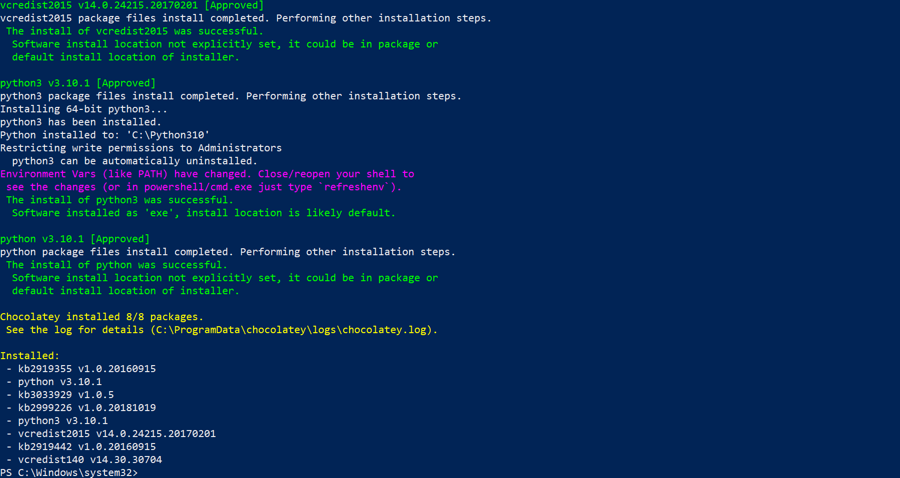
  
  <br/>
  
  Test
  ```powershell
  python --version 
  ```
  
  

  <br/>
</details>

---

<br/>

## **Check Python Configuration**
### Check **current version**

<details>	
  <summary> Watch</summary>
  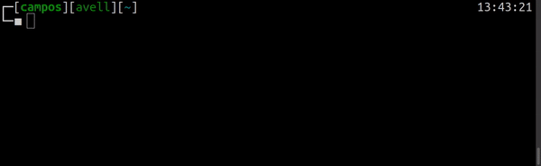
</details>

```bash
python --version
```

### Check **where** installed Python
<details>	
  <summary> Watch</summary>
  
</details>

```bash
which python
```

### Check **which Python versions** are installed
<details>	
  <summary> Watch</summary>
  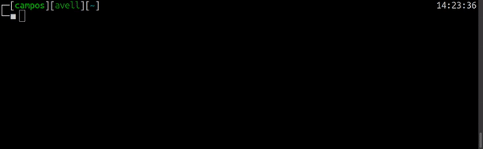
</details>
  
```bash
sudo update-alternatives --list python
```

---

<br/>

## **Advanced settings of Python**

<details>	
   <summary><b> Install multiples Python versions</b></summary>
  <!-- ### **Install multiples Python versions** -->
  Sometimes you might work on different projects at the same time with different versions of Python. Normally I using Anaconda is the easiest solution, however, can there are restricted.
  
  1. Add repository
     <details>	
       <summary> Watch</summary>
       
     </details>
  
     This PPA contains more recent Python versions packaged for Ubuntu.
     ```bash
     sudo add-apt-repository ppa:deadsnakes/ppa -y
     ```
  
  2. Update packeages
     ```bash
     sudo apt update -y
     ```
     
  3. Check which python version is installed
     ```bash
     python --version
     ```
     
  4. Install Python
     ```bash
     sudo apt install python3.<VERSION>
     ```
  <br/>
</details>
   

<details>	
   <summary><b> Change system's Python</b></summary>
  
  Before installed other versions of Python it's necessary set which system's Python will be use.
  
  1. Use `update-alternatives`
  
     It's possible use the `update-alternatives` command to set priority to different versions of the same software installed in Ubuntu systems. Now, define priority of versions:
     
     ```bash
     sudo update-alternatives --install /usr/bin/python python /usr/bin/python3.11 1
     
     sudo update-alternatives --install /usr/bin/python python /usr/bin/python3.10 2
      
     sudo update-alternatives --install /usr/bin/python python /usr/bin/python3.8 3
  
     sudo update-alternatives --install /usr/bin/python python /usr/bin/python3.6 4
     ```
  
     In directory `/usr/bin` will be create simbolic link: `/usr/bin/python -> /etc/alternatives/python*`
  
  2. Choose version
  
     <details>	
       <summary> Watch</summary>
       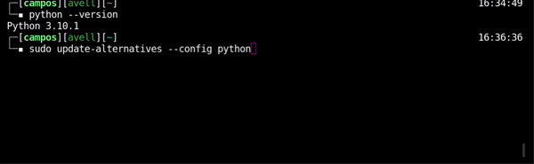
     </details>
  
     ```bash
     sudo update-alternatives --config python
     ```
  
  3. Test
     ```bash
     python --version
     ```
  <br/>
</details>


<details>
  <summary><b> Change Python2 to Python3</b></summary>
  
  If return Python **2**, try set a alias in `/home/$USER/.bashrc`, see this [example](https://github.com/brunocampos01/home-sweet-home/blob/master/config/.bashrc).
  
  ```bash
  alias python=python3
  ```
  
  **NOTE:**
  The important thing to realize is that Python 3 is not backwards compatible with Python 2. This means that if you try to run Python 2 code as Python 3, it will probably break.

  <br/>
</details>

  
  <details>
    <summary><b> Set Python's Environment Variables</b></summary>
  
  <!-- ### **Set Python's Environment Variables** -->
  - To individual project `PYTHONPATH` search path until module. Example: [Apache Airflow](https://airflow.apache.org/) read `dag\` folder and add automatically any file that is in this directory. 
  - To interpreter `PYTHONHOME` indicate standard packages.
  
  <br/>
  
   <details>
     <summary><b>    Set PYTHONPATH</b></summary>
    
   1. Open profile
      ```bash
      sudo vim ~/.bashrc
      ```
    
   2. Insert Python PATH
      ```bash
      export PYTHONHOME=/usr/bin/python<NUMER_VERSION>
      ```
    
   3. Update profile/bashrc
      ```bash
      source ~/.bashrc
      ```
    
   4. Test
      ```bash
      >>> import sys
      >>> from pprint import pprint
      >>> pprint(sys.path)
      ['',
       '/usr/lib/python311.zip',
       '/usr/lib/python3.11',
       '/usr/lib/python3.11/lib-dynload',
       '/usr/local/lib/python3.11/dist-packages',
       '/usr/lib/python3/dist-packages']
      ```
      
      Example with Apache Airflow
      ```bash
      >>> import sys
      >>> from pprint import pprint
      >>> pprint(sys.path)
      ['',
       '/home/project_name/dags',
       '/home/project_name/config',
       '/home/project_name/utilities',
       ...
       ]
      ```
   </details>
   <br/>
</details>


---

<br/>

## **What is a virtual environment and how it works**
Python can run in a virtual environment with **isolation** from the system. 

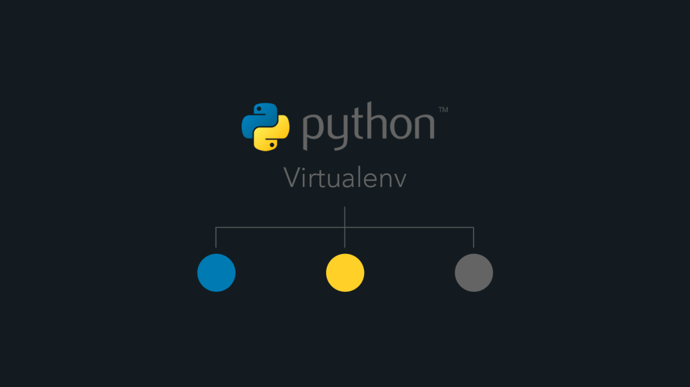

###### Image source: https://vincenttechblog.com/fix-change-python-virtualenv-settings/

<br/>

<details>
  <summary><b> Arquitecture of Execution</b></summary>

  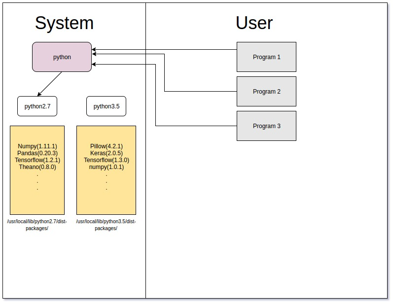
  
  <br/>
  
  Virtualenv enables us to create multiple Python environments which are isolated from the global Python environment as well as from each other.
  
  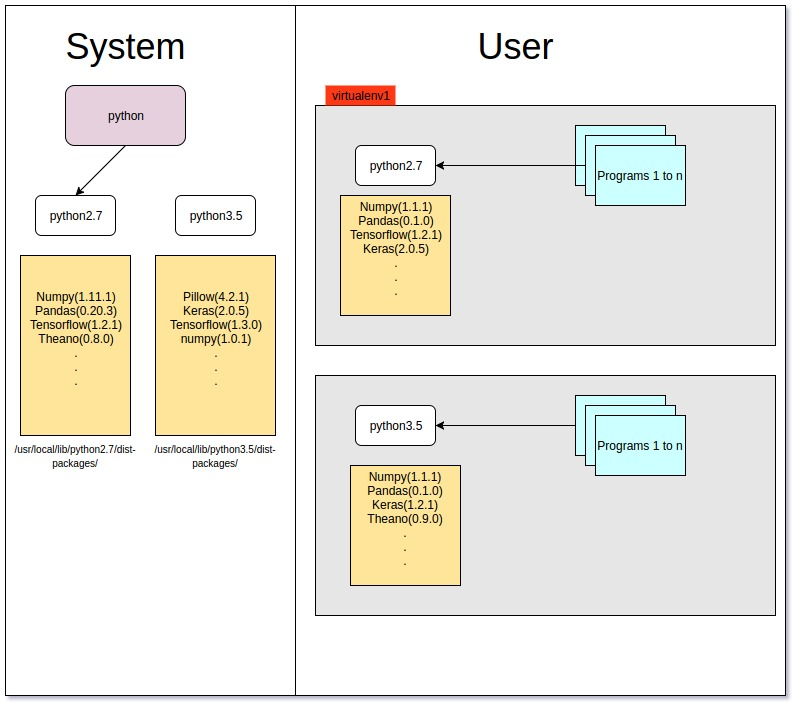
  
  <br/>
  
  When Python is initiating, it analyzes the path of its binary. In a virtual environment, it's actually just a copy or Symbolic link to your system's Python binary. Next, set the `sys.prefix` location which is used to locate the `site-packages` (third party packages/libraries)
  
  
  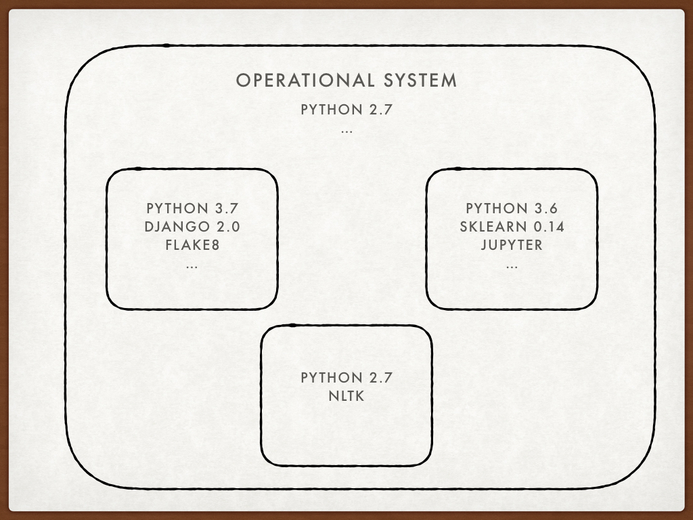
  
  <br/>
  
  #### **Symbolic link**
  - `sys.prefix` points to the virtual environment directory.
  - `sys.base.prefix` points to the **non-virtual** environment.
  
  #### **Folder of virtual environment**
  ```bash
  ll
  
  # random.py -> /usr/lib/python3.6/random.py
  # reprlib.py -> /usr/lib/python3.6/reprlib.py
  # re.py -> /usr/lib/python3.6/re.py
  # ...
  ```
  
  ```bash
  tree
  
  ├── bin
  │   ├── activate
  │   ├── activate.csh
  │   ├── activate.fish
  │   ├── easy_install
  │   ├── easy_install-3.8
  │   ├── pip
  │   ├── pip3
  │   ├── pip3.8
  │   ├── python -> python3.8
  │   ├── python3 -> python3.8
  │   └── python3.8 -> /Library/Frameworks/Python.framework/Versions/3.8/bin/python3.8
  ├── include
  ├── lib
  │   └── python3.8
  │       └── site-packages
  └── pyvenv.cfg
  ```
  
</details>

<details>
  <summary><b> Create Virtual Environment</b></summary>  
  <details>	
      <summary> Watch</summary>
      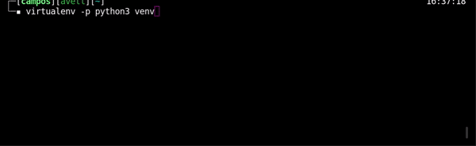
  </details>
    
  Create virtual environment
  ```bash
  virtualenv -p python3  <NAME_ENVIRONMENT>
  ```
    
  Activate 
  ```bash
  source <NAME_ENVIRONMENT>/bin/activate
  ```
  <br/>
</details>

---

<br/>

## **Package manager**
<details>
  <summary><b> Pipenv</b></summary> 
  
  Create and manage automatically a virtualenv for your projects, as well as adds/removes packages from your Pipfile as you install/uninstall packages. It also generates the ever-important `Pipfile.lock`, which is used to produce deterministic builds.
  
  #### **Features**
  - Deterministic builds
  - Separates development and production environment packages into a single file `Pipefile`
  - Automatically adds/removes packages from your `Pipfile`
  - Automatically create and manage a virtualenv
  - Check PEP 508 requirements
  - Check installed package safety
  
  #### **Pipfile X requirements**
  ```bash
  # Pipfile
  
  [[source]]
  name = "pypi"
  url = "https://pypi.org/simple"
  verify_ssl = true
  
  [dev-packages]
  
  [packages]
  requests = "*"
  numpy = "==1.18.1"
  pandas = "==1.0.1"
  wget = "==3.2"
  
  [requires]
  python_version = "3.8"
  platform_system = 'Linux'
  ```
  
  ```bash
  # requirements.txt
  
  requests
  matplotlib==3.1.3
  numpy==1.18.1
  pandas==1.0.1
  wget==3.2
  ```
  
  <br/>
  
  ### **Install**
  ```bash
  pip3 install --user pipenv
  ```
  
  <br/>

  ### Create Pipfile and virtual environment
  1. Create environment
     <details>	
       <summary> Watch</summary>
       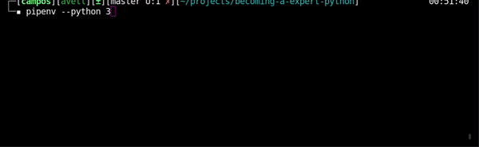
     </details>
  
     ```bash
     pipenv --python 3
     ```
  
  2. See **where** virtual environment is installed
     ```bash
     pipenv --venv
     ```
  
  3. Activate environment
     ```bash
     pipenv run
     ```
  
  4. Install packages with Pipefile
     ```bash
     pipenv install flask
     # or
     pipenv install --dev flask
     ```
  
  5. Create lock file
     <details>	
       <summary> Watch</summary>
       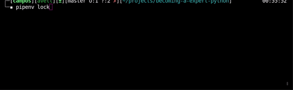
     </details>
   
     ```bash
     pipenv lock
     ```
     <br/>
</details>

<details>
  <summary><b> Python Package Index</b></summary> 
   
   [Doc Python Package Index](https://pypi.org/)
   <br/>
</details>

<details>
  <summary><b> Poetry</b></summary> 
    
   [Doc Poetry](https://python-poetry.org/)
   <br/>
</details>

<details>
  <summary><b> Conda</b></summary> 
  
  [Doc Conda](https://docs.conda.io/en/latest/)
  <br/>
</details>

---

<br/>

## **Requirements File**
`Requirements.txt` is file containing a list of items to be installed using pip install.

<details>	
  <summary><b> Principal Comands</b></summary>

  1. Visualize instaled packages
  ```bash
  pip3 freeze
  ```
  
  2. Generate file `requirements.txt`
  ```bash
  pip3 freeze > requirements.txt
  ```
  
  3. Test 
  ```bash
  cat requirements.txt
  ```
  
  4. Install packages in requirements
  ```bash
  pip3 install -r requirements.txt
  ```
  <br/>
</details>

---

<br/>

## **Deterministic Build**
<!-- ### **The issue with Pip** -->
Using pip and `requirements.txt` file, have a **real issue here is that the build isn’t [deterministic](https://pt.wikipedia.org/wiki/Algoritmo_determin%C3%ADstico)**. What I mean by that is, given the same input (the `requirements.txt` file), pip does not always produce the same environment.


### **pip-tools**
A set of command line tools to help you keep your pip-based packages fresh.

#### **Features**
- Distinguish direct dependencies and versions
- Freeze a set of exact packages and versions that we know work
- Make it reasonably easy to update packages
- Take advantage of pip's hash checking to give a little more confidence that packages haven't been modified (DNS attack)
- Stable

<details>	
  <summary><b> Principal Comands</b></summary>

  1. Install
  ```
  pip install pip-tools
  ```
  
  2. Get packages's version
  ```bash
  pip3 freeze > requirements.in
  ```
  
  3. Generate hashes and list dependeces
  ```bash
  pip-compile --generate-hashes requirements.in
  ```
  output: [requirements.txt](requirements.txt)
  
  4. Install packages and hash checking
  ```bash
  pip-compile --generate-hashes requirements.in
  ```
  <br/>

</details>	

---

<br/>

## **Compiler and interpreter**
CPython can be defined as both an interpreter and a compiler.
- The **compiler** converts the `.py` source file into a `.pyc` bytecode for the Python virtual machine.
- The **interpreter** executes this bytecode on the virtual machine.


<br/>


<!-- <details>	
  <summary><b> CPython's Design</b></summary> -->

### **CPython's Design**
The principal feature of [CPython](https://en.wikipedia.org/wiki/CPython#:~:text=8%20External%20links-,Design,bytecode%20at%20any%20one%20time.), is that it makes use of a global interpreter lock (GIL). This is a mechanism used in computer-language interpreters to synchronize the execution of threads so that only one native thread can execute at a time. 
<br/>
Therefore, for a CPU-bound task in Python, single-process multi-thread Python program would not improve the performance. However, this does not mean multi-thread is useless in Python. For a I/O-bound task in Python, multi-thread could be used to improve the program performance.

<details>	
  <summary><b> Multithreading in Python</b></summary>
  The Python has multithreads despite the GIL. Using Python threading, we are able to make better use of the CPU sitting idle when waiting for the I/O bound, how memory I/O, hard drive I/O, network I/O.
  
  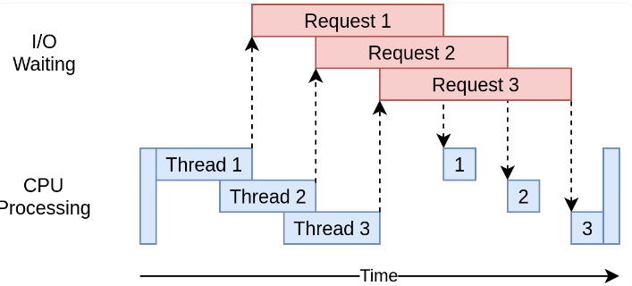
  
  <br/>
  
  This can happen when multiple threads are servicing separate clients. One thread may be waiting for a client to reply, and another may be waiting for a database query to execute, while the third thread is actually processing Python code or other example is read multiples images from disk.
  
  **NOTE:** we would have to be careful and use locks when necessary. Lock and unlock make sure that only one thread could write to memory at one time, but this will also introduce some overhead. 
  
  <!--
  ver mais sobre thread and process
  https://leimao.github.io/blog/Python-Concurrency-High-Level/ -->
  
   <br/>
</details>

<details>	
  <summary><b> Community Consensus</b></summary>

  Removing the GIL would have made **Python 3 slower in comparison to Python 2** in single-threaded performance. Other problem if remove the GIL it's would **broke the existing C extensions** which depend heavily on the solution that the GIL provides.
  <br/>
  Although many proposals have been made to eliminate the GIL, the general consensus has been that in most cases, the advantages of the GIL outweigh the disadvantages; in the few cases where the GIL is a bottleneck, the application should be built around the multiprocessing structure.
  
  <br/>
</details>


---

<br/>

## **How Python runs a program**
1. Tokenize the source code: `Parser/tokenizer.c`
2. Parse the stream of tokens into an Abstract Syntax Tree (AST): `Parser/parser.c`
3. Transform AST into a Control Flow Graph: `Python/compile.c`
4. Emit bytecode based on the Control Flow Graph: `Python/compile.c`


---

<br/>

## **How Python search path module**
When Python executes this statement:
```python
import my_lib
```
The interpreter searches `my_lib.py` a list of directories
assembled from the following sources: <!-- montada a partir das seguintes fontes: -->
- Current directory
- The list of directories contained in the **PYTHONPATH** environment variable
- In directory which Python was is installed. E.g. 
  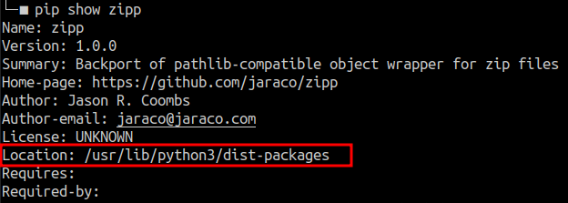


The resulting search can be accessed using the **sys** module:
```python
import sys

sys.paths
# ['', '/usr/lib/python38.zip', 
# '/usr/lib/python3.8',
# '/usr/lib/python3.8/lib-dynload',
# '/home/campos/.local/lib/#python3.8/site-packages',
# '/usr/local/lib/python3.8/dist-packages',
# '/usr/lib/python3/dist-packages']
```

<br/>

Now, to see where a packeage was imported from you can use the attribute `__file__`:
```python
import zipp

zipp.__file__
# '/usr/lib/python3/dist-packages/zipp.py'
```

> NOTE: you can see that the `__file__` directory is in the list of directories searched by the interpreter.

<!-- TODO
- how check what was imported ?
  - `dir()` function
- package initiazion
  - __init__
  - __all__
https://realpython.com/python-modules-packages/#package-initialization -->

---

<br/>

## **How Python manages process and threads**

TODO

<!-- 
https://realpython.com/python-gil/
https://realpython.com/courses/speed-python-concurrency/
https://realpython.com/intro-to-python-threading/
https://data-flair.training/blogs/python-multithreading/
https://sobolevn.me/2020/06/how-async-should-have-been
-->

---

<br/>

## **How Python manages memory**

TODO

<!-- https://realpython.com/courses/how-python-manages-memory/ -->


---

<br/>

## **How to deeply understand Python code execution**


TODO

<!-- trace via Pycharm
trace via VS CODE
trace memory allocations: https://docs.python.org/3/library/tracemalloc.html#module-tracemalloc
code coverage: https://pypi.org/project/coverage/
PySnooper: https://github.com/cool-RR/PySnooper -->


---

<br/>

## **Static code analysis**
The static code analysis serves to **evaluate the coding**. This analysis must be done before submitting for a code review. The static code analysis can check:
- Code styling analysis
- Comment styling analysis
- Error detection
- Duplicate code detection
- Unused code detection
- Complexity analysis
- Security linting

The characteristics of a static analysis are:
- Provides insight into code without executing it
- Can automate code quality maintenance
- Can automate the search for bugs at the early stages
- Can automate the finding of security problems

A lint, is a [static code analysis tool](https://en.wikipedia.org/wiki/Lint_(software)).

<details>	
  <summary><b> Pylint</b></summary>

  [Pylint](https://pylint.org/) is a lint that checks for errors in Python code, tries to enforce a coding standard and looks for code smells. The principal features is:
  - Pylint follow the [PEP8](https://www.python.org/dev/peps/pep-0008/) style guide.
  - It's possible automate with Jenkins.
  - It is fully customizable through a `.pylintrc` file where you can choose which errors or agreements are relevant to you.
  - Usage
    ```bash
      pylint <file/dir> --rcfile=<.pylintrc>
    ```  
  <details>	
  <summary><b> Example execution</b></summary>
    
  <br/>
  </details>
  
  <br/>
</details>

<details>	
  <summary><b> Pyflakes</b></summary>

  [Documentation Pyflakes](https://github.com/PyCQA/pyflakes)
  <br/>
</details>

<details>	
  <summary><b> Mypy</b></summary>

  [Documentation Mypy](http://mypy-lang.org/)
  <br/>
</details>

<details>	
  <summary><b> Prospector</b></summary>

  [Documentation Propector](https://prospector.landscape.io/en/master/) 
  <br/>
</details>

---

<br/>

## Other Tools to make an effective Python style guide
<details>	
  <summary><b> Isort</b></summary>

  [isort](https://pypi.org/project/isort/) is a Python tool/library for sorting imports alphabetically, automatically divided into sections. It is very useful in projects where we deal with a lot of imports [6].
  ```bash
  # sort the whole project
  isort --recursive ./src/
  
  # just check for errors
  isort script.py --check-only
  ``` 
  <br/>
</details>

<details>	
  <summary><b> Unify</b></summary>

  Someone likes to write them in single quotes, someone in double ones. To unify the whole project, there is a tool that allows you to automatically align with your style guide — [unify](https://pypi.python.org/pypi/unify) [6].
  ```bash
  unify --in-place -r ./src/
  ```
  Work recursively for files in the folder.
  
  <br/>
</details>

<details>	
  <summary><b> docformatter</b></summary>

  [Docformater](https://pypi.org/project/docformatter/) is utility helps to bring your docstring under the [PEP 257](https://www.python.org/dev/peps/pep-0257/) [6]. The agreement specifies how documentation should be written.
  ```bash
  docformatter --in-place example.py
  ```
  
  <br/>
</details>

<details>	
  <summary><b> Autoformatters</b></summary>

  There are also automatic code formatters now, here are the popular one [6]:
  - [yapf](https://github.com/google/yapf) (here you can make a align with your own style guide)
  - [black](https://github.com/psf/black) (you don't need a style guide because you don't have a choice)
  - [autopep8](https://github.com/hhatto/autopep8) (makes your python script to conform PEP8 style guide)
  
  <br/>
</details>

<details>	
  <summary><b> Settings Files to text editor and IDE</b></summary>

  - EditorConfig
  - Gitattributes
 
 <br/>
</details>

---

<br/>

## **Principal style guides**
To make the code consistent and make sure it's readable the _style guides_ can help.
- [Google style guide: THE BETTER](https://google.github.io/styleguide/pyguide.html) 
- [Real Python: Naming Conventions](https://realpython.com/python-pep8/#naming-conventions)
- [PEP 08: Style Guide](https://www.python.org/dev/peps/pep-0008/)
- [PEP 257: Docstrings](https://www.python.org/dev/peps/pep-0257/)
- [PEP 484: Type Hints](https://www.python.org/dev/peps/pep-0484/)

---

<br/>

## **My Knobs**

<details>
  <summary><b> Identation and Length</b></summary> 
  
  - 4 spaces
  - Limit all lines to a maximum **72 characteres to docstring or comments**
  - Limit all lines to a maximum **79 characteres to code**  
  <br/>
</details>

<details>
  <summary><b> Naming Convention</b></summary> 

  - Class Name (camelCase): `CapWords()`
  - Variables (snack_case): `cat_words`
  - Constants: `MAX_OVERFLOW`
  <br/>
</details>


<details>
  <summary><b> Exception</b></summary> 
  
  Limit the clausule `try:` minimal code necessary.
  
  Yes:
  ```Python
  try:
      value = collection[key]
  except KeyError:
      return key_not_found(key)
  else:
      return handle_value(value)
  ```
  
  No:
  ```Python
  try:
      # Too broad!
      return handle_value(collection[key])
  except KeyError:
      # Will also catch KeyError raised by handle_value()
      return key_not_found(key)
  ```
  
  - The goal to answer the question **"What went wrong?"** programmatically rather than just claiming that _"There was a problem"_
  <br/>
</details>

<details>
  <summary><b> Return</b></summary> 
  
  "_Should explicitly state this as return None_"
  
  - Be consistent in return statements.
  - Todas as instruções de retorno em uma função devem retornar uma expressão ou nenhuma delas deve.
  
  Yes:
  ```Python
  def foo(x):
      if x >= 0:
          return math.sqrt(x)
      else:
          return None
  ```
  
  No:
  ```Python
  def foo(x):
      if x >= 0:
          return math.sqrt(x)
  ```
  <br/>
</details>

---

<br/>

## **Docstrings**

Docstrings must have:
- Args
- Returns
- Raises


<details>
  <summary><b> Example Google Style Guide</b></summary> 

  ```Python
  def fetch_bigtable_rows(big_table, keys, other_silly_variable=None):
      """Fetches rows from a Bigtable.
  
      Retrieves rows pertaining to the given keys from the Table instance
      represented by big_table.  Silly things may happen if
      other_silly_variable is not None.
  
      Args:
          big_table: An open Bigtable Table instance.
          keys: A sequence of strings representing the key of each table row
              to fetch.
          other_silly_variable: Another optional variable, that has a much
              longer name than the other args, and which does nothing.
  
      Returns:
          A dict mapping keys to the corresponding table row data
          fetched. Each row is represented as a tuple of strings. For
          example:
  
          {'Serak': ('Rigel VII', 'Preparer'),
           'Zim': ('Irk', 'Invader'),
           'Lrrr': ('Omicron Persei 8', 'Emperor')}
  
          If a key from the keys argument is missing from the dictionary,
          then that row was not found in the table.
  
      Raises:
          IOError: An error occurred accessing the bigtable.Table object.
      """
      return None
  ``` 
  <br/>
</details>


<!-- TODO
- Side effects: https://realpython.com/defining-your-own-python-function/#side-effects
- return: https://realpython.com/defining-your-own-python-function/#exiting-a-function -->

---

<br/>

## **Interview Questions**

<details>
  <summary><b> Virtual Environment</b></summary> 

  1. What is virtual environment in Python?
  2. How to create and use a virtual environment in Python?
  3. How do Python virtual environments work?
</details>


---

<br/>

<details>	
  <summary><b> References</b></summary>
  
  - 1: [Python 3 Installation & Setup Guide](https://realpython.com/installing-python/)
  - 2: [An Effective Python Environment: Making Yourself at Home](https://realpython.com/effective-python-environment/)
  - 3: [Import Scripts as Modules](https://realpython.com/python-import/#import-scripts-as-modules)
  - 4: [Python Modules and Packages – An Introduction](https://realpython.com/python-modules-packages/)
  - 5: [What Is the Python Global Interpreter Lock (GIL)?](https://realpython.com/python-gil/)
  - 6: [7 tips to make an effective python style guide](https://luminousmen.com/post/7-tips-to-make-an-effective-python-style-guide)
  - 7: [Python Static Analysis Tools](https://luminousmen.com/post/python-static-analysis-tools)
  - 8: [My unpopular opinion about black code formatter](https://luminousmen.com/post/my-unpopular-opinion-about-black-code-formatter)
  <br/>
</details>

---

<p  align="left">
<br/>
<a href="mailto:brunocampos01@gmail.com" target="_blank">
</a>
<a href="https://stackoverflow.com/users/8329698/bruno-campos" target="_blank">
</a>
<a href="https://www.linkedin.com/in/brunocampos01" target="_blank"></a>
<a href="https://github.com/brunocampos01" target="_blank"></a>
<a href="https://medium.com/@brunocampos01" target="_blank">
</a>
<a rel="license" href="http://creativecommons.org/licenses/by-sa/4.0/"></a><br/>
</p>
