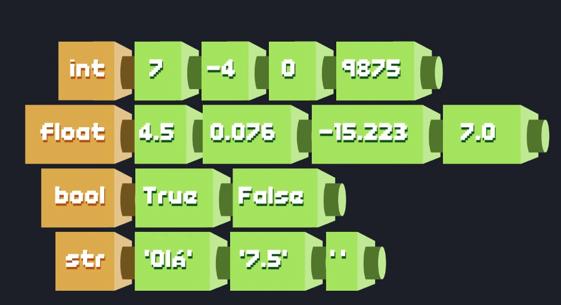

# Basic Comands
  - Libraries
  - Função print
  - Tipos de dados em Python
  - Sistemas numéricos
  - Funções e libs matemáticas

---
## Libraries
Import everythings module:


<br/>

Import only thing module:


---

## Function print formated

### Variables integer and float
- **%i** imprime variáveis inteiras
- **%f** imprime variáveis reais, ela por padrão arredonda a ultima casa

### Houses after the point
Para limitar o número de algoritmos só inserir o **%.2f** terá 2 casas decimais
- Ex: **%.1f** terá uma única casa

### Cientific notation
**%g** imprime variáveis em notação cientifica: 1e+14 = 1x10^14

Examples:
```
# Imprime um número int de forma formatada
print ("%i" % 100)
```
100

```
# Imprime um número real de forma formatada, por padrão tem 6 casas decimais
print ("%f" % 100.2)
```
100.200000

```
# Imprime um número real de forma formatada com 2 casas decimais
print ("%.2f" % 100.2)
```
100.20

```
# Imprime número com notação cientifica e detecta algaritmos significativos
print ("%g" % 1000000000000000000000000000000)
```
1e+30


---

## Data Type

- Python não tem tipos primitivos.
- Em python é tudo objeto.

 

More examples:
 

---

## Arithmetic operators
 

Examples:

<br/>

<br/>

<br/><br/><br/>


## Librarie Random
```
# Cria números aleatorios de 1 a 6
for i in range(10):
    x = randrange(1,7)
    print(x)
```
1
5
2
3
5
6
1
4
4
4

```
# Escolhe um número/objeto dentro da lista inserida
for i in range(10):
    x = choice([1, 2, 3, "teste", 5])
    print(x)
```
2
2
2
teste
teste
1
2
5
3
1
