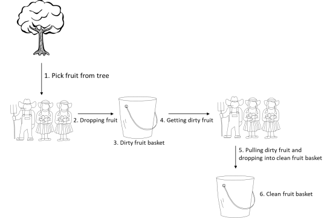

# Multithreading

Suppose that you want to simulate a fruit farm:
- Three farmers are collecting fruits from a single tree to a single dirty fruit basket.
- In parallel, three other farmers are getting the fruits from the dirty fruit basket,
cleaning them, and pushing them into the single cleaned fruit basket.
- All the farmers are managing the fruit individually
- The tree has 50 fruits (and only one farmer at one time can pick fruit from the tree)
- Time to collect fruits from the trees into the basket: random(3,6) seconds
- Time to clean the fruits into the cleaned fruit basket: random(2,4) seconds
- The simulation ends when all the fruits from the tree are collected and cleaned.
- The number of fruits in the tree and in the baskets must be logged every second.



### Expected deliverable

Your code should be executable with the following call “yourScript.py”, with a similar output log
to the one below:
```commandline
2020-12-01 19:02:00 Tree (50 fruits) - dirty basket ( 0 ) - Clean Basket ( 0 )

# OR

2020-12-01 19:02:00 Tree (50 fruits) - dirty basket ( 0 ) - Clean Basket ( 0 ) – (optional) farmer1
(0) – farmer2 (0) – cleaner1(0) – cleaner2 (0)
```

## How to Run
### Requisite

| Requisite | Version |
| --------- | ------- |
| Python    | 3.9.7   |

```bash
# application
python second_exercise/app/pick_and_clean_fruit.py

# tests
python -m unittest second_exercise/test/test_pick_and_clean_fruit.py
```

---
