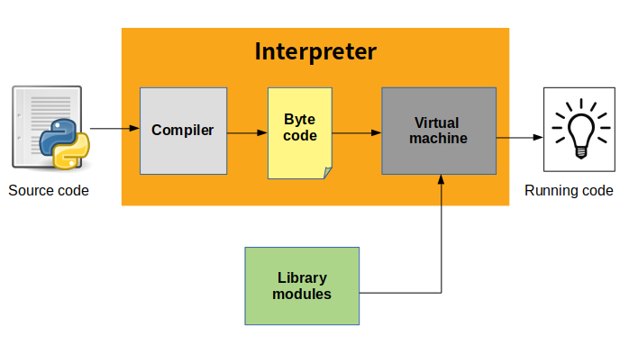

# Fundamentals
- Pre Requeriments
- Instalation
- How alter Python PATH and Python version
- What is Python?
- Keys words
- Interpreter Python
- How Python program run
- Environment Virtual
- PEP 8: https://realpython.com/python-pep8/#naming-conventions


## Pre Requeriments
- Vim editor:<br/>
`sudo apt install vim`
- Python 3.7 ou superior:<br/>
`sudo apt install python3.7`
- Git:<br/>
`sudo apt get install git`
- pip:<br/>
`sudo apt install python-pip`
- Jupyter Notebook:<br/>
`sudo wget https://repo.anaconda.com/archive/Anaconda3-5.3.1-Linux-x86_64.sh`<br/>
`chmod +x Anaconda3-5.3.1-Linux-x86_64.sh`<br/>
`./Anaconda3-5.3.1-Linux-x86_64.sh`<br/>

### Alter Python PATH
1. First open profile in editor: <br/>
`~/.profile` or `~/.bashrc`

2. Insert Python PATH:  <br/>
`export PYTHON=/usr/bin/python<NUMER_VERSION>`

3. Update profile/bashrc: <br/>
`sudo vim ~/.bashrc`<br/>

  - Insert in final document:<br/>
  `export PYTHON=/usr/bin/python3`<br/>

`source ~/.bashrc`

### Alter Python version
CMD: `update-alternatives` symbolic links determining default commands

- Check version<br/>
`python --version`

- Install python 2.7 and 3.7 <br/>
`update-alternatives --install /usr/bin/python python /usr/bin/python<NUMER_VERSION> 1`<br/>
`update-alternatives --install /usr/bin/python python /usr/bin/python<OTHER_NUMER_VERSION> 2`<br/>

- Alter python versions<br/>
`sudo update-alternatives --config python`

 

---

## What is Python?
É uma linguagem de script de programação interpretada.<br/>
Paradigmas:
- imperativa
- orientada à objetos
- funcional

---

## Keys words:
```
and        del        from        not        while
as         elif       global      or         with
assert     else       if          pass       yield
break      except     import      print
class      exec       in          raise
continue   finally    is          return
def        for        lambda      try
```

---

## Interpreter and compiler

 
 <br/>

### CPython
Compiler and interpreter bytecode, write in C.


### Jython 

Compiler and interpreter Java bytecode, wirte in Java.


### Comparian


### Why use alter compiler python?

**CPython:** torna muito fácil escrever extensões C para seu código Python porque no final ele é executado por um interpretador C. <br/>
**Jython:**, por outro lado, torna muito fácil trabalhar com outros programas Java: você pode importar qualquer classe Java sem esforço adicional, chamando e utilizando suas classes Java de dentro de seus programas Jython.

---

### How Python program run ?



1. First Python checks for program syntax
2. Compiles and converts it to bytecode and directly bytecode is loaded in system memory.
3. Then compiled bytecode interpreted from memory to execute it.

---
