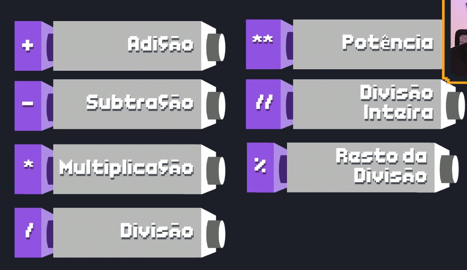
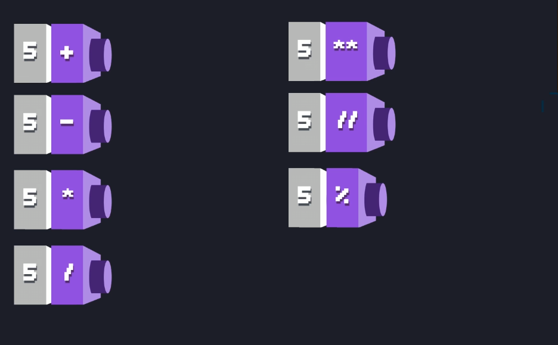
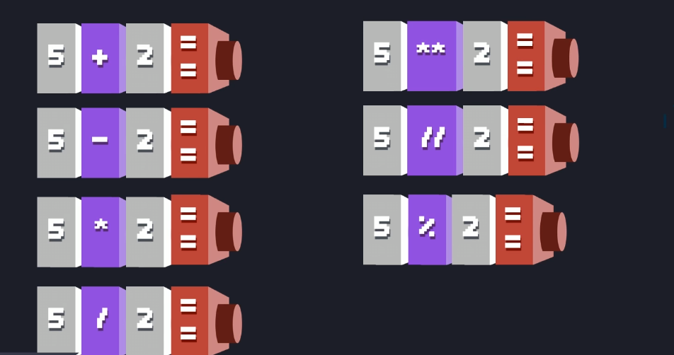
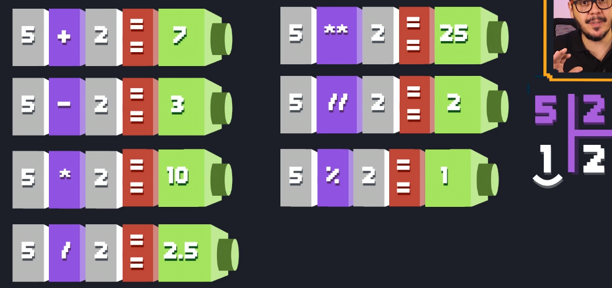
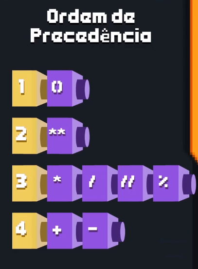

# Fundamentals
  - O que é o Python
  - Interpretador e compilador
  - Environment Virtual
  - Libraries
  - Keys words
  - PEP 8: https://realpython.com/python-pep8/#naming-conventions

# Basic Comands
  - Função print
  - Tipos de dados em Python
  - Sistemas numéricos
  - Funções e libs matemáticas

---
## What is Python?
É uma linguagem de script de programação interpretada.<br/>
Paradigmas:
- imperativa
- orientada à objetos
- funcional


Keys words:
```
and        del        from        not        while
as         elif       global      or         with
assert     else       if          pass       yield
break      except     import      print
class      exec       in          raise
continue   finally    is          return
def        for        lambda      try
```

---

## Interpreter and compiler

interpreter.png


- **CPython:** compiler and interpreter bytecode, write in C.

cpython.png

- **Jython:** compiler and interpreter Java bytecode, wirte in Java.
jython.jpg


comp-interpreter.png


### Python program is run
1. First Python checks for program syntax
2. Compiles and converts it to bytecode and directly bytecode is loaded in system memory.
3. Then compiled bytecode interpreted from memory to execute it.

### Why use alter compiler python?>br/>
**CPython:** torna muito fácil escrever extensões C para seu código Python porque no final ele é executado por um interpretador C. <br/>
**Jython:**, por outro lado, torna muito fácil trabalhar com outros programas Java: você pode importar qualquer classe Java sem esforço adicional, chamando e utilizando suas classes Java de dentro de seus programas Jython.


---

## Libraries
Importa tudo de um módulo:

 
 <br/>

Importa somente um módulo:

 

---
## Function print formated
### Variables integer and float
- **%i** imprime variáveis inteiras
- **%f** imprime variáveis reais, ela por padrão arredonda a ultima casa

### Houses after the point
Para limitar o número de algoritmos só inserir o **%.2f** terá 2 casas decimais
- Ex: **%.1f** terá uma única casa

### Cientific notation
**%g** imprime variáveis em notação cientifica: 1e+14 = 1x10^14

Examples:
```
# Imprime um número int de forma formatada
print ("%i" % 100)
```
100

```
# Imprime um número real de forma formatada, por padrão tem 6 casas decimais
print ("%f" % 100.2)
```
100.200000

```
# Imprime um número real de forma formatada com 2 casas decimais
print ("%.2f" % 100.2)
```
100.20

```
# Imprime número com notação cientifica e detecta algaritmos significativos
print ("%g" % 1000000000000000000000000000000)
```
1e+30


---

## Data Type

- Python não tem tipos primitivos. 
- Em python é tudo objeto. 

 

More examples:
 

---

## Arithmetic operators
 

Examples:

<br/>

<br/>

<br/><br/><br/>



## Librarie Random
```
# Cria números aleatorios de 1 a 6
for i in range(10):
    x = randrange(1,7)
    print(x)
```
1
5
2
3
5
6
1
4
4
4

```
# Escolhe um número/objeto dentro da lista inserida
for i in range(10):
    x = choice([1, 2, 3, "teste", 5])
    print(x)
```
2
2
2
teste
teste
1
2
5
3
1
